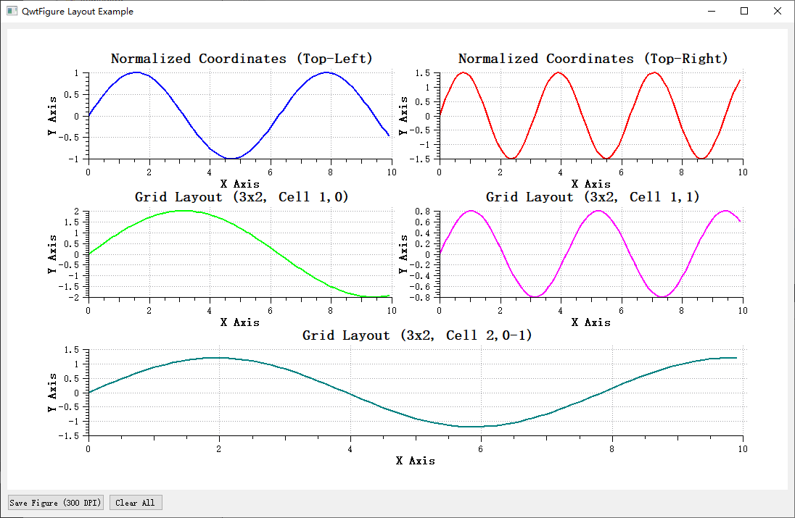

## tag:v7.0.2

- 抽取出`QwtPlotLayoutEngine`类
- 增加`QwtPlotParasiteLayout`类，用于实现寄生轴的布局
- 增加`QwtPlotTransparentCanvas`类，用于实现一个完全透明的画布
- `QwtFigure`类实现寄生轴功能
- `QwtScaleWidget`添加了`setEdgeMargin`和`edgeMargin`方法，可以实现刻度和绘图边缘的距离设置
- 调整了`QwtScaleWidget`的布局方案，能支持`edgeMargin`
- 例子增加parasitePlot演示如何使用寄生轴


## tag:v7.0.1

- 增加`QwtFigure`类，`QwtFigure`用于管理多个QwtPlot，实现类似Matplotlib的Figure功能，支持网格化布局

`QwtFigure`类的效果如下：



- example增加figure例子，用于演示`QwtFigure`的使用

## tag:v7.0.0

- 把整个工程合并为QwtPlot.h和QwtPlot.cpp，直接可以引入，文件位于src-amalgamate
- 例子增加staticExample
- 增强`QwtPlotBarChart`的接口以支持pen和brush的设置.
- 增加`QwtGridRasterData`类，相比`QwtMatrixRasterData`，它支持一个二维数据表，以及x,y轴进行网格插值
- `QwtLinearColorMap`增加stopColors函数，修改`QwtLinearColorMap`的`colorStop`函数为`stopPos`
- `Qwt`的初始化参数进行了调整，让默认绘图更符合当前绘图的审美

`QwtPlotCanvas`初始化如下：
```cpp
QwtPlotCanvas::QwtPlotCanvas(QwtPlot* plot) : QFrame(plot), QwtPlotAbstractCanvas(this)
{
    ...

    setLineWidth(0);
    setFrameShadow(QFrame::Plain);
    setFrameShape(QFrame::Box);
}
```

`QwtPlotLayout`初始化调整如下

```cpp
QwtPlotLayout::QwtPlotLayout()
{
...
    setCanvasMargin(-1);
...
}
```

- 去除QWT_MOC_INCLUDE
- 调整了一些类的实现，以便能合并到一个文件中

------

**Qwt 7.0** is my modified version based on Qwt 6.2.0 source code. It complies with Qwt's open-source license, and I'm releasing these modifications as open-source.

Starting from this version, Qwt will support:
- The latest **C++11 standard**
- **CMake build system**

**Modifications in this version:**
1. Enhanced `QwtPlotBarChart` interface to support **pen and brush configuration**  
2. Added `QwtGridRasterData` class – supports **2D data tables** with **grid interpolation** on X/Y axes (vs. `QwtMatrixRasterData`)  
3. Added `stopColors()` function to `QwtLinearColorMap` and renamed `colorStop()` to `stopPos()`  


> **Qwt7.0**是我基于Qwt6.2.0版本对源码进行修改后的版本，遵循Qwt的开源协议，我将修改进行开源
>
>从此版本的Qwt，将有如下改动:
>	
>- 支持最新的**C++11标准**
>- **支持CMake构建**
>
>下面是此版本的修改内容：
>- 增强`QwtPlotBarChart`的接口以支持pen和brush的设置.
>- 增加`QwtGridRasterData`类，相比`QwtMatrixRasterData`，它支持一个二维数据表，以及x,y轴进行网格插值
>- `QwtLinearColorMap`增加stopColors函数，修改`QwtLinearColorMap`的`colorStop`函数为`stopPos`


Qwt 6.2.0

------

0) Requirement for Qt >= 4.8

1) Class Includes added

Include files, that match the class names are available now. So
it is possible to write "#include <QwtPlot>" now instead of "include qwt_plot.h"

2) BSD License for examples

Where possible the code of the examples is available under the 3-clause BSD License 

3) MathML text renderer removed

The code can be found at https://github.com/uwerat/qwt-mml-dev now and is intended
to become a standalone lib. Anyone who is interested to workon it, please let me know.

4) Spline interpolation

The broken implementation of QwtSpline has been replaced by a bunch of classes
offering all sort of functionalities around splines.

The most popular spline approximation/interpolation algos have been implemented:

	- Basis
	- Cardinal
	- ParabolicBlending
	- Akima
	- The one used in MS Excel
	- Cubic

An implementation of the de Casteljau’s algorithm has been added

	- QwtBezier

5) New plot items

	- QwtPlotVectorField
      A new type of plot item for vector fields

    - QwtPlotGraphicItem
      An item displaying a QwtGraphic image ( f.e used by QwtPlotSvgItem )

6) Plot Canvas

	- QwtAbstractPlotCanvas introduced
	- QwtPlotOpenGLCanvas added to support QOpenGLWidget

7) QwtPlotCurve

	- QwtPlotCurve::FilterPointsAggressive mode added - a fast weeding algo
      for huge datasets with increasing x or y values

	- QwtPlotCurve::closestPoint is virtual now
	- QwtPlotCurve: polygon clipping includes the painter clip
	- QwtPlotCurve::setLegendAttributes added
	- QwtValuePointData added for curves, where the x values are the index
	- a couple of new QwtPlotCurve::setSamples alternatives

8) QwtPlotSpectrogram

	- QwtPlotSpectrogram::setColorTableSize added
	- QwtRasterData::setInterval/interval changed into a pure virtual getter
	- QwtMatrixRasterData::BicubicInterpolation added
	- QwtMatrixRasterData::interval: API cleanup
	- QwtHueColorMap, QwtSaturationValueColorMap added

9) QwtPlotRenderer

	- using QPdfWriter where possible

10)
	- LOG_MIN/LOG_MAX removed, use QwtTransform::LogMin/LogMax instead ( values differ ! )
	- qwt_compat.h removed
	- qwtFuzzyGreaterOrEqual/qwtFuzzyLessOrEqual removed
	- qwtGetMin/qwtGetMax removed

11)
    - Not aligning unknown paint engines ( f.e EMF )
    - QwtNullPaintDevice is using a different type than QPaintEngine::User now

12) Many other changes ...
