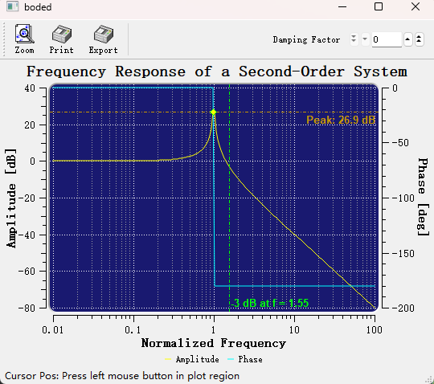

# 概述

Qt 生态里能画图的库不多，主流的为`QCustomPlot`、`Qwt`、`Qt Charts`和`KDChart`，Qt6.8之后把原来的 `Qt Charts`（2D） 与 Qt DataVisualization（3D） 合并为统一的Qt Graphs模块（注意不是Qt Graphics），底层全部基于 Qt Quick Scene Graph（QSG）+ Qt Quick 3D，彻底放弃了老旧的 Graphics-View/QPainter 管线，不过Qt Graphs 须通过 QQuickWidget 或 QQuickWindow 嵌入，必须带 QML runtime，C++支持不足，[论坛吐槽不少](https://forum.qt.io/topic/159224/qt-graphs-building-2d-plot-using-c-only),虽然Qt Graphs 是 Qt 官方“大一统”的未来，但这个未来可能3年内不会到来，且不支持win7等老系统，对嵌入式也不友好，因此，`QCustomPlot`、`Qwt`、`Qt Charts`和`KDChart`还会是最近几年绘图控件的选项。

这几个控件`QCustomPlot`最简单、美观，推广度最高，只要引入`qcustomplot.h`头文件，`qcustomplot.cpp`源文件，就可以直接使用（[官方文档](https://www.qcustomplot.com/index.php/documentation)），也支持Qt6，然而`QCustomPlot`最大的问题是其开源协议为`GPL`，有传染性，如果你使用了`QCustomPlot`，意味着你的软件也要成为`GPL`，这对商业非常不友好。

`Qwt`是老牌的绘图控件（[官方文档](https://qwt.sourceforge.io/index.html)），有着不错的性能，但部署难，让很多人望而怯步。它的协议为`LGPL`，商业相对友好。

`Qt Charts`是Qt官方的绘图控件（[官方文档](https://doc.qt.io/qt-5/qtcharts-index.html)），效率不高(可以说很低)，不适合做科学计算，同时，Qt Charts 没有 LGPL 选项，开源版是GPLv3，只要你在项目中使用了Qt Charts，就必须 把整个项目以 GPLv3 协议开源。

`KDChart`是KDAB的绘图控件（[官方文档](https://www.kdab.com/software-technologies/developer-tools/kd-chart/)），`KDChart3.0`起是MIT协议，对商业非常友好，但渲染效果一般，一股excel2003的风格，但`KDChart`有甘特图，这是上面3款都没有的。

因此，如果你的项目需要商业用途，那么你只有`Qwt`和`KDChart3.0`两种选择，但`Qwt`作者停止更新，我个人更喜欢`Qwt`，因为`Qwt`的架构更符合软件工程原则，其大规模渲染性能更优，像`QCustomPlot`的优势是交互功能开箱即用，例如鼠标缩放，坐标轴缩放，而`Qwt`需要较多的代码来实现，但`Qwt`有着更精细的控制能力，因此在我的项目需要绘图的时候，我会选择`Qwt`，并根据我的需求添加一些自己需要的功能，改进、优化它，因此，就有了此项目。

# Qwt7.0

我在`Qwt`最后版本上进行了维护，后续我将我需要的功能添加进去，同时逐步修改、优化一些已有的功能，例如它默认的老旧样式

项目地址为：

[Github：https://github.com/czyt1988/QWT](https://github.com/czyt1988/QWT)

[Gitee：https://gitee.com/czyt1988/QWT](https://gitee.com/czyt1988/QWT)

下面是我的目标以及目前我已经完成的一些工作：

- [x] CMake支持 
- [ ] 支持Qt6
- [ ] C++11优化
- [x] 合并为单一文件，简化引入
- [ ] 优化超大规模数据的渲染
- [ ] 提供一些集成的交互方法，让使用更简单
- [x] 美化控件
- [x] 提供Figure实现绘图的布局
- [ ] 增加寄生轴的支持，实现n个坐标轴

总之，我将继续维护`Qwt`，让其成为一个协议友好，性能优越，方便使用的Qt绘图库

# Qwt7.0的新特性

## Cmake支持

Qwt7.0已经支持`CMake`，并且未来将考虑抛弃`QMake`

安装Qwt后，你的项目只需如下即可引入Qwt，免去以往繁琐的配置和预定义宏：

```cmake
target_link_libraries(${YOU_APP_TARGET} PUBLIC qwt::qwt)
```

## 单一头文件和源文件

参考`QCustomPlot`，我把原`Qwt`整个工程合并为`QwtPlot.h`和`QwtPlot.cpp`，只要把这两个文件引入项目即可使用：

cmake示例：

```cmake
# QwtPlot依赖Core Gui Widgets Svg Concurrent OpenGL PrintSupport这几个模块，需要引入工程
find_package(QT NAMES Qt6 Qt5 COMPONENTS Core REQUIRED)
find_package(Qt${QT_VERSION_MAJOR} 5.8 COMPONENTS Core Gui Widgets Svg Concurrent OpenGL PrintSupport REQUIRED)


add_executable(YOU_APP_TARGET
    main.cpp
    QwtPlot.h
    QwtPlot.cpp
)

target_link_libraries(YOU_APP_TARGET 
    PUBLIC
    Qt${QT_VERSION_MAJOR}::Core 
    Qt${QT_VERSION_MAJOR}::Gui 
    Qt${QT_VERSION_MAJOR}::Widgets
    Qt${QT_VERSION_MAJOR}::Svg
    Qt${QT_VERSION_MAJOR}::Concurrent
    Qt${QT_VERSION_MAJOR}::OpenGL
    Qt${QT_VERSION_MAJOR}::PrintSupport
    )
```

## 美化了风格

原有的Qwt样式使用的是很老旧的浮雕风，和现代审美不符，为此我针对性的优化，qwt6.3的效果如下：



优化后的效果如下：


主要去除了默认的凹陷风格，坐标轴紧贴绘图不进行分离，总体视觉更符合现代风格

## 增加了Figure绘图容器

类似Python的matplotlib，Qwt提供了Figure绘图容器，可以很方便的进行多个绘图布局


通过新增的`QwtFigure`类，可以很方便的进行多个绘图布局,支持网格布局（类似matplotlib的subplot）

# 待办事项

## `QwtFigure`增加寄生轴功能

科学绘图经常要求多个坐标轴，例如：一个绘图区域，有多个Y轴，共享一个X轴，或者多个X轴，共享一个Y轴，目前就算`QCustomPlot`也只能实现同一个方向2个坐标轴，而不能无限多，为此，将参考matplotlib的实现，实现一个寄生轴功能，可以增加多个坐标轴

## 优化超大规模数据的渲染

针对超大规模数据，Qwt的并没有做渲染优化，虽然现在对于百万数据性能尚可，但300万以上还是能感觉到有一定卡顿，后续将采取抽稀算法，优化超大规模数据的渲染，尽量能实现千万至亿级数据的快速渲染

## 添加一些集成的交互方法

提供一些开箱即用的交互方法，例如数据拾取，数据标尺，也同时参考EChart的一些效果进行集成


# changelog

详细的日志请参阅[CHANGES.MD](./CHANGES.md)


# 绘图展示

## 基本图表

  
`examples/simpleplot`  

  
`examples/barchart`  

  
`examples/barchart`  

  
`examples/scatterplot`  

  
`examples/curvedemo`  

## 实时可视化

  
`examples/cpuplot`  

  
`examples/realtime`  

  
`examples/oscilloscope`  

## 高级图表

  
`examples/polardemo`  

  
`examples/spectrogram`  

  
`examples/spectrogram`  

  
`playground/vectorfield`  

  
`examples/stockchart`  

  
`examples/bode`  

  
`examples/friedberg`  

  
`playground/plotmatrix`  

  
`playground/scaleengine`  

  
`playground/rescaler`  

  
`playground/graphicscale`  

  
`examples/splineeditor`  

  
`examples/sysinfo`  

  
`examples/distrowatch`  

  
`examples/rasterview`  

  
`examples/rasterview`  

  
`playground/svgmap`  

## 动态演示

  
`examples/animated`  

  
`playground/curvetracker`  

  
`examples/refreshtest`  

## 样式与符号

  
`examples/legends`  

  
`playground/symbols`  

  
`playground/shapes`  

## 控件窗口

  
`examples/controls`  

  
`examples/controls`  

  
`examples/controls`  

  
`examples/controls`  

  
`examples/radio`  

  
`playground/timescale`  

## 仪表盘

  
`examples/dials`  

  
`examples/dials`  
