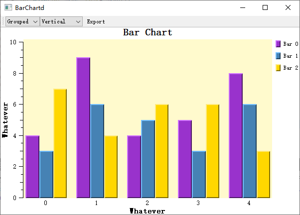
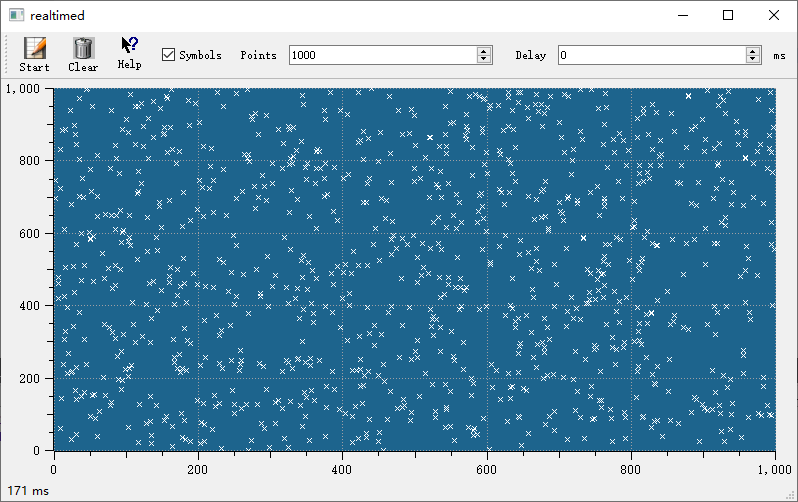
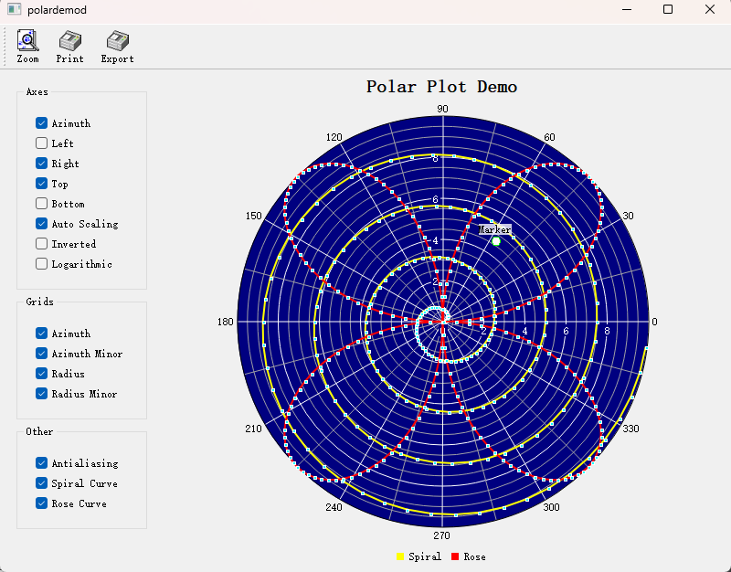
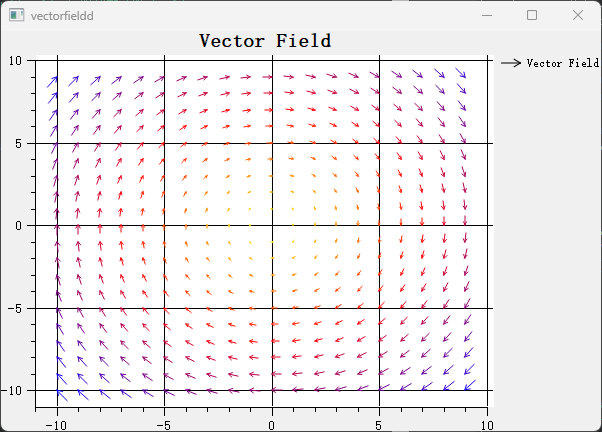
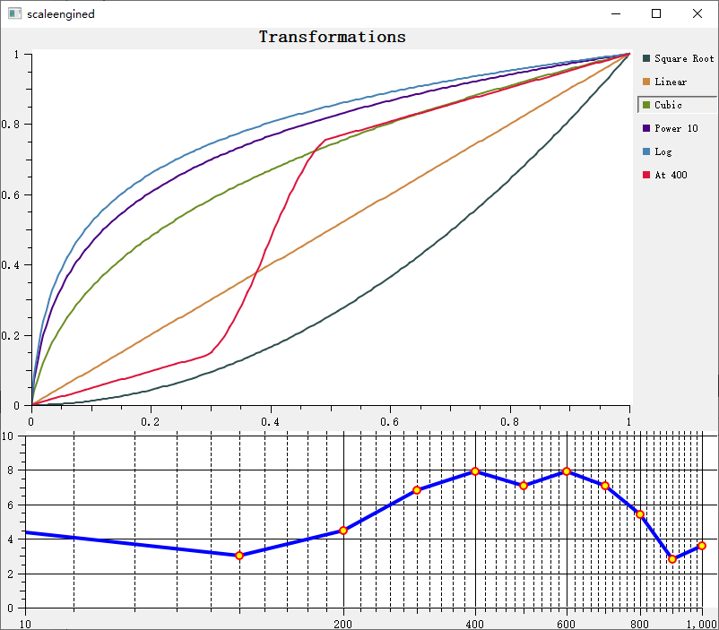
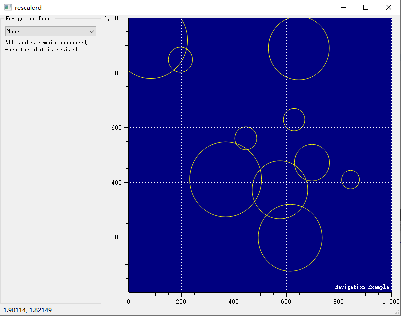
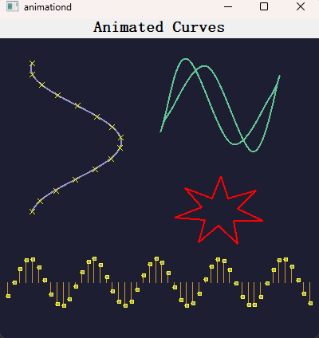
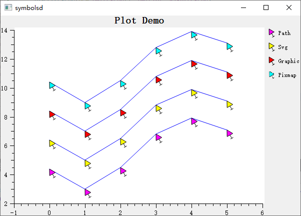
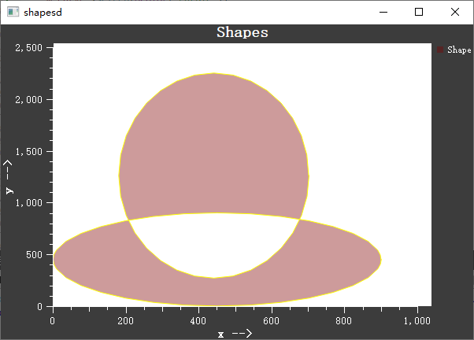
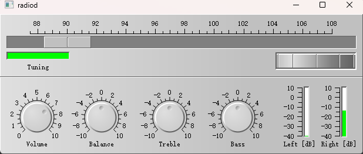

# Overview

There are only a handful of plotting libraries in the Qt ecosystem, the mainstream ones being `QCustomPlot`, `Qwt`, `Qt Charts`, and `KDChart`.  
After Qt 6.8 the former `Qt Charts` (2-D) and Qt DataVisualization (3-D) were merged into a unified Qt Graphs module (note: **not** Qt Graphics). The new back-end is built entirely on Qt Quick Scene Graph (QSG) + Qt Quick 3D, completely abandoning the aging Graphics-View / QPainter pipeline.  
However, Qt Graphs must be embedded through `QQuickWidget` or `QQuickWindow`, which means the QML runtime is mandatory and C++ support is poor—[complaints on the forum](https://forum.qt.io/topic/159224/qt-graphs-building-2d-plot-using-c-only) are numerous.  
Although Qt Graphs is Qt’s official “unified” future, that future probably will not arrive within the next three years, and it drops support for older systems such as Windows 7 and is unfriendly to embedded devices.  
Therefore, `QCustomPlot`, `Qwt`, `Qt Charts`, and `KDChart` will remain the practical choices for the next few years.

- `QCustomPlot` is the simplest and most attractive, and enjoys the widest adoption.  
  Just include `qcustomplot.h` and `qcustomplot.cpp` and you are ready to go ([official docs](https://www.qcustomplot.com/index.php/documentation)).  
  It also supports Qt 6.  
  Its biggest drawback, however, is the **GPL** license, which is highly “viral”: any program that uses `QCustomPlot` must itself be GPL—a deal-breaker for commercial use.

- `Qwt` is a veteran plotting library ([official docs](https://qwt.sourceforge.io/index.html)) with solid performance, yet its deployment difficulty deters many users.  
  It is licensed under **LGPL**, which is relatively commercial-friendly.

- `Qt Charts` is Qt’s own plotting package ([official docs](https://doc.qt.io/qt-5/qtcharts-index.html)) but its performance is poor—arguably very low—and unsuitable for scientific computing.  
  Worse, Qt Charts has **no LGPL option**; the open-source version is **GPL v3**, so using it in a project forces the entire project to be open-sourced under GPL v3.

- `KDChart` is KDAB’s plotting library ([official docs](https://www.kdab.com/software-technologies/developer-tools/kd-chart/)).  
  Starting with **KDChart 3.0** it is **MIT-licensed**, making it extremely commercial-friendly.  
  Its rendering style, however, is mediocre—reminiscent of Excel 2003.  
  A unique feature is **Gantt charts**, unavailable in the other three.

Hence, for commercial projects you are effectively limited to `Qwt` and `KDChart 3.0`.  
Because the `Qwt` author has ceased maintenance, I personally prefer `Qwt`: its architecture conforms better to software-engineering principles and its large-scale rendering performance is superior.  
`QCustomPlot` delivers out-of-the-box interactive features such as mouse zooming and axis scaling, whereas `Qwt` requires more code to achieve the same, yet it offers finer-grained control.  
When my own projects need plotting I therefore choose `Qwt`, enhancing and optimizing it with the features I need—hence this project.

# Qwt7.0

I have taken over maintenance of the final official `Qwt` release, adding the features I need while gradually refining existing ones, e.g., its outdated default styling.

Project repositories:

- [GitHub: https://github.com/czyt1988/QWT](https://github.com/czyt1988/QWT)  
- [Gitee: https://gitee.com/czyt1988/QWT](https://gitee.com/czyt1988/QWT)

Goals and current progress:

- [x] CMake support  
- [ ] Qt 6 support  
- [ ] C++11 modernization  
- [x] Merged into single header/source for easier inclusion  
- [ ] Optimize rendering for ultra-large data sets  
- [ ] Provide integrated interaction helpers for simpler usage  
- [x] Modernized visual style  
- [x] Figure class for layout management  
- [ ] Add parasite-axis support for unlimited axes

In short, I will keep maintaining `Qwt` so it becomes a license-friendly, high-performance, and easy-to-use Qt plotting library.

# New Features in Qwt7.0

## CMake Support

Qwt7.0 now supports **CMake**; `qmake` may be dropped in the future.  
After installing Qwt you can simply link it in your project:

```cmake
target_link_libraries(${YOUR_APP_TARGET} PUBLIC qwt::qwt)
```

## Single Header & Source File

Following the example of `QCustomPlot`, I have merged the entire `Qwt` library into `QwtPlot.h` and `QwtPlot.cpp`.  
Drop these two files into your project and you are ready to go.

Example `CMakeLists.txt`:

```cmake
# QwtPlot requires Core Gui Widgets Svg Concurrent OpenGL PrintSupport
find_package(QT NAMES Qt6 Qt5 COMPONENTS Core REQUIRED)
find_package(Qt${QT_VERSION_MAJOR} 5.8 COMPONENTS Core Gui Widgets Svg Concurrent OpenGL PrintSupport REQUIRED)

add_executable(YOUR_APP_TARGET
    main.cpp
    QwtPlot.h
    QwtPlot.cpp
)

target_link_libraries(YOUR_APP_TARGET
    PUBLIC
    Qt${QT_VERSION_MAJOR}::Core
    Qt${QT_VERSION_MAJOR}::Gui
    Qt${QT_VERSION_MAJOR}::Widgets
    Qt${QT_VERSION_MAJOR}::Svg
    Qt${QT_VERSION_MAJOR}::Concurrent
    Qt${QT_VERSION_MAJOR}::OpenGL
    Qt${QT_VERSION_MAJOR}::PrintSupport
)
```

## Modernized Visual Style

The original Qwt style used an outdated beveled look inconsistent with modern aesthetics.  
I therefore redesigned it.  
Qwt 6.3:


Qwt 7.0:


Key changes: removed the default sunken style, placed axes flush against the plot area, overall appearance now aligns with contemporary design.

## Added Figure Container

Inspired by Python’s matplotlib, Qwt now provides a Figure container for effortless multi-plot layouts:


The new `QwtFigure` class supports grid layouts (similar to matplotlib’s subplot).

# To-Do List

## Parasite-Axis Support in `QwtFigure`

Scientific plotting often requires multiple axes, e.g., multiple Y axes sharing one X axis, or vice versa.  
Currently even `QCustomPlot` only supports two axes in the same direction; we will implement parasite axes to allow an arbitrary number, following matplotlib’s approach.

## Optimize Rendering for Ultra-Large Data Sets

Qwt performs acceptably up to a few million points, but begins to stutter beyond 3 million.  
We will introduce a decimation algorithm to handle tens or even hundreds of millions of points efficiently.

## Integrated Interaction Helpers

Provide out-of-the-box helpers such as data picking and rulers, and incorporate effects inspired by ECharts.

# Changelog

See [CHANGES.MD](./CHANGES.md) for detailed logs.

# Gallery

## Basic Charts

  
`examples/simpleplot`

  
`examples/barchart`

  
`examples/barchart`

  
`examples/scatterplot`

  
`examples/curvedemo`

## Real-Time Visualization

  
`examples/cpuplot`

  
`examples/realtime`

  
`examples/oscilloscope`

## Advanced Charts

  
`examples/polardemo`

  
`examples/spectrogram`

  
`examples/spectrogram`

  
`playground/vectorfield`

  
`examples/stockchart`

  
`examples/bode`

  
`examples/friedberg`

  
`playground/plotmatrix`

  
`playground/scaleengine`

  
`playground/rescaler`

  
`playground/graphicscale`

  
`examples/splineeditor`

  
`examples/sysinfo`

  
`examples/distrowatch`

  
`examples/rasterview`

  
`examples/rasterview`

  
`playground/svgmap`

## Animated Demos

  
`examples/animated`

  
`playground/curvetracker`

  
`examples/refreshtest`

## Styles & Symbols

  
`examples/legends`

  
`playground/symbols`

  
`playground/shapes`

## Control Widgets

  
`examples/controls`

  
`examples/controls`

  
`examples/controls`

  
`examples/controls`

  
`examples/radio`

  
`playground/timescale`

## Instrument Panels

  
`examples/dials`

  
`examples/dials`