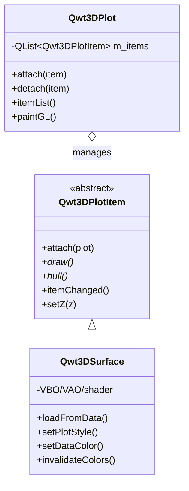

# 3D Module Refactoring Guide

This document explains why the 3D plotting module (`qwt::plot3d`) was completely refactored, what the original architecture looked like and its problems, the refactoring approach, the resulting architecture, and the benefits it brings. It is intended for developers maintaining or extending the 3D module.

!!! info "Scope"
    The refactor ships in **v7.3.5** on the `new3d` branch. For the end-user usage guide see [3D Plot Introduction](../use-guide/3d-plot.md); for the per-module conventions see [`src/plot3d/AGENTS.md`](../../src/plot3d/AGENTS.md).

## 1. Why Refactor

The 3D module originated from the standalone `QwtPlot3D` library (Qt 3/4 era) and was integrated into Qwt 7.1. Over the years it accumulated several structural debts that blocked further development:

- **Coupled responsibilities** — the 3D widget mixed window management, view transforms, *and* plotting data/style in a single class. Adding a new plot type meant editing the central widget.
- **Legacy OpenGL** — the renderer used the fixed-function pipeline (`glBegin/glEnd`, display lists, `gluSphere`/`gluCylinder`, GL matrix stack). This is deprecated, slow, and incompatible with OpenGL Core Profile required by modern Qt/ANGLE/ES.
- **Inverted dependency direction** — low-level value objects (color functors, drawables, data mappings) held back-pointers to the top-level widget, creating fragile cycles that caused dangling-pointer crashes and made testing impossible.
- **Naming inconsistency** — types lived in `namespace Qwt3D`, while the rest of the library used the `Qwt` class-prefix convention in the global scope.
- **Divergence from 2D** — the 2D module had long adopted a clean `QwtPlot` (canvas) + `QwtPlotItem` (data) split; 3D had no such separation, so patterns could not be shared.

These issues meant every new feature (themes, NaN handling, new plot styles) risked regressions elsewhere. A structural refactor was undertaken to align 3D with the 2D architecture and modern rendering practice.

## 2. Original Architecture

### 2.1 Monolithic `Plot3D` widget

The old `Plot3D` (in `namespace Qwt3D`) was a `QOpenGLWidget` subclass that held *everything* — coordinate system, transforms, mouse/keyboard handling, **and** data/color/style:

```cpp
namespace Qwt3D {

class QWT3D_EXPORT Plot3D : public QOpenGLWidget
{
    // ... view transforms, rotation/shift/scale getters ...

    // Data & style were ALSO on the widget:
    void setPlotStyle(Qwt3D::PLOTSTYLE val);
    void setDataColor(Color* col);
    void setMeshColor(Qwt3D::RGBA rgba);
    void setShading(Qwt3D::SHADINGSTYLE val);
    Qwt3D::Enrichment* addEnrichment(Qwt3D::Enrichment const&);
    void showColorLegend(bool);
    void updateData();
    // ...
};

} // namespace Qwt3D
```

`SurfacePlot` subclassed `Plot3D` and added surface-specific loading. Because data and rendering lived together, there was no way to attach multiple independent datasets to one window.

### 2.2 Legacy OpenGL rendering

The old `Drawable` base class managed GL state directly with raw fixed-function arrays:

```cpp
class QWT3D_EXPORT Drawable
{
    // ...
    virtual void saveGLState();
    virtual void restoreGLState();

protected:
    GLdouble modelMatrix[16];
    GLdouble projMatrix[16];
    GLint viewport[4];
};
```

Rendering relied on immediate mode, display lists, GLU quadrics, and the GL matrix stack (`glRotatef`, `glRasterPos3d` + `glDrawPixels` for text).

### 2.3 Reverse pointers (the "deferred smells")

Low-level classes reached *up* to the top-level widget — a dependency-direction violation:

- **`Drawable::m_plot`** — the Tier-2 drawable base baked in a `Qwt3D::Plot*` back-pointer.
- **`GridMapping::m_surface`** — the Tier-3 data source held a `SurfacePlot*`:

```cpp
class QWT3D_EXPORT GridMapping : public Mapping
{
protected:
    Qwt3D::SurfacePlot* plotWidget() const;
    void setPlotWidget(Qwt3D::SurfacePlot* pw);
};
```

Color functors likewise stored a `Qwt3D::Plot*`/`SurfacePlot*` and called back into the widget from their mutators (e.g. to trigger `invalidateColors()`), mirroring an anti-pattern 2D had deliberately avoided.

### 2.4 Original file structure

```
src/plot3d/
  qwt3d_plot.{h,cpp}            Plot3D widget (monolithic)
  qwt3d_surfaceplot.{h,cpp,_p.h} SurfacePlot subclass
  qwt3d_graphplot.h             stub base (unused)
  qwt3d_multiplot.h             stub (unused)
  qwt3d_volumeplot.h            stub (unused)
  qwt3d_meshplot.cpp            plotting logic (split across files)
  qwt3d_gridplot.cpp            plotting logic (split across files)
  qwt3d_dataviews.cpp           data view glue
  qwt3d_openglhelper.h          legacy GL state helpers
  qwt3d_drawable.{h,cpp}        base with m_plot back-pointer
  qwt3d_gridmapping.{h,cpp}     data mapping with m_surface back-pointer
  ... (axis, label, color, coordsys, theme, io, ...)
```

## 3. Problems Summary

| Problem | Consequence |
|---------|-------------|
| Monolithic widget (data + rendering + window) | Cannot attach multiple datasets; every plot type edits the central class |
| Legacy fixed-function OpenGL | Incompatible with Core Profile; slow; deprecated GLU calls |
| `namespace Qwt3D` | Naming inconsistency with rest of library |
| Reverse pointers (drawable→plot, mapping→surface, color→surface) | Dangling-pointer crashes; cycles; untestable value objects |
| Stub classes (`GraphPlot`, `MultiPlot`, `VolumePlot`) | Dead code masquerading as extensibility points |
| Split plotting logic across `meshplot.cpp`/`gridplot.cpp` | Hard to follow the surface rendering path |
| 3D diverges from 2D `QwtPlot`+`QwtPlotItem` | No shared mental model or patterns |

## 4. Refactoring Approach

The refactor was driven by five principles, applied incrementally across the `new3d` branch commits.

### 4.1 Plot + Item architecture (mirror 2D)

Adopt the same separation as 2D's `QwtPlot` + `QwtPlotItem`: the widget becomes a **pure rendering window**, and each dataset becomes an **item** that attaches to it.



`Qwt3DPlot` keeps only GL context, view transforms, lighting, coordinate system, theme, and the item list. All data/style methods (`setPlotStyle`, `setDataColor`, `loadFromData`, `setMeshColor`, `setFloorStyle`, `addEnrichment`, `setShading`, `showNormals`) moved to `Qwt3DSurface`.

### 4.2 Modern OpenGL migration

All legacy GL was replaced with modern, Core-Profile-safe rendering:

- **VBO** (`QOpenGLBuffer`) + **VAO** (`QOpenGLVertexArrayObject`) for vertex data, uploaded once and reused across frames.
- **GLSL 3.30 Core shaders** for every primitive type — 10 shader files under `src/plot3d/shaders/` (`surface`, `polygon`, `line`, `point`, `text`; vert+frag pairs).
- **CPU-side `QMatrix4x4`** matrix computation — no GL matrix stack.
- **`QOpenGLTexture`** for text labels — replacing `glRasterPos3d` + `glDrawPixels`.
- **CPU-generated geometry** for Cone/Arrow enrichments — replacing `gluCylinder`/`gluDisk`.
- `gl2ps` vector export wrapped behind `QWT3D_ENABLE_GL2PS` (Compatibility Profile fallback).
- Deleted `qwt3d_openglhelper.h`.

### 4.3 De-namespace + `Qwt3D` prefix

Removed `namespace Qwt3D` entirely. All types now use a `Qwt3D` class prefix in the global scope (e.g. `Qwt3DPlot`, `Qwt3DSurface`, `Qwt3DFunction`), matching the rest of the library.

### 4.4 Eliminate reverse pointers

Two "deferred smells" were resolved by inverting the dependency direction:

**Smell #1 — `Qwt3DDrawable::m_plot`.** Introduced a value struct `Qwt3DRenderContext` that bundles the matrices, viewport, and shared shader programs current at a given `paintGL()` call site. It is passed by const reference down the `draw()` chain, so drawables no longer need a widget pointer:

```cpp
struct QWT3D_EXPORT Qwt3DRenderContext
{
    QMatrix4x4 modelView;
    QMatrix4x4 projection;
    QSize viewport;
    QOpenGLShaderProgram* lineShader = nullptr;
    QOpenGLShaderProgram* polygonShader = nullptr;
    QOpenGLShaderProgram* textShader = nullptr;

    QPointF worldToScreen(const Triple& world) const;
    Triple screenToWorld(const QPointF& screen) const;
    Triple relativePosition(Triple rel) const;
};

class Qwt3DDrawable
{
public:
    virtual void draw(const Qwt3DRenderContext& ctx);  // no back-pointer
};
```

**Smell #2 — `Qwt3DGridMapping::m_surface`.** `create()` now *returns* data structures (`Qwt3DFunctionData` / `Qwt3DParametricData`) that the caller feeds to `Qwt3DSurface::loadFromData()`, instead of the mapping holding a surface pointer. `m_surface`, `surface()`, `setSurface()`, `assign()`, and the `Qwt3DSurface*` constructor were removed.

### 4.5 Color functors as pure value objects

Color classes (`Qwt3DColor`, `Qwt3DStandardColor`, `Qwt3DColorMapColor`) were made pure value objects — no `Qwt3DSurface*`/`Qwt3DPlot*` pointer, no callbacks, no signals. Mutators are **silent**. The z-range is *pushed in* as data by `Qwt3DSurface::pushColorRange()` rather than pulled by the functor. After mutating an attached functor, the caller must invoke `surface->invalidateColors()` — exactly mirroring 2D's "mutate the `QwtSymbol`, then call `itemChanged()`" contract.

### 4.6 Tiered dependency layering

Classes were organized into tiers; dependencies may only point downward (or same tier). The only legal upward pointer is `Qwt3DPlotItem::plot()` (item→widget), because rendering needs the widget's GL context.

| Tier | Files | Notes |
|------|-------|-------|
| 0 — pure values/tools | `qwt3d_types`, `qwt3d_global`, `qwt3d_portability`, `qwt3d_helper`, `qwt3d_autoptr`, `qwt3d_autoscaler`, `qwt3d_scale`, `qwt3d_mapping` | no 3D class pointers |
| 1 — silent value objects | `qwt3d_color`, `qwt3d_colormap_color`, `qwt3d_enrichment`(+`_std`), `qwt3d_theme` | never notify anyone |
| 2 — drawables | `qwt3d_drawable`(base), `qwt3d_label`, `qwt3d_axis`, `qwt3d_colorlegend`, `qwt3d_coordsys` | receive `Qwt3DRenderContext`, no back-pointer |
| 3 — data-source mappings | `qwt3d_gridmapping`, `qwt3d_function`, `qwt3d_parametricsurface` | `create()` returns data, no sink pointer |
| 4 — items | `qwt3d_plotitem`(base), `qwt3d_surface`(+`_p`), `qwt3d_bar`(+`_p`), `qwt3d_line3d`(+`_p`) | holds `Qwt3DPlot*` (legal) |
| 5 — widget | `qwt3d_plot`(+`_p`), `qwt3d_lighting`, `qwt3d_mousekeyboard`, `qwt3d_movements` | high holds low |
| Cross-cutting I/O | `qwt3d_io`, `qwt3d_io_reader`, `qwt3d_io_gl2ps` | takes `Qwt3DPlot*` as functor param only, never stores it |

## 5. New Architecture

### 5.1 Class responsibilities

```mermaid
flowchart TD
    subgraph Widget["Qwt3DPlot (Tier 5 — pure window)"]
        GL["GL context / view transforms / lighting / coord system / theme / item list"]
        GL -->|"paintGL: for each item sorted by z"| Loop["item->draw()"]
    end
    subgraph Item["Qwt3DPlotItem (Tier 4 — abstract)"]
        IT["attach/detach/draw/hull/z/title/itemChanged"]
    end
    subgraph Surface["Qwt3DSurface (Tier 4 — concrete)"]
        Data["data storage"]
        VBO["VBO/VAO/EBO/shader"]
        Color["Qwt3DColor functor (Tier 1)"]
        Enr["list of Qwt3DEnrichment (Tier 1)"]
        Data --> VBO
        Color --> VBO
        VBO --> draw
        Enr --> draw
    end
    Widget -->|"ctx = Qwt3DRenderContext"| Surface
    Item <|-- Surface
    Surface -->|"plot() up-ref (legal)"| Widget
```

- **`Qwt3DPlot`** — pure rendering window. Builds a `Qwt3DRenderContext` per draw phase and hands it to drawables; iterates items by z-order; exposes shared shader accessors (`lineShader()`, `polygonShader()`, `textShader()`).
- **`Qwt3DPlotItem`** — abstract base: `attach/detach/draw/hull/z/title/setVisible/itemChanged/populateLegendColors`. Mirrors `QwtPlotItem`.
- **`Qwt3DSurface`** — concrete surface item. Owns data, VBO/VAO/EBO/shader, color functor, and enrichments. Holds the methods moved off the old widget (`setPlotStyle`, `setDataColor`, `loadFromData`, `setResolution`, `setMeshColor`, `addEnrichment`, `setFloorStyle`, `setShading`, `showNormals`).
- **`Qwt3DBar`** / **`Qwt3DLine`** — additional concrete `Qwt3DPlotItem` subclasses added in v7.3.5, demonstrating the extension point: a bar chart (per-bar cuboids with flat per-face normals; 1D series or 2D grid) and a line/curve item (`Tube`/`Lines`/`Dots`; the Tube style sweeps a circular cross-section with parallel-transport framing). Like `Qwt3DSurface`, they own VBO/VAO + a `Qwt3DColor` functor and implement `draw()`/`hull()`/`populateLegendColors()`; both are wired into `Qwt3DTheme::applyToItem()`.

### 5.2 Theme system split

`Qwt3DTheme::apply()` now splits responsibilities: plot-level properties (background, coordinate colors, title, lighting) apply to `Qwt3DPlot`, while item-level properties (meshColor, dataColorPreset, plotStyle, shading, smoothMesh) apply to attached `Qwt3DSurface` items via `dynamic_cast`.

### 5.3 New file structure

```
src/plot3d/
  qwt3d_plot.{h,cpp,_p.h}       Qwt3DPlot — pure rendering window (PIMPL)
  qwt3d_plotitem.{h,cpp}        Qwt3DPlotItem — abstract item base (NEW)
  qwt3d_surface.{h,cpp,_p.h}    Qwt3DSurface — surface item (replaces surfaceplot) (NEW)
  qwt3d_bar.{h,cpp,_p.h}        Qwt3DBar — 3D bar chart item (NEW, v7.3.5)
  qwt3d_line3d.{h,cpp,_p.h}    Qwt3DLine — 3D line/curve item (Tube/Lines/Dots) (NEW, v7.3.5)
  qwt3d_render_context.{h,cpp}  Qwt3DRenderContext — value struct (NEW)
  qwt3d_drawable.{h,cpp}        base drawable, draw(ctx) — no back-pointer
  qwt3d_color.{h,cpp}           pure value-object color functors
  qwt3d_colormap_color.{h,cpp}  adapter bridging core QwtColorMap → 3D
  qwt3d_theme.{h,cpp}           theme system (plot/item split)
  qwt3d_coordsys / axis / label / colorlegend  modernized to VBO/VAO + shaders
  qwt3d_function / parametricsurface  create() returns data, targets Qwt3DSurface*
  shaders/                      surface/polygon/line/point/text vert+frag (NEW)
  AGENTS.md                     per-module AI agent guide (NEW)
```

Removed: `graphplot.h`, `multiplot.h`, `volumeplot.h`, `meshplot.cpp`, `gridplot.cpp`, `surfaceplot.*`, `dataviews.cpp`, `openglhelper.h`.

## 6. Benefits

1. **Symmetry with 2D** — `Qwt3DPlot`+`Qwt3DPlotItem` mirrors `QwtPlot`+`QwtPlotItem`; patterns (attach, z-order, `itemChanged`, value-object styles) transfer directly between 2D and 3D.
2. **Multiple datasets per window** — attach any number of `Qwt3DPlotItem`s to one `Qwt3DPlot`; the old architecture could not do this.
3. **Modern, Core-Profile OpenGL** — VBO/VAO + GLSL shaders are faster, portable to ES/ANGLE, and avoid all deprecated GLU/immediate-mode calls.
4. **Acyclic dependencies** — the tiered layering with a single legal up-pointer (`item→plot`) eliminates dangling-pointer crashes and makes low-level classes unit-testable in isolation.
5. **Pure value objects** — color functors and themes are silent, copyable, and self-contained, matching the 2D `QwtColorMap`/`QwtSymbol` contract.
6. **Clear extension points** — a new 3D plot type is just a new `Qwt3DPlotItem` subclass; the widget never needs editing. (The old stubs `GraphPlot`/`MultiPlot`/`VolumePlot` were deleted as dead extensibility theatre.) This was realized in v7.3.5 by `Qwt3DBar` and `Qwt3DLine`, each added as a self-contained item with no changes to `Qwt3DPlot`.
7. **Consistent naming** — dropping `namespace Qwt3D` for the `Qwt3D` class prefix unifies the library's naming convention.
8. **Unified colormap ecosystem** — `Qwt3DColorMapColor` bridges the core module's 22 scientific colormap presets (viridis, plasma, …) directly onto 3D surfaces, so 2D and 3D share one color system.

## 7. Migration Reference

| Old (v7.3.4) | New (v7.3.5) |
|--------------|--------------|
| `Qwt3D::Plot3D` | `Qwt3DPlot` |
| `Qwt3D::SurfacePlot` | `Qwt3DSurface` (item) |
| `Qwt3D::Function` | `Qwt3DFunction` (targets `Qwt3DSurface*`) |
| `Qwt3D::ParametricSurface` | `Qwt3DParametricSurface` |
| `Qwt3D::CoordinateSystem` | `Qwt3DCoordinateSystem` |
| `Qwt3D::Axis` | `Qwt3DAxis` |
| `Qwt3D::ColorLegend` | `Qwt3DColorLegend` |
| `Qwt3D::Color` | `Qwt3DColor` |
| `Qwt3D::StandardColor` | `Qwt3DStandardColor` |
| `Qwt3D::ColorMapColor` | `Qwt3DColorMapColor` |
| `Qwt3D::Drawable` | `Qwt3DDrawable` |
| `Qwt3D::Label` | `Qwt3DLabel` |
| `Qwt3D::GridMapping` | `Qwt3DGridMapping` |
| `Qwt3D::Scale` / `AutoScaler` / `Enrichment` / `Mapping` | `Qwt3DScale` / `Qwt3DAutoScaler` / `Qwt3DEnrichment` / `Qwt3DMapping` |
| `plot->setPlotStyle(...)` | `surface->setPlotStyle(...)` |
| `plot->setDataColor(...)` | `surface->setDataColor(...)` |
| `plot->loadFromData(...)` | `surface->loadFromData(...); surface->attach(plot)` |
| `plot->updateData()` | `plot->update()` or `item->itemChanged()` |
| `plot->setCoordinateStyle(...)` | use `Qwt3DCoordinateSystem` API directly |
| `SIGNAL()/SLOT()` connects | new-style `connect()` function pointers |

!!! warning "Breaking change"
    This is a source-incompatible refactor. Existing 3D user code must migrate call sites from widget-level data/style APIs to the corresponding `Qwt3DSurface` item APIs. See the [changelog](../../CHANGES.md) for the full list.

## 8. Conclusion

The refactor converts the 3D module from a legacy, monolithic, fixed-function widget into a modern Plot+Item architecture with Core-Profile OpenGL and acyclic, tiered dependencies. It aligns 3D with the 2D module's proven design, makes the rendering path portable and fast, and establishes clear, safe extension points for future 3D plot types — all while sharing the unified color/theme ecosystem across 2D and 3D.
