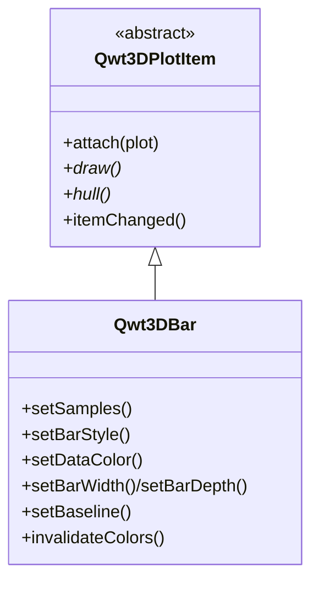

# 3D Bar Chart - Qwt3DBar

`Qwt3DBar` is a 3D plot item for drawing bar charts in 3D space. Each sample becomes an axis-aligned cuboid ("bar") whose height encodes a scalar value. It supports both 1D series of bars and 2D grids (3D histograms / "bar3"), with per-bar colormap coloring, lit flat shading, and wireframe/edge overlays.

For an overview of the 3D module see [3D Plot Introduction](3d-plot.md). `Qwt3DBar` is a `Qwt3DPlotItem` and follows the same attach/draw/hull contract as `Qwt3DSurface`.

## Key Features

- **Two data shapes** — 1D series (bars placed freely on the xy-plane) and 2D grid (3D histogram over an x/y domain)
- **Lit solid geometry** — per-bar cuboids with flat per-face normals, responding to `Qwt3DPlot::enableLighting()` (Blinn-Phong)
- **Three styles** — `Filled`, `FilledMesh` (filled + edge lines), `Wireframe`
- **Per-bar color** — driven by a `Qwt3DColor` functor (typically by height z), with full colormap-preset support via `Qwt3DColorMapColor`
- **Configurable geometry** — baseline and auto footprint (bar width/depth = 80% of spacing by default)
- **Theme integration** — picked up automatically by `Qwt3DTheme::applyToItem()`

## Basic Concepts

### Data Shapes

| Shape | `setSamples` overload | Use case |
|-------|------------------------|----------|
| 1D series | `setSamples(QVector<QwtPoint3D>)` or `(x, heights)` | Bars along an axis / scattered bars |
| 2D grid | `setSamples(double** z, cols, rows, minX, maxX, minY, maxY)` or `(Qwt3DFunctionData)` | 3D histogram (bar3) |

For the 1D series, `(x, y)` is the bar footprint center and `z` is the height. For the 2D grid, `z[i][j]` is the height at grid node `(xi, yj)`.

### Rendering Styles

| Style | Description |
|-------|-------------|
| `Qwt3DBar::Filled` | Filled bars, no edges |
| `Qwt3DBar::FilledMesh` | Filled bars + separately colored edge lines (default) |
| `Qwt3DBar::Wireframe` | Edge lines only |

### Architecture



`Qwt3DBar` reuses the lit `surface` shader (`:/shaders/surface.vert/frag`); each bar is emitted as 6 flat-normal faces (24 vertices, 36 triangle indices). It owns its VBO/VAO/EBO and a `Qwt3DColor` functor, exactly like `Qwt3DSurface`.

## Usage

The 3D bar chart example is located at: `examples/3D/bar3D`.

### 1. 2D Grid Bar Chart (3D histogram)

```cpp
#include <qwt3d_plot.h>
#include <qwt3d_bar.h>
#include <qwt3d_colormap_color.h>

Qwt3DPlot* plot = new Qwt3DPlot();
plot->setTitle("Gaussian peak as 3D bars");

Qwt3DBar* bars = new Qwt3DBar();
bars->attach(plot);

// 9x9 grid of bar heights over [-2,2] x [-2,2]
const int cols = 9, rows = 9;
const double minX = -2, maxX = 2, minY = -2, maxY = 2;
QVector<QVector<double>> z(cols, QVector<double>(rows));
for (int i = 0; i < cols; ++i)
    for (int j = 0; j < rows; ++j) {
        const double x = minX + (maxX - minX) * i / (cols - 1);
        const double y = minY + (maxY - minY) * j / (rows - 1);
        z[i][j] = std::exp(-(x * x + y * y) / 1.5);
    }
std::vector<double*> ptrs(cols);
for (int i = 0; i < cols; ++i)
    ptrs[i] = z[i].data();
bars->setSamples(ptrs.data(), cols, rows, minX, maxX, minY, maxY);

bars->setBarStyle(Qwt3DBar::FilledMesh);
bars->setDataColor(new Qwt3DColorMapColor("viridis"));
bars->setBaseline(0.0);

plot->enableLighting(true);
plot->setRotation(35, 0, 25);
plot->show();
```

### 2. 1D Series of Bars

```cpp
// Bars along the x axis, y = 0, height = h[i]
QVector<double> x = {0, 1, 2, 3, 4};
QVector<double> h = {1.2, 2.3, 0.8, 3.1, 1.7};
bars->setSamples(x, h);

// Or place bars freely in the xy-plane (x,y = footprint center, z = height)
QVector<QwtPoint3D> pts;
pts << QwtPoint3D(0, 0, 1.2) << QwtPoint3D(1, 1, 2.3) << QwtPoint3D(2, 0, 0.8);
bars->setSamples(pts);
```

### 3. Bar Geometry: Footprint and Baseline

```cpp
// Explicit bar footprint (world units). <= 0 means auto = 80% of spacing.
bars->setBarWidth(0.7);
bars->setBarDepth(0.7);

// Baseline: the z where bars start (default 0). Negative heights make a
// bar extend downward from the baseline.
bars->setBaseline(0.0);
```

### 4. Coloring

```cpp
// Per-bar colormap by height (default behavior). Reuse any of the 22 presets.
bars->setDataColor(new Qwt3DColorMapColor("plasma"));

// Mutating an attached functor in place (e.g. alpha) requires a rebuild:
auto* cm = new Qwt3DColorMapColor("viridis");
bars->setDataColor(cm);
cm->setAlpha(0.8);          // silent mutator
bars->invalidateColors();   // trigger VBO color rebuild
```

### 5. Switching Styles

```cpp
bars->setBarStyle(Qwt3DBar::Filled);      // solid only
bars->setBarStyle(Qwt3DBar::FilledMesh);  // solid + edge lines (default)
bars->setBarStyle(Qwt3DBar::Wireframe);   // edges only
bars->setMeshColor(RGBA(0.1, 0.1, 0.1, 0.4));
bars->setMeshLineWidth(1.0);
```

### 6. Theme & Coordinate System

```cpp
// Apply a theme — Qwt3DBar is handled by Qwt3DTheme::applyToItem().
plot->applyTheme(Qwt3DTheme::Scientific);

// Tune axis tick length (per-axis, anisotropy-proof):
plot->coordinates()->setTicLengthScale(0.02);
```

## Core Methods Summary

| Method | Description |
|--------|-------------|
| `setSamples(...)` | Load bar data (1D or 2D grid, see Data Shapes) |
| `setBarWidth(w)` / `setBarDepth(d)` | Bar footprint (<= 0 = auto, 80% of spacing) |
| `setBaseline(z)` | Bar bottom z (default 0) |
| `setBarStyle(BarStyle)` | `Filled` / `FilledMesh` / `Wireframe` |
| `setDataColor(Qwt3DColor*)` | Per-bar color functor (takes ownership) |
| `dataColor()` | Get the color functor |
| `setMeshColor(RGBA)` / `setMeshLineWidth(double)` | Edge line appearance |
| `invalidateColors()` | Rebuild VBO colors after mutating the functor in place |
| `hull()` | Bounding box (used by the plot to frame the coordinate system) |
| `draw()` / `populateLegendColors()` | `Qwt3DPlotItem` interface |

!!! tip "Tips"
    - Keep grids modest (a few thousand bars) — each bar emits 24 vertices.
    - Use `FilledMesh` with a semi-transparent mesh color for crisp edges without clutter.
    - `enableLighting(true)` greatly improves the 3D read of flat-shaded bars.
    - For anisotropic data, call `plot->coordinates()->setTicLengthScale(...)` so axis ticks stay proportional.

!!! example "Related Examples"
    - 3D bar chart: `examples/3D/bar3D`
