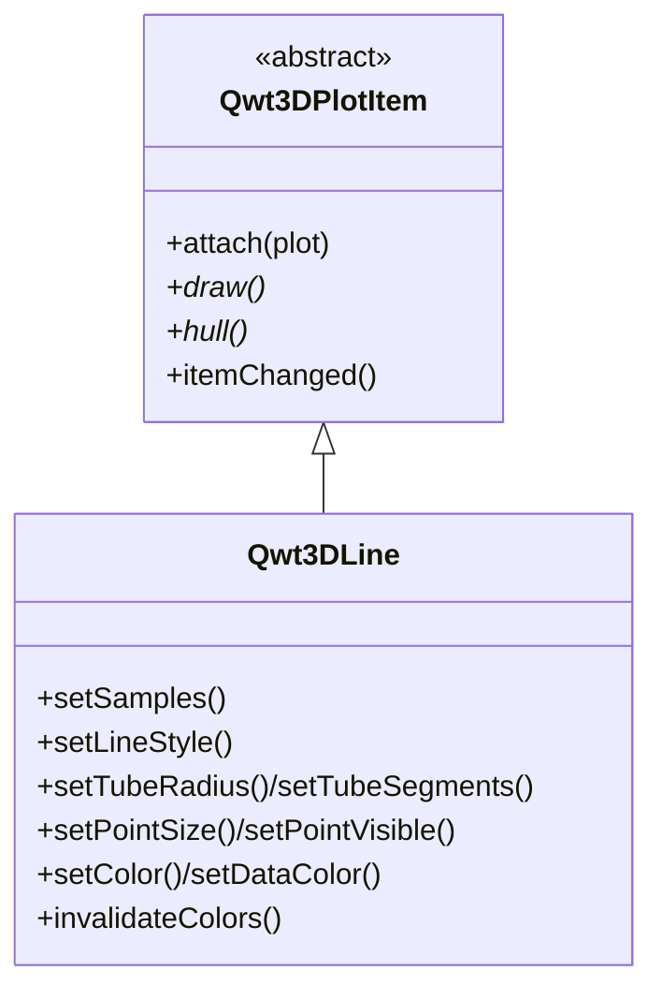

# 3D Line Plot - Qwt3DLine

`Qwt3DLine` is a 3D plot item for drawing polylines (curves) through 3D space. It accepts a series of `QwtPoint3D` samples and renders them as a connected curve, with three rendering styles ranging from a thin GL line to a lit solid tube.

For an overview of the 3D module see [3D Plot Introduction](3d-plot.md). `Qwt3DLine` is a `Qwt3DPlotItem` and follows the same attach/draw/hull contract as `Qwt3DSurface`.

## Key Features

- **Three styles** — `Tube` (default, lit solid), `Lines` (thin GL line), `Dots` (point markers)
- **Tube geometry** — polyline swept with a circular cross-section using parallel-transport framing (robust on straight segments, unlike Frenet frames), with Blinn-Phong lighting
- **Auto tube radius** — 0.5% of the hull diagonal when not set; tunable ring tessellation
- **Per-vertex coloring** — colormap along the curve (e.g. by position/arc-length) or solid color
- **Point-marker overlay** — optional markers on top of the `Lines`/`Tube` styles
- **Theme integration** — picked up by `Qwt3DTheme::applyToItem()`

## Basic Concepts

### Line Styles

| Style | Description |
|-------|-------------|
| `Qwt3DLine::Tube` | Lit solid tube swept along the polyline (default). True 3D thickness. |
| `Qwt3DLine::Lines` | Thin GL line strip (1px). Reliable, but width not adjustable in Core profile. |
| `Qwt3DLine::Dots` | Per-sample point markers with configurable point size. |

!!! note "Why Tube?"
    OpenGL Core profile does not support `glLineWidth > 1` reliably. For visibly thick 3D curves (trajectories, streamlines), use the `Tube` style, which builds real geometry.

### Architecture



The `Tube` style reuses the lit `surface` shader; `Lines`/`Dots` reuse the shared `lineShader()`/`pointShader()` exposed by `Qwt3DPlot`. Data is stored as a `QwtSeriesData<QwtPoint3D>` (the core module's `QwtPoint3DSeriesData`).

## Usage

The 3D line plot example is located at: `examples/3D/line3D`.

### 1. Basic Tube Curve (helix)

```cpp
#include <qwt3d_plot.h>
#include <qwt3d_line3d.h>
#include <qwt3d_colormap_color.h>

Qwt3DPlot* plot = new Qwt3DPlot();
plot->setTitle("3D helix");

Qwt3DLine* line = new Qwt3DLine();
line->attach(plot);

QVector<QwtPoint3D> samples;
for (int i = 0; i < 240; ++i) {
    const double t = 4 * M_PI * i / 239;
    samples.append(QwtPoint3D(std::cos(t), std::sin(t), t));
}
line->setSamples(samples);

line->setLineStyle(Qwt3DLine::Tube);
line->setTubeRadius(0.05);
line->setTubeSegments(10);
line->setDataColor(new Qwt3DColorMapColor("plasma"));

plot->enableLighting(true);
plot->show();
```

### 2. Setting Data

```cpp
// QVector of 3D points
line->setSamples(points);

// Parallel x/y/z arrays
line->setSamples(xs, ys, zs);

// Raw pointer + count
line->setSamples(samplesPtr, count);

// Own series data object (item takes ownership)
line->setSamples(new QwtPoint3DSeriesData(points));
```

### 3. Line Styles

```cpp
line->setLineStyle(Qwt3DLine::Tube);   // lit solid tube (default)
line->setTubeRadius(0.05);             // <= 0 = auto (0.5% of hull diagonal)
line->setTubeSegments(10);             // ring tessellation (min 3)

line->setLineStyle(Qwt3DLine::Lines);  // thin GL line
line->setLineWidth(1.0);               // NOTE: > 1 not guaranteed in Core

line->setLineStyle(Qwt3DLine::Dots);   // point markers
line->setPointSize(10.0);
```

### 4. Coloring

```cpp
// Solid color (used when no data color functor is set)
line->setColor(RGBA(0.9, 0.9, 0.9, 1.0));

// Per-vertex colormap (color varies along the curve)
line->setDataColor(new Qwt3DColorMapColor("plasma"));

// Mutating an attached functor in place requires a rebuild:
auto* cm = new Qwt3DColorMapColor("plasma");
line->setDataColor(cm);
cm->setAlpha(0.9);
line->invalidateColors();
```

### 5. Point Markers Overlay

Draw point markers on top of the `Lines` or `Tube` style:

```cpp
line->setLineStyle(Qwt3DLine::Tube);
line->setPointVisible(true);   // overlay markers at each sample
line->setPointSize(8.0);
```

### 6. Theme & Coordinate System

```cpp
plot->applyTheme(Qwt3DTheme::Dark);
plot->coordinates()->setTicLengthScale(0.02);
```

## Core Methods Summary

| Method | Description |
|--------|-------------|
| `setSamples(...)` | Set the 3D point series (multiple overloads, see above) |
| `data()` / `dataSize()` | Access the series / sample count |
| `setLineStyle(LineStyle)` | `Lines` / `Tube` / `Dots` |
| `setLineWidth(w)` | GL line width (Lines style; > 1 not guaranteed in Core) |
| `setTubeRadius(r)` / `setTubeSegments(n)` | Tube cross-section (<= 0 = auto; min 3) |
| `setPointSize(s)` / `setPointVisible(bool)` | Point markers (Dots, or overlay on Lines/Tube) |
| `setColor(RGBA)` / `setDataColor(Qwt3DColor*)` | Solid or per-vertex color functor |
| `dataColor()` / `invalidateColors()` | Color functor access / rebuild trigger |
| `hull()` / `draw()` / `populateLegendColors()` | `Qwt3DPlotItem` interface |

!!! tip "Tips"
    - For trajectories/streamlines prefer `Tube` with lighting on.
    - Increase `setTubeSegments` for smoother tubes (cost: more vertices).
    - If the curve bends sharply, raise the sample density so the tube stays smooth.
    - Use `setPointVisible(true)` on a `Tube` to mark sample points.

!!! example "Related Examples"
    - 3D line plot: `examples/3D/line3D`
