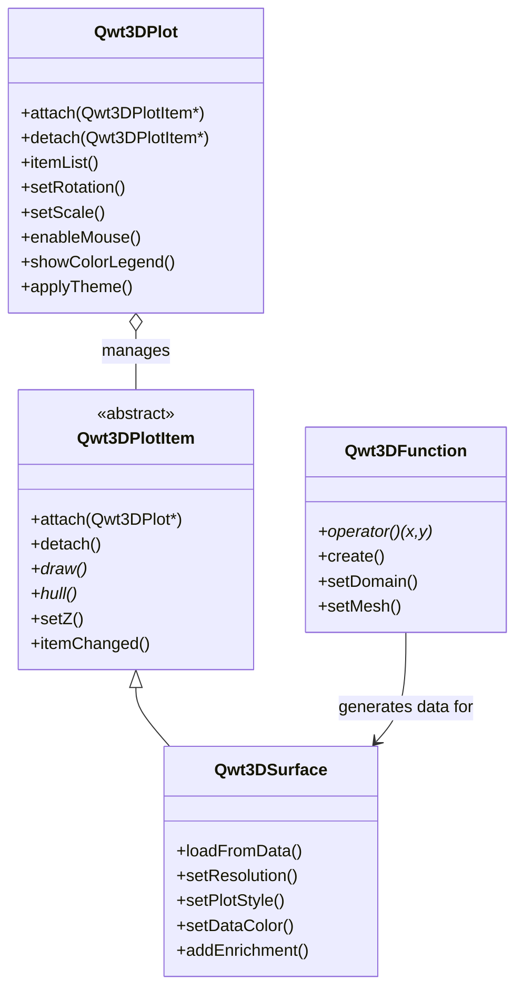

# 3D Plot Introduction

Qwt 7.1 integrates the original `QwtPlot3D` library, providing 3D data visualization capabilities. Starting from v7.3.3, the 3D module has been fully refactored to a **Plot + Item** architecture that mirrors the 2D module (`QwtPlot` + `QwtPlotItem`), with modern OpenGL rendering (VBO/VAO + GLSL 3.3 Core shaders).

## Main Features

**Features**

- ✅ **Plot + Item architecture**: `Qwt3DPlot` (rendering window) + `Qwt3DPlotItem` (drawable items), symmetric with 2D's `QwtPlot` + `QwtPlotItem`
- ✅ **Multiple plot types**: Surface plots, grid plots, parametric surfaces, function plots, etc.
- ✅ **Modern OpenGL rendering**: VBO/VAO + GLSL 3.3 Core shaders (no legacy fixed-function pipeline)
- ✅ **Interactive operations**: Supports mouse rotation, zooming, and panning
- ✅ **Lighting and materials**: Supports lighting effects and material configuration
- ✅ **Theme system**: One-click visual style switching with 10 preset themes and 22 scientific colormaps
- ✅ **Multi-item composition**: Attach multiple items to a single `Qwt3DPlot` for combined rendering

## Architecture Overview

The 3D module follows a **Plot + Item** pattern, symmetric with the 2D module:

- **`Qwt3DPlot`** is a rendering window (`QOpenGLWidget` subclass) that manages the GL context, view transforms, lighting, coordinate system, and mouse/keyboard interaction. It holds **no plotting data** itself.
- **`Qwt3DPlotItem`** is the abstract base class for all 3D drawable items. Items manage their own data, geometry, and styles. They attach to a `Qwt3DPlot` via `attach()` / `detach()`.
- A single `Qwt3DPlot` can hold **any number of items**, rendered together in one GL context.



!!! note "No Namespace"
    All 3D classes use the `Qwt3D` prefix directly in the global scope (e.g., `Qwt3DPlot`, `Qwt3DSurface`). There is no `namespace Qwt3D` — this is a breaking change from v7.3.2 and earlier.

## Core Classes

| Class | Description |
|-------|-------------|
| `Qwt3DPlot` | 3D rendering window (QOpenGLWidget), manages GL context, view, lighting, coordinate system, and item list |
| `Qwt3DPlotItem` | Abstract base class for all 3D plot items (attach/detach/draw/hull) |
| `Qwt3DSurface` | 3D surface plot item, displays continuous surfaces (handles both grid and cell data) |
| `Qwt3DBar` | 3D bar chart item (1D series or 2D grid histogram); per-bar cuboids with flat normals |
| `Qwt3DLine` | 3D line/curve item; Tube (swept cylinder, lit) / Lines / Dots styles |
| `Qwt3DFunction` | Data generator that creates surfaces from z = f(x, y) mathematical functions |
| `Qwt3DParametricSurface` | Data generator for parametric surfaces r(u, v) |
| `Qwt3DCoordinateSystem` | 3D coordinate system with 12 axes, box/frame styles |
| `Qwt3DColorLegend` | 3D color bar / legend |
| `Qwt3DTheme` | 3D theme system, encapsulates background, mesh, colormap, axes, lighting, and all visual attributes |

## Usage

The 3D plot example is located at: `examples/3D/simpleplot3D`. Screenshot:


### Basic Usage Example

```cpp
#include <qwt3d_plot.h>
#include <qwt3d_surface.h>
#include <qwt3d_function.h>

// Create rendering window
Qwt3DPlot* plot = new Qwt3DPlot();

// Create surface item
Qwt3DSurface* surface = new Qwt3DSurface();
surface->attach(plot);

// Define mathematical function
class MyFunction : public Qwt3DFunction
{
public:
    double operator()(double x, double y) override
    {
        return std::sin(x) * std::cos(y);
    }
};

// Create function and assign to surface
MyFunction* func = new MyFunction(*surface);
func->setDomain(-5, 5, -5, 5);  // x and y range
func->setMesh(50, 50);           // 50x50 grid
func->create();

// Set rotation angles
plot->setRotation(30, 0, 45);  // X, Y, Z axis rotation angles

// Display
plot->show();
```

### Data Loading

```cpp
#include <qwt3d_plot.h>
#include <qwt3d_surface.h>

// Create plot + surface item
Qwt3DPlot* plot = new Qwt3DPlot();
Qwt3DSurface* surface = new Qwt3DSurface();
surface->attach(plot);

// Allocate a 100x100 Z value array
double* zData[100];
for (int i = 0; i < 100; ++i)
    zData[i] = new double[100];
// ... fill data ...

// Load Z value data with explicit X/Y range
surface->loadFromData(zData, 100, 100, 0.0, 100.0, 0.0, 100.0);

// Set resolution (1 = use all data; higher values downsample)
surface->setResolution(1);
```

### Interactive Operations

```cpp
// Enable mouse interaction
plot->enableMouse(true);

// Mouse operations:
// - Left button drag: Rotate view
// - Middle button drag: Pan
// - Scroll wheel: Zoom

// Set scale ratio
plot->setScale(1.0, 1.0, 1.0);  // X, Y, Z scale ratio

// Set rotation angles
plot->setRotation(45, 30, 60);  // X, Y, Z axis rotation angles (degrees)
```

### Color Mapping

```cpp
#include <qwt3d_colormap_color.h>

// Enable color legend
plot->showColorLegend(true);

// Set color mapping based on Z values using a core colormap preset
surface->setDataColor(new Qwt3DColorMapColor(plot, "viridis"));
```

### Multi-Item Composition

One of the key advantages of the Plot + Item architecture is the ability to render multiple items in the same 3D space:

```cpp
Qwt3DPlot* plot = new Qwt3DPlot();

// Surface item
Qwt3DSurface* surface = new Qwt3DSurface();
surface->loadFromData(gridData, cols, rows, 0, 10, 0, 10);
surface->attach(plot);

// Second surface with different z-order
Qwt3DSurface* overlay = new Qwt3DSurface();
overlay->loadFromData(overlayData, cols2, rows2, 0, 10, 0, 10);
overlay->setZ(1.0);  // render on top
overlay->attach(plot);
```

### 3D Bar Chart (v7.3.5+)

`Qwt3DBar` renders a 3D bar chart / 3D histogram. Each sample becomes an axis-aligned cuboid ("bar") whose height encodes the scalar value. Two data shapes are supported:

- A **1D series** of bars placed freely on the xy-plane (`setSamples` with `QwtPoint3D`, where (x, y) is the footprint center and z is the height).
- A **2D grid** of bars sampled over a rectangular x/y domain (`setSamples` with a `double**` z-matrix or a `Qwt3DFunctionData`) — the classic "bar3" / 3D histogram.

Bars reuse the lit surface shader with flat per-face normals, so they respond to `enableLighting()`. Colors are driven per-bar by a `Qwt3DColor` functor (typically by height).

```cpp
#include <qwt3d_plot.h>
#include <qwt3d_bar.h>
#include <qwt3d_colormap_color.h>

Qwt3DPlot* plot = new Qwt3DPlot();

Qwt3DBar* bars = new Qwt3DBar();
bars->setSamples(zMatrix, columns, rows, minX, maxX, minY, maxY); // 2D grid
bars->setBarStyle(Qwt3DBar::FilledMesh);
bars->setDataColor(new Qwt3DColorMapColor("viridis"));
bars->setBaseline(0.0);          // bar bottom z (default 0)
bars->attach(plot);

plot->enableLighting(true);
plot->setRotation(35, 0, 25);
```

```cpp
// 1D series variant: bars along the x axis, y = 0
QVector<double> x = {0, 1, 2, 3, 4};
QVector<double> h = {1.2, 2.3, 0.8, 3.1, 1.7};
bars->setSamples(x, h);
```

### 3D Line Plot (v7.3.5+)

`Qwt3DLine` renders a polyline through 3D space. Data is a series of `QwtPoint3D` samples, set via `setSamples(...)` (overloads mirror 2D `QwtPlotCurve`). Three rendering styles are provided:

- **`Tube` (default)** — the polyline is swept with a circular cross-section to form a lit, solid tube. True 3D thickness with Blinn-Phong shading; recommended for trajectories and streamlines. Tube geometry uses parallel-transport framing (robust on straight segments, unlike Frenet frames). The radius auto-sizes to 0.5% of the hull diagonal when not set.
- **`Lines`** — thin GL line strip (1px). Reliable, but `glLineWidth > 1` is not guaranteed in OpenGL Core profile.
- **`Dots`** — per-sample point markers with configurable point size.

Colors may be solid (`setColor`) or driven per-vertex by a `Qwt3DColor` functor (`setDataColor`).

```cpp
#include <qwt3d_plot.h>
#include <qwt3d_line3d.h>
#include <qwt3d_colormap_color.h>

Qwt3DPlot* plot = new Qwt3DPlot();

QVector<QwtPoint3D> samples;
for (int i = 0; i < 240; ++i) {
    const double t = 4 * M_PI * i / 239;
    samples.append(QwtPoint3D(std::cos(t), std::sin(t), t));  // helix
}

Qwt3DLine* line = new Qwt3DLine();
line->setSamples(samples);
line->setLineStyle(Qwt3DLine::Tube);
line->setTubeRadius(0.05);
line->setTubeSegments(10);
line->setDataColor(new Qwt3DColorMapColor("plasma"));
line->attach(plot);

plot->enableLighting(true);
```

!!! note "Tube vs Lines"
    OpenGL Core profile does not support `glLineWidth > 1` reliably, so thick 3D curves must use the `Tube` style (geometry) rather than wide GL lines.

### Theme System (v7.3.1+)

The `Qwt3DTheme` class provides one-click switching of 3D plot visual styles, encapsulating all visual attributes including background color, mesh color, data colormap, axis colors, title styling, lighting presets, and shading modes.

#### Built-in Preset Themes

| Preset Name | Description |
|-------------|-------------|
| `Default` | White background + jet colormap + no lighting |
| `Dark` | Dark gray background + viridis + soft lighting |
| `Scientific` | White background + jet + studio lighting |
| `Warm` | Warm-toned background + hot colormap |
| `Cool` | Cool-toned background + cool colormap |
| `Matplotlib` | matplotlib style (viridis + soft lighting) |
| `EarthTones` | Earth tones + autumn colormap |
| `Ocean` | Ocean tones + winter colormap |
| `HighContrast` | Black background with white lines for high contrast |
| `Presentation` | Large fonts + thick lines, suitable for presentations |

#### Usage Examples

```cpp
#include <qwt3d_theme.h>

// Method 1: Use preset theme (recommended)
plot->applyTheme(Qwt3DTheme::Dark);

// Method 2: Apply theme by name
plot->applyTheme("Scientific");

// Method 3: Custom theme
Qwt3DTheme theme(Qwt3DTheme::Scientific);
theme.setDataColorPreset("plasma");  // Use one of 22 scientific colormap presets
theme.setShininess(20.0);
theme.setLightingPreset(Qwt3DTheme::Studio);
theme.apply(plot);
```

#### Colormap Presets

`Qwt3DTheme` provides 22 scientific visualization colormaps via the `core` module's `QwtColorMapPreset`:

- Perceptually uniform: `viridis`, `plasma`, `inferno`, `magma`, `cividis`
- Classic: `jet`, `hot`, `cool`, `spring`, `summer`, `autumn`, `winter`
- Grayscale: `gray`, `bone`, `copper`
- Rainbow: `rainbow`, `hsv`, `turbo`
- Diverging: `coolwarm`, `rdylbu`, `rdylgn`, `spectral`

```cpp
// Switch colormap
theme.setDataColorPreset("viridis");

// View all available presets
QStringList presets = QwtColorMapPreset::availablePresets();
```

#### Lighting Presets

| Preset | Description |
|--------|-------------|
| `NoLighting` | No lighting, solid color rendering |
| `FlatLight` | Uniform ambient light |
| `Studio` | Classic three-point lighting |
| `Outdoor` | Strong directional light + ambient |
| `Soft` | Soft diffuse lighting |

## Build Configuration

To use 3D features, enable the `QWT_CONFIG_QWTPLOT_3D` CMake option:

```cmake
find_package(qwt REQUIRED)

# Link 2D plot library
target_link_libraries(${PROJECT_NAME} PRIVATE qwt::plot)

# Link 3D plot library
target_link_libraries(${PROJECT_NAME} PRIVATE qwt::plot3d)
```

!!! warning "OpenGL Dependency"
    The 3D plot module requires **OpenGL 3.3+ Core Profile** and uses GLSL 3.30 shaders. Ensure that your graphics driver supports OpenGL 3.3 or higher. The module also bundles `gl2ps` for vector export (EPS/PDF) as a Compatibility Profile fallback.

## Core Method Summary

### Qwt3DPlot Methods

| Method | Description |
|--------|-------------|
| `attach(item)` / `detach(item)` | Attach/detach a plot item |
| `itemList()` | Get list of attached items |
| `setRotation(x, y, z)` | Set rotation angles (degrees) |
| `setScale(x, y, z)` | Set scale ratio |
| `setZoom(z)` | Set zoom level |
| `enableMouse(bool)` | Enable/disable mouse interaction |
| `showColorLegend(bool)` | Show/hide color legend |
| `applyTheme(preset)` / `applyTheme(name)` | Apply a theme |
| `setBackgroundColor(RGBA)` | Set background color |

### Qwt3DSurface Methods

| Method | Description |
|--------|-------------|
| `loadFromData(...)` | Load data array into the surface (3 overloads: grid double**, grid Triple**, cell) |
| `setResolution(int)` | Set data resolution (1 = all data, higher = downsample) |
| `setPlotStyle(PLOTSTYLE)` | Set rendering style (WIREFRAME, HIDDENLINE, FILLED, FILLEDMESH, POINTS) |
| `setDataColor(Qwt3DColor*)` | Set data color functor (takes ownership) |
| `setMeshColor(RGBA)` / `setMeshLineWidth(double)` | Configure mesh appearance |
| `setFloorStyle(FLOORSTYLE)` | Set floor projection style |
| `setShading(SHADINGSTYLE)` | Set shading mode (FLAT, GOURAUD) |
| `addEnrichment(Qwt3DEnrichment&)` | Add vertex/edge/face enrichment |
| `setNormalLength(double)` / `showNormals(bool)` | Configure surface normals |

### Qwt3DBar Methods

| Method | Description |
|--------|-------------|
| `setSamples(...)` | Load bar data (1D: `QVector<QwtPoint3D>` / `(x, heights)`; 2D grid: `double**` + domain or `Qwt3DFunctionData`) |
| `setBarWidth(w)` / `setBarDepth(d)` | Set bar footprint (<= 0 = auto, 80% of spacing) |
| `setBaseline(z)` | Set bar bottom z value (default 0) |
| `setBarStyle(BarStyle)` | `Filled`, `FilledMesh`, `Wireframe` |
| `setDataColor(Qwt3DColor*)` | Set per-bar color functor (takes ownership) |
| `setMeshColor(RGBA)` / `setMeshLineWidth(double)` | Configure edge lines |
| `invalidateColors()` | Rebuild VBO colors after mutating the functor in place |

### Qwt3DLine Methods

| Method | Description |
|--------|-------------|
| `setSamples(...)` | Set the 3D point series (`QVector<QwtPoint3D>` / parallel x,y,z arrays / `QwtSeriesData<QwtPoint3D>*`) |
| `setLineStyle(LineStyle)` | `Lines`, `Tube`, `Dots` |
| `setLineWidth(w)` | GL line width (Lines style; > 1 not guaranteed in Core) |
| `setTubeRadius(r)` / `setTubeSegments(n)` | Tube cross-section (<= 0 = auto; min 3 segments) |
| `setPointSize(s)` / `setPointVisible(bool)` | Point markers (Dots style, or overlay on Lines/Tube) |
| `setColor(RGBA)` / `setDataColor(Qwt3DColor*)` | Solid color or per-vertex color functor |
| `invalidateColors()` | Rebuild VBO colors after mutating the functor in place |

### Qwt3DFunction Methods

| Method | Description |
|--------|-------------|
| `operator()(x, y)` | Pure virtual — user implements z = f(x, y) |
| `assign(Qwt3DSurface&)` | Assign target surface item |
| `setDomain(minX, maxX, minY, maxY)` | Set X/Y data range |
| `setMesh(columns, rows)` | Set grid resolution |
| `create()` / `create(surface&)` | Generate and load surface data |

!!! tip "3D Plot Recommendations"
    - Data size should not be too large (recommended under 100x100 grid)
    - For complex surfaces, reduce resolution to improve performance
    - Use lighting effects to enhance visual appearance
    - Use `setZ()` to control draw order when multiple items overlap

!!! example "Related Examples"
    - Basic 3D plot: `examples/3D/simpleplot3D`
    - 3D axis configuration: `examples/3D/axes`
    - 3D enrichments: `examples/3D/enrichments`
    - 3D auto switch: `examples/3D/autoswitch`
    - Dynamic 3D surface (QwtFigure integration): `examples/3D/figureSurface3D`
    - 3D bar chart: `examples/3D/bar3D`
    - 3D line plot: `examples/3D/line3D`

Screenshots of 3D axis configuration, 3D enrichments, 3D auto switch, and dynamic 3D surface:


