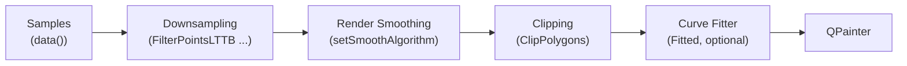
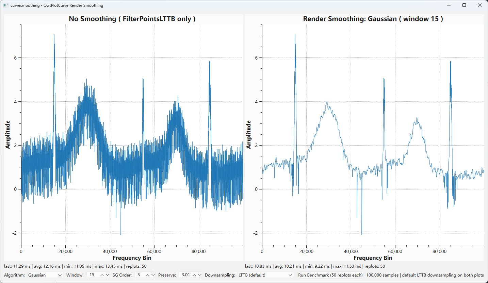

# Curve Render Smoothing

Curves with a huge number of samples — f.e. spectra or acquired signals — often show pixel level noise: the line appears as a fuzzy band of vertical jitter instead of a clean trace. The **render smoothing** of `QwtPlotCurve` removes this noise during painting, without modifying the sample data.

## Why downsampling alone does not remove the noise

With the default `FilterPointsLTTB` downsampling the samples are reduced to a min/max bucket representation that **intentionally keeps the extreme values of each bucket** ( see [Curve Downsampling](curve-downsampling.md) ). Random jitter produces extremes everywhere, so the noise survives the reduction — it has to, otherwise peaks of real data would be lost.

The `Fitted` curve attribute does not help either: it interpolates a spline **through** every point of the ( still noisy ) polyline. An interpolating curve reproduces noise exactly, it does not filter it.

Render smoothing closes this gap: it is a low pass filter that operates on the rendered polyline — combined with a **feature preservation** step that keeps the significant points ( peaks, dips ) at their original position and height, so that the curve is de-noised without being distorted.

## Position in the rendering pipeline



Properties of this position:

- Only the **y coordinates** are modified. The x coordinates — and with it the horizontal position of every feature — stay exact.
- The smoothing runs **before** an optional curve fitter, so a `Fitted` spline receives an already de-noised polyline. Both settings can be combined.
- Implemented for `QwtPlotCurve::Lines` only ( including filled curves ).

## API

```cpp
// Gaussian weighted moving window
curve->setSmoothAlgorithm( QwtPlotCurve::GaussianSmoothing );
curve->setSmoothWindow( 15 );

// or: Savitzky-Golay local polynomial regression
curve->setSmoothAlgorithm( QwtPlotCurve::SavitzkyGolaySmoothing );
curve->setSmoothWindow( 21 );
curve->setSmoothPolynomialOrder( 3 );
```

| Setter | Default | Meaning |
|--------|---------|---------|
| `setSmoothAlgorithm()` | `NoSmoothing` | `NoSmoothing`, `GaussianSmoothing` or `SavitzkyGolaySmoothing` |
| `setSmoothWindow()` | 9 | Number of neighboring polyline points per filter window. Odd values `>= 3`, even values are rounded up |
| `setSmoothPolynomialOrder()` | 3 | Polynomial order of the Savitzky-Golay fit. Limited to `1 .. window - 2`, no effect for the other algorithms |
| `setSmoothPreserveThreshold()` | 3.0 | Feature preservation in multiples of the estimated noise level ( see below ). `0` disables it and results in a pure low pass filter |

## Algorithms

### GaussianSmoothing

Each point becomes the Gaussian weighted average of its window neighborhood ( σ = window / 4, samples outside the polyline are mirrored at the borders ).

* **+** strongest noise suppression
* **−** without feature preservation narrow peaks lose height and become rounder

### SavitzkyGolaySmoothing

Fits a polynomial of the given order to each window by least squares and evaluates it at the window center. The classic filter of spectroscopy.

* **+** keeps the shape of narrow peaks better than the Gaussian
* **−** slightly less noise suppression than the Gaussian at the same window size

| | Noise suppression | Narrow peak shape ( without preservation ) |
|---|---|---|
| GaussianSmoothing | best | rounded |
| SavitzkyGolaySmoothing | good | close to original |

### Feature preservation ( peak protection )

Any linear low pass filter attenuates features that are narrower than its window — a spectrum peak would lose height, what distorts the data. Therefore both algorithms are followed by a non linear preservation step ( enabled by default, `setSmoothPreserveThreshold()` ):

1. A wide baseline ( two box passes, computed in `O(n)` ) follows the overall shape of the curve but not the narrow features.
2. The noise scale is estimated robustly as the **median** of the absolute deviations of the original points from that baseline — the typical extent of the noise band. Features do not influence this median.
3. Points deviating from the baseline by more than `threshold` multiples of the noise scale are considered core points of real features: they keep their **original position and height**. Points below the threshold are taken from the smoothed polyline, the transition is blended over a small range.

The result: the noise band collapses to a clean line, while peaks and dips stay exactly where the data puts them.

* Lower threshold → more of the curve is preserved ( more residual noise and medium spikes ).
* Higher threshold ( 4 - 6 ) → medium spikes are suppressed as well, but shallow features start to be smoothed too.
* `0` → pure linear low pass filter ( peaks and dips get attenuated ).

Measured on a 100,000 sample spectrum with random jitter, upward spikes and a deep dip ( 900 px canvas, window 15, preservation 3.0 ): the mean vertical extent of the noise band dropped from 55.2 px to 10.7 px ( Gaussian + LTTB ) resp. 2.7 px ( Gaussian + Pixel downsampling ), while the top pixel row of a narrow peak **and** the bottom pixel row of the deep dip stayed identical to the unsmoothed rendering. Without preservation the same peak lost 26 px of its height and the dip 63 px of its depth.

## Choosing the window

The smoothing runs **after** downsampling, so the window counts *polyline points*, not samples. The reduced polyline is usually only a small multiple of the canvas width ( with `FilterPointsLTTB` about 4 x canvas width ), regardless of the sample count.

Practical consequences:

* A window of 9 - 21 covers most use cases. It corresponds to a horizontal span of a few pixels to a few dozen pixels.
* Larger windows smooth more, but start to flatten real features ( and SG needs `order < window - 1` ).
* Because the window is relative to the *rendered* points, the visual effect stays consistent while zooming: zooming in spreads the samples over more pixels, the polyline gets longer and the same window covers a smaller value range.

## Performance

The filter is `O( n * w )` on the reduced polyline — a few thousand points on typical canvases. The baseline of the feature preservation is computed with prefix sums in `O( n )`, independent of its width. On a 100,000 sample spectrum the complete replot takes ~0.1 ms with or without smoothing, the overhead is not measurable in practice. Kernels ( and the SG coefficient solve ) are computed per replot, what is negligible for the window sizes in question.

The smoothing is stateless and reentrant: curves can be painted from multiple threads ( f.e. by `QwtPlotDirectPainter` or printing on background threads ) without extra synchronization.

## Example

`examples/2D/curvesmoothing` shows a 100,000 sample spectrum with random jitter:



* Left plot: default rendering ( `FilterPointsLTTB` downsampling only )
* Right plot: same samples with render smoothing
* Controls to switch algorithm, window, SG order and the preservation threshold
* Both plots display last / avg / min / max replot times, plus a benchmark button running 50 replots each

## Related

* [Curve Downsampling](curve-downsampling.md) — how the polyline is being reduced before the smoothing sees it
* [Curve](curve.md) — general curve documentation
