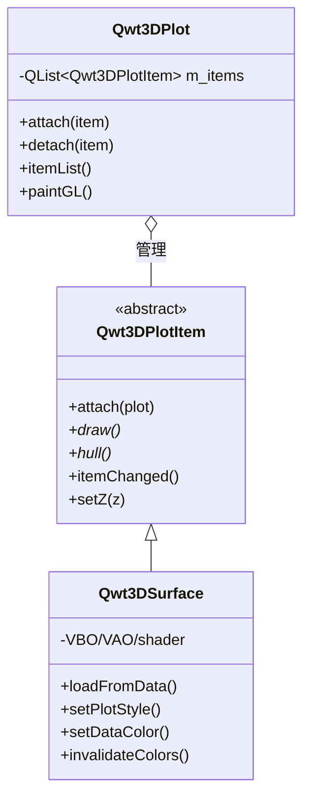

# 3D 模块重构说明

本文档说明 `qwt::plot3d` 3D 绘图模块为何进行彻底重构、原架构及其问题、重构思路、重构后的架构，以及带来的收益。面向维护或扩展 3D 模块的开发者。

!!! info "范围"
    本重构随 **v7.3.5** 发布于 `new3d` 分支。面向最终用户的使用指南见 [3D 绘图简介](../use-guide/3d-plot.md)；模块级开发约定见 [`src/plot3d/AGENTS.md`](../../src/plot3d/AGENTS.md)。

## 1. 为何要重构

3D 模块源自独立的 `QwtPlot3D` 库（Qt 3/4 时代），于 Qwt 7.1 合入。多年累积了若干结构性债务，阻碍了后续开发：

- **职责耦合** —— 3D 控件把窗口管理、视图变换、**以及**绘图数据/样式揉在同一个类里。新增一种绘图类型就得改动中心控件。
- **遗留 OpenGL** —— 渲染使用固定管线（`glBegin/glEnd`、显示列表、`gluSphere`/`gluCylinder`、GL 矩阵栈）。已被废弃、性能差，且与现代 Qt/ANGLE/ES 要求的 Core Profile 不兼容。
- **依赖方向倒置** —— 底层值对象（颜色 functor、drawable、数据映射）持有顶层控件的反向指针，形成脆弱的循环引用，导致悬空指针崩溃，且无法单元测试。
- **命名不一致** —— 类型位于 `namespace Qwt3D`，而库其余部分采用全局作用域的 `Qwt` 类前缀约定。
- **与 2D 脱节** —— 2D 模块早已采用清晰的 `QwtPlot`（画布）+ `QwtPlotItem`（数据）拆分；3D 没有这种分离，模式无法共享。

这些问题意味着每个新功能（主题、NaN 处理、新绘图样式）都有在别处引发回归的风险。因此进行了结构性重构，使 3D 与 2D 架构及现代渲染实践对齐。

## 2. 原始架构

### 2.1 单体式 `Plot3D` 控件

旧的 `Plot3D`（位于 `namespace Qwt3D`）是 `QOpenGLWidget` 子类，持有*一切* —— 坐标系、变换、鼠标/键盘处理，**以及**数据/颜色/样式：

```cpp
namespace Qwt3D {

class QWT3D_EXPORT Plot3D : public QOpenGLWidget
{
    // ... 视图变换、旋转/平移/缩放 getter ...

    // 数据与样式也挂在控件上：
    void setPlotStyle(Qwt3D::PLOTSTYLE val);
    void setDataColor(Color* col);
    void setMeshColor(Qwt3D::RGBA rgba);
    void setShading(Qwt3D::SHADINGSTYLE val);
    Qwt3D::Enrichment* addEnrichment(Qwt3D::Enrichment const&);
    void showColorLegend(bool);
    void updateData();
    // ...
};

} // namespace Qwt3D
```

`SurfacePlot` 继承 `Plot3D` 并增加表面加载。由于数据与渲染放在一起，无法在一个窗口挂载多个独立数据集。

### 2.2 遗留 OpenGL 渲染

旧的 `Drawable` 基类直接用裸的固定管线数组管理 GL 状态：

```cpp
class QWT3D_EXPORT Drawable
{
    // ...
    virtual void saveGLState();
    virtual void restoreGLState();

protected:
    GLdouble modelMatrix[16];
    GLdouble projMatrix[16];
    GLint viewport[4];
};
```

渲染依赖立即模式、显示列表、GLU 二次曲面，以及 GL 矩阵栈（`glRotatef`、文本用 `glRasterPos3d` + `glDrawPixels`）。

### 2.3 反向指针（"deferred smells"）

低层类向上*回指*顶层控件 —— 这是依赖方向的违规：

- **`Drawable::m_plot`** —— Tier-2 drawable 基类烤入了 `Qwt3D::Plot*` 反向指针。
- **`GridMapping::m_surface`** —— Tier-3 数据源持有 `SurfacePlot*`：

```cpp
class QWT3D_EXPORT GridMapping : public Mapping
{
protected:
    Qwt3D::SurfacePlot* plotWidget() const;
    void setPlotWidget(Qwt3D::SurfacePlot* pw);
};
```

颜色 functor 同样存储 `Qwt3D::Plot*`/`SurfacePlot*`，并在 mutator 里回调控件（例如触发 `invalidateColors()`），这恰恰是 2D 刻意回避的反模式。

### 2.4 原始文件结构

```
src/plot3d/
  qwt3d_plot.{h,cpp}            Plot3D 控件（单体）
  qwt3d_surfaceplot.{h,cpp,_p.h} SurfacePlot 子类
  qwt3d_graphplot.h             stub 基类（未用）
  qwt3d_multiplot.h             stub（未用）
  qwt3d_volumeplot.h            stub（未用）
  qwt3d_meshplot.cpp            绘图逻辑（分散在多文件）
  qwt3d_gridplot.cpp            绘图逻辑（分散在多文件）
  qwt3d_dataviews.cpp           数据视图胶水
  qwt3d_openglhelper.h          遗留 GL 状态工具
  qwt3d_drawable.{h,cpp}        带 m_plot 反向指针的基类
  qwt3d_gridmapping.{h,cpp}     带 m_surface 反向指针的数据映射
  ... (axis, label, color, coordsys, theme, io, ...)
```

## 3. 问题汇总

| 问题 | 后果 |
|------|------|
| 单体控件（数据+渲染+窗口） | 无法挂载多个数据集；每种绘图类型都要改中心类 |
| 遗留固定管线 OpenGL | 与 Core Profile 不兼容；慢；GLU 调用已废弃 |
| `namespace Qwt3D` | 与库其余部分命名不一致 |
| 反向指针（drawable→plot、mapping→surface、color→surface） | 悬空指针崩溃；循环引用；值对象无法测试 |
| stub 类（`GraphPlot`、`MultiPlot`、`VolumePlot`） | 伪装成扩展点的死代码 |
| 绘图逻辑分散于 `meshplot.cpp`/`gridplot.cpp` | 难以跟踪表面渲染路径 |
| 3D 与 2D `QwtPlot`+`QwtPlotItem` 脱节 | 无共享心智模型或模式 |

## 4. 重构思路

重构由五条原则驱动，在 `new3d` 分支各提交中渐进实施。

### 4.1 Plot + Item 架构（对齐 2D）

采用与 2D `QwtPlot` + `QwtPlotItem` 相同的分离：控件成为**纯渲染窗口**，每个数据集成为一个挂载其上的**item**。



`Qwt3DPlot` 只保留 GL 上下文、视图变换、光照、坐标系、主题和 item 列表。所有数据/样式方法（`setPlotStyle`、`setDataColor`、`loadFromData`、`setMeshColor`、`setFloorStyle`、`addEnrichment`、`setShading`、`showNormals`）移至 `Qwt3DSurface`。

### 4.2 现代 OpenGL 迁移

所有遗留 GL 替换为现代、Core Profile 安全的渲染：

- **VBO**（`QOpenGLBuffer`）+ **VAO**（`QOpenGLVertexArrayObject`）管理顶点数据，一次上传、跨帧复用。
- **GLSL 3.30 Core 着色器**覆盖每种图元 —— `src/plot3d/shaders/` 下 10 个着色器文件（`surface`、`polygon`、`line`、`point`、`text`；vert+frag 成对）。
- **CPU 端 `QMatrix4x4`** 矩阵计算 —— 不再用 GL 矩阵栈。
- **`QOpenGLTexture`** 渲染文本标签 —— 取代 `glRasterPos3d` + `glDrawPixels`。
- **CPU 生成几何体**用于 Cone/Arrow 扩展 —— 取代 `gluCylinder`/`gluDisk`。
- `gl2ps` 矢量导出包裹在 `QWT3D_ENABLE_GL2PS` 条件编译后（Compatibility Profile 回退）。
- 删除 `qwt3d_openglhelper.h`。

### 4.3 去命名空间 + `Qwt3D` 前缀

彻底移除 `namespace Qwt3D`。所有类型在全局作用域使用 `Qwt3D` 类前缀（如 `Qwt3DPlot`、`Qwt3DSurface`、`Qwt3DFunction`），与库其余部分一致。

### 4.4 消除反向指针

两个"deferred smell"通过反转依赖方向解决：

**Smell #1 —— `Qwt3DDrawable::m_plot`。** 引入值结构体 `Qwt3DRenderContext`，打包某次 `paintGL()` 调用点当前的矩阵、视口和共享着色器程序。它以 const 引用沿 `draw()` 链下传，drawable 不再需要控件指针：

```cpp
struct QWT3D_EXPORT Qwt3DRenderContext
{
    QMatrix4x4 modelView;
    QMatrix4x4 projection;
    QSize viewport;
    QOpenGLShaderProgram* lineShader = nullptr;
    QOpenGLShaderProgram* polygonShader = nullptr;
    QOpenGLShaderProgram* textShader = nullptr;

    QPointF worldToScreen(const Triple& world) const;
    Triple screenToWorld(const QPointF& screen) const;
    Triple relativePosition(Triple rel) const;
};

class Qwt3DDrawable
{
public:
    virtual void draw(const Qwt3DRenderContext& ctx);  // 无反向指针
};
```

**Smell #2 —— `Qwt3DGridMapping::m_surface`。** `create()` 现在*返回*数据结构（`Qwt3DFunctionData` / `Qwt3DParametricData`），由调用方喂给 `Qwt3DSurface::loadFromData()`，而非映射持有 surface 指针。`m_surface`、`surface()`、`setSurface()`、`assign()` 及带 `Qwt3DSurface` 参数的构造函数均已移除。

### 4.5 颜色 functor 作为纯值对象

颜色类（`Qwt3DColor`、`Qwt3DStandardColor`、`Qwt3DColorMapColor`）变为纯值对象 —— 无 `Qwt3DSurface*`/`Qwt3DPlot*` 指针、无回调、无信号。mutator 是**静默**的。z 范围由 `Qwt3DSurface::pushColorRange()` 作为数据*推入*，而非 functor 去拉。修改已挂载 functor 后，调用方必须调用 `surface->invalidateColors()` —— 这与 2D"修改 `QwtSymbol` 后调 `itemChanged()`"的契约完全对应。

### 4.6 分层依赖规则

类按概念分层；依赖只能向下（或同层）。唯一合法的向上指针是 `Qwt3DPlotItem::plot()`（item→控件），因为渲染需要控件暴露的 GL 上下文。

| 层 | 文件 | 说明 |
|------|-------|-------|
| 0 纯值/工具 | `qwt3d_types`、`qwt3d_global`、`qwt3d_portability`、`qwt3d_helper`、`qwt3d_autoptr`、`qwt3d_autoscaler`、`qwt3d_scale`、`qwt3d_mapping` | 无任何 3D 类指针 |
| 1 静默值对象 | `qwt3d_color`、`qwt3d_colormap_color`、`qwt3d_enrichment`(+`_std`)、`qwt3d_theme` | 不通知任何人 |
| 2 drawable | `qwt3d_drawable`(base)、`qwt3d_label`、`qwt3d_axis`、`qwt3d_colorlegend`、`qwt3d_coordsys` | 通过 `Qwt3DRenderContext` 接收资源，无反向指针 |
| 3 数据源映射 | `qwt3d_gridmapping`、`qwt3d_function`、`qwt3d_parametricsurface` | `create()` 返回数据，无汇指针 |
| 4 item | `qwt3d_plotitem`(base)、`qwt3d_surface`(+`_p`)、`qwt3d_bar`(+`_p`)、`qwt3d_line3d`(+`_p`) | 持 `Qwt3DPlot*`（合法） |
| 5 控件 | `qwt3d_plot`(+`_p`)、`qwt3d_lighting`、`qwt3d_mousekeyboard`、`qwt3d_movements` | 高持低，方向正确 |
| 横切 I/O | `qwt3d_io`、`qwt3d_io_reader`、`qwt3d_io_gl2ps` | 仅以 `Qwt3DPlot*` 为 functor 参数，不存储 |

## 5. 重构后架构

### 5.1 类职责

```mermaid
flowchart TD
    subgraph Widget["Qwt3DPlot (Tier 5 — 纯窗口)"]
        GL["GL 上下文 / 视图变换 / 光照 / 坐标系 / 主题 / item 列表"]
        GL -->|"paintGL: 按 z 序遍历 item"| Loop["item->draw()"]
    end
    subgraph Item["Qwt3DPlotItem (Tier 4 — 抽象)"]
        IT["attach/detach/draw/hull/z/title/itemChanged"]
    end
    subgraph Surface["Qwt3DSurface (Tier 4 — 具体)"]
        Data["数据存储"]
        VBO["VBO/VAO/EBO/shader"]
        Color["Qwt3DColor functor (Tier 1)"]
        Enr["list of Qwt3DEnrichment (Tier 1)"]
        Data --> VBO
        Color --> VBO
        VBO --> draw
        Enr --> draw
    end
    Widget -->|"ctx = Qwt3DRenderContext"| Surface
    Item <|-- Surface
    Surface -->|"plot() 上引（合法）"| Widget
```

- **`Qwt3DPlot`** —— 纯渲染窗口。每绘制阶段构建 `Qwt3DRenderContext` 交给 drawable；按 z 序遍历 item；暴露共享着色器访问器（`lineShader()`、`polygonShader()`、`textShader()`）。
- **`Qwt3DPlotItem`** —— 抽象基类：`attach/detach/draw/hull/z/title/setVisible/itemChanged/populateLegendColors`。对应 `QwtPlotItem`。
- **`Qwt3DSurface`** —— 具体表面 item。持有数据、VBO/VAO/EBO/shader、颜色 functor 和扩展。拥有从旧控件移来的方法（`setPlotStyle`、`setDataColor`、`loadFromData`、`setResolution`、`setMeshColor`、`addEnrichment`、`setFloorStyle`、`setShading`、`showNormals`）。
- **`Qwt3DBar`** / **`Qwt3DLine`** —— v7.3.5 新增的另外两个具体 `Qwt3DPlotItem` 子类，验证了扩展点：柱状图（逐柱立方体、逐面扁平法向；1D 序列或 2D 网格）与线/曲线 item（`Tube`/`Lines`/`Dots`；Tube 样式用 parallel-transport 标架扫掠圆形截面）。与 `Qwt3DSurface` 一样，各自持有 VBO/VAO + `Qwt3DColor` functor 并实现 `draw()`/`hull()`/`populateLegendColors()`；均已接入 `Qwt3DTheme::applyToItem()`。

### 5.2 主题系统拆分

`Qwt3DTheme::apply()` 现拆分职责：控件级属性（背景、坐标色、标题、光照）应用于 `Qwt3DPlot`，item 级属性（meshColor、dataColorPreset、plotStyle、shading、smoothMesh）通过 `dynamic_cast` 应用于已挂载的 `Qwt3DSurface` item。

### 5.3 新文件结构

```
src/plot3d/
  qwt3d_plot.{h,cpp,_p.h}       Qwt3DPlot —— 纯渲染窗口（PIMPL）
  qwt3d_plotitem.{h,cpp}        Qwt3DPlotItem —— 抽象 item 基类（新增）
  qwt3d_surface.{h,cpp,_p.h}    Qwt3DSurface —— 表面 item（替代 surfaceplot）（新增）
  qwt3d_bar.{h,cpp,_p.h}        Qwt3DBar —— 3D 柱状图 item（新增，v7.3.5）
  qwt3d_line3d.{h,cpp,_p.h}    Qwt3DLine —— 3D 线/曲线 item（Tube/Lines/Dots）（新增，v7.3.5）
  qwt3d_render_context.{h,cpp}  Qwt3DRenderContext —— 值结构体（新增）
  qwt3d_drawable.{h,cpp}        drawable 基类，draw(ctx) —— 无反向指针
  qwt3d_color.{h,cpp}           纯值对象颜色 functor
  qwt3d_colormap_color.{h,cpp}  适配器，桥接 core 的 QwtColorMap → 3D
  qwt3d_theme.{h,cpp}           主题系统（控件/item 拆分）
  qwt3d_coordsys / axis / label / colorlegend  迁移至 VBO/VAO + 着色器
  qwt3d_function / parametricsurface  create() 返回数据，面向 Qwt3DSurface*
  shaders/                      surface/polygon/line/point/text vert+frag（新增）
  AGENTS.md                     模块级 AI agent 指引（新增）
```

已删除：`graphplot.h`、`multiplot.h`、`volumeplot.h`、`meshplot.cpp`、`gridplot.cpp`、`surfaceplot.*`、`dataviews.cpp`、`openglhelper.h`。

## 6. 重构收益

1. **与 2D 对称** —— `Qwt3DPlot`+`Qwt3DPlotItem` 对应 `QwtPlot`+`QwtPlotItem`；模式（attach、z 序、`itemChanged`、值对象样式）可在 2D/3D 间直接迁移。
2. **一个窗口多个数据集** —— 可向一个 `Qwt3DPlot` 挂载任意数量的 `Qwt3DPlotItem`；旧架构无法做到。
3. **现代 Core Profile OpenGL** —— VBO/VAO + GLSL 着色器更快、可移植到 ES/ANGLE，规避所有废弃的 GLU/立即模式调用。
4. **无环依赖** —— 带单一合法上引（item→plot）的分层规则消除了悬空指针崩溃，使低层类可独立单元测试。
5. **纯值对象** —— 颜色 functor 与主题静默、可拷贝、自包含，匹配 2D `QwtColorMap`/`QwtSymbol` 契约。
6. **清晰扩展点** —— 新 3D 绘图类型只需新的 `Qwt3DPlotItem` 子类；控件无需改动。（旧的 `GraphPlot`/`MultiPlot`/`VolumePlot` stub 作为死代码已删除。）这一点在 v7.3.5 由 `Qwt3DBar` 与 `Qwt3DLine` 落地——各自作为自包含 item 加入，`Qwt3DPlot` 无任何改动。
7. **命名统一** —— 弃用 `namespace Qwt3D`、改用 `Qwt3D` 类前缀，统一了库的命名约定。
8. **统一 colormap 生态** —— `Qwt3DColorMapColor` 桥接 core 模块 22 种科学 colormap 预设（viridis、plasma……）直达 3D 表面，使 2D 与 3D 共享同一颜色系统。

## 7. 迁移对照

| 旧（v7.3.4） | 新（v7.3.5） |
|--------------|--------------|
| `Qwt3D::Plot3D` | `Qwt3DPlot` |
| `Qwt3D::SurfacePlot` | `Qwt3DSurface`（item） |
| `Qwt3D::Function` | `Qwt3DFunction`（面向 `Qwt3DSurface*`） |
| `Qwt3D::ParametricSurface` | `Qwt3DParametricSurface` |
| `Qwt3D::CoordinateSystem` | `Qwt3DCoordinateSystem` |
| `Qwt3D::Axis` | `Qwt3DAxis` |
| `Qwt3D::ColorLegend` | `Qwt3DColorLegend` |
| `Qwt3D::Color` | `Qwt3DColor` |
| `Qwt3D::StandardColor` | `Qwt3DStandardColor` |
| `Qwt3D::ColorMapColor` | `Qwt3DColorMapColor` |
| `Qwt3D::Drawable` | `Qwt3DDrawable` |
| `Qwt3D::Label` | `Qwt3DLabel` |
| `Qwt3D::GridMapping` | `Qwt3DGridMapping` |
| `Qwt3D::Scale` / `AutoScaler` / `Enrichment` / `Mapping` | `Qwt3DScale` / `Qwt3DAutoScaler` / `Qwt3DEnrichment` / `Qwt3DMapping` |
| `plot->setPlotStyle(...)` | `surface->setPlotStyle(...)` |
| `plot->setDataColor(...)` | `surface->setDataColor(...)` |
| `plot->loadFromData(...)` | `surface->loadFromData(...); surface->attach(plot)` |
| `plot->updateData()` | `plot->update()` 或 `item->itemChanged()` |
| `plot->setCoordinateStyle(...)` | 直接使用 `Qwt3DCoordinateSystem` API |
| `SIGNAL()/SLOT()` 连接 | 新式函数指针 `connect()` |

!!! warning "破坏性变更"
    本重构源码不兼容。现有 3D 用户代码须将控件级数据/样式 API 调用点迁移到对应的 `Qwt3DSurface` item API。完整列表见 [更新日志](../../CHANGES-CN.md)。

## 8. 总结

重构将 3D 模块从遗留、单体、固定管线的控件，转变为现代 Plot+Item 架构，采用 Core Profile OpenGL 与无环分层依赖。它使 3D 与 2D 模块的成熟设计对齐，让渲染路径可移植且高效，并为未来 3D 绘图类型建立了清晰、安全的扩展点 —— 同时在 2D 与 3D 间共享统一的颜色/主题生态。
