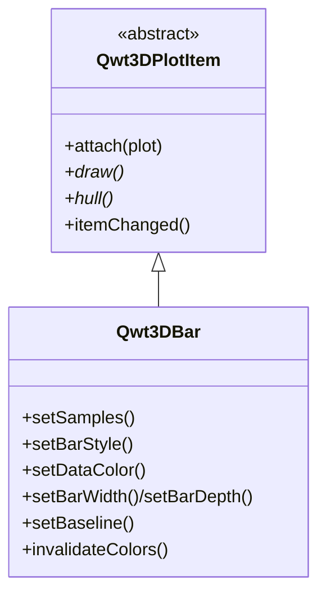

# 3D柱状图 - Qwt3DBar

`Qwt3DBar` 是在 3D 空间中绘制柱状图的 3D 绘图 item。每个样本变成一个轴对齐的长方体（"柱"），其高度编码标量值。支持 1D 序列柱与 2D 网格（3D 直方图 / "bar3"），可按柱做 colormap 着色、带光照的扁平着色、以及线框/边线叠加。

3D 模块总览见 [3D绘图简介](3d-plot.md)。`Qwt3DBar` 是 `Qwt3DPlotItem`，遵循与 `Qwt3DSurface` 相同的 attach/draw/hull 契约。

## 主要功能特性

- **两种数据形态** —— 1D 序列（柱自由放置在 xy 平面）与 2D 网格（在 x/y 域上的 3D 直方图）
- **带光照的实体几何** —— 逐柱立方体、逐面扁平法向，响应 `Qwt3DPlot::enableLighting()`（Blinn-Phong）
- **三种样式** —— `Filled`、`FilledMesh`（填充+边线）、`Wireframe`
- **逐柱颜色** —— 由 `Qwt3DColor` functor 驱动（通常按高度 z），通过 `Qwt3DColorMapColor` 支持全部 colormap 预设
- **几何可配** —— baseline 与自动底面（柱宽/深默认取间距的 80%）
- **主题集成** —— 由 `Qwt3DTheme::applyToItem()` 自动接管

## 基本概念

### 数据形态

| 形态 | `setSamples` 重载 | 用途 |
|------|-------------------|------|
| 1D 序列 | `setSamples(QVector<QwtPoint3D>)` 或 `(x, heights)` | 沿轴排列 / 散布柱 |
| 2D 网格 | `setSamples(double** z, cols, rows, minX, maxX, minY, maxY)` 或 `(Qwt3DFunctionData)` | 3D 直方图（bar3） |

1D 序列中，`(x, y)` 为柱底中心，`z` 为高度；2D 网格中，`z[i][j]` 为网格节点 `(xi, yj)` 处的高度。

### 渲染样式

| 样式 | 说明 |
|------|------|
| `Qwt3DBar::Filled` | 仅填充，无边线 |
| `Qwt3DBar::FilledMesh` | 填充 + 单独颜色的边线（默认） |
| `Qwt3DBar::Wireframe` | 仅边线 |

### 架构



`Qwt3DBar` 复用带光照的 `surface` 着色器（`:/shaders/surface.vert/frag`）；每根柱发射为 6 个扁平法向面（24 顶点、36 三角索引）。它自持 VBO/VAO/EBO 与 `Qwt3DColor` functor，与 `Qwt3DSurface` 完全一致。

## 使用方法

3D 柱状图示例位于：`examples/3D/bar3D`。

### 1. 2D 网格柱状图（3D 直方图）

```cpp
#include <qwt3d_plot.h>
#include <qwt3d_bar.h>
#include <qwt3d_colormap_color.h>

Qwt3DPlot* plot = new Qwt3DPlot();
plot->setTitle("Gaussian peak as 3D bars");

Qwt3DBar* bars = new Qwt3DBar();
bars->attach(plot);

// 9x9 网格，域 [-2,2] x [-2,2]
const int cols = 9, rows = 9;
const double minX = -2, maxX = 2, minY = -2, maxY = 2;
QVector<QVector<double>> z(cols, QVector<double>(rows));
for (int i = 0; i < cols; ++i)
    for (int j = 0; j < rows; ++j) {
        const double x = minX + (maxX - minX) * i / (cols - 1);
        const double y = minY + (maxY - minY) * j / (rows - 1);
        z[i][j] = std::exp(-(x * x + y * y) / 1.5);
    }
std::vector<double*> ptrs(cols);
for (int i = 0; i < cols; ++i)
    ptrs[i] = z[i].data();
bars->setSamples(ptrs.data(), cols, rows, minX, maxX, minY, maxY);

bars->setBarStyle(Qwt3DBar::FilledMesh);
bars->setDataColor(new Qwt3DColorMapColor("viridis"));
bars->setBaseline(0.0);

plot->enableLighting(true);
plot->setRotation(35, 0, 25);
plot->show();
```

### 2. 1D 序列柱

```cpp
// 柱沿 x 轴排列，y = 0，高度 = h[i]
QVector<double> x = {0, 1, 2, 3, 4};
QVector<double> h = {1.2, 2.3, 0.8, 3.1, 1.7};
bars->setSamples(x, h);

// 或在 xy 平面自由放置（x,y 为柱底中心，z 为高度）
QVector<QwtPoint3D> pts;
pts << QwtPoint3D(0, 0, 1.2) << QwtPoint3D(1, 1, 2.3) << QwtPoint3D(2, 0, 0.8);
bars->setSamples(pts);
```

### 3. 柱几何：底面与基线

```cpp
// 显式底面（世界单位）。<= 0 表示自动 = 间距的 80%
bars->setBarWidth(0.7);
bars->setBarDepth(0.7);

// 基线：柱起始 z（默认 0）。负高度使柱从基线向下延伸。
bars->setBaseline(0.0);
```

### 4. 着色

```cpp
// 按高度的逐柱 colormap（默认行为）。可复用 22 种预设。
bars->setDataColor(new Qwt3DColorMapColor("plasma"));

// 就地修改已挂载 functor（如 alpha）需触发重建：
auto* cm = new Qwt3DColorMapColor("viridis");
bars->setDataColor(cm);
cm->setAlpha(0.8);          // 静默 mutator
bars->invalidateColors();   // 触发 VBO 颜色重建
```

### 5. 切换样式

```cpp
bars->setBarStyle(Qwt3DBar::Filled);      // 仅实体
bars->setBarStyle(Qwt3DBar::FilledMesh);  // 实体 + 边线（默认）
bars->setBarStyle(Qwt3DBar::Wireframe);   // 仅边线
bars->setMeshColor(RGBA(0.1, 0.1, 0.1, 0.4));
bars->setMeshLineWidth(1.0);
```

### 6. 主题与坐标系

```cpp
// 应用主题 —— Qwt3DBar 由 Qwt3DTheme::applyToItem() 处理。
plot->applyTheme(Qwt3DTheme::Scientific);

// 调节轴刻度长度（逐轴、各向异性免疫）：
plot->coordinates()->setTicLengthScale(0.02);
```

## 核心方法总结

| 方法 | 说明 |
|------|------|
| `setSamples(...)` | 加载柱数据（1D 或 2D 网格，见数据形态） |
| `setBarWidth(w)` / `setBarDepth(d)` | 柱底面（<= 0 = 自动，间距 80%） |
| `setBaseline(z)` | 柱底 z（默认 0） |
| `setBarStyle(BarStyle)` | `Filled` / `FilledMesh` / `Wireframe` |
| `setDataColor(Qwt3DColor*)` | 逐柱颜色 functor（获取所有权） |
| `dataColor()` | 获取颜色 functor |
| `setMeshColor(RGBA)` / `setMeshLineWidth(double)` | 边线外观 |
| `invalidateColors()` | 就地修改 functor 后重建 VBO 颜色 |
| `hull()` | 包围盒（供 plot 构建坐标系） |
| `draw()` / `populateLegendColors()` | `Qwt3DPlotItem` 接口 |

!!! tip "建议"
    - 网格不宜过大（数千柱以内）——每柱 24 顶点。
    - 用 `FilledMesh` 配半透明 mesh 色可获得清晰边线又不杂乱。
    - `enableLighting(true)` 显著改善扁平着色柱的 3D 感。
    - 各向异性数据时调用 `plot->coordinates()->setTicLengthScale(...)` 让刻度保持比例。

!!! example "相关示例"
    - 3D 柱状图：`examples/3D/bar3D`
