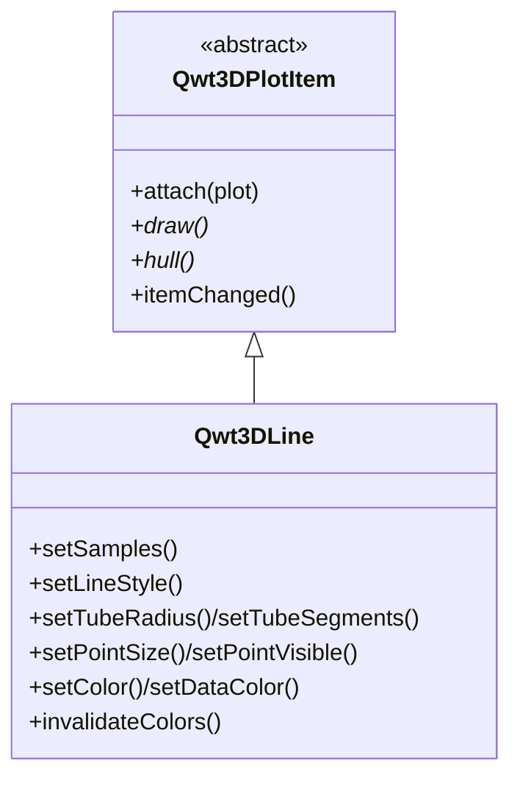

# 3D线图 - Qwt3DLine

`Qwt3DLine` 是在 3D 空间中绘制折线（曲线）的 3D 绘图 item。它接受 `QwtPoint3D` 样本序列，渲染为连通曲线，提供从细 GL 线到带光照实体管道的三种样式。

3D 模块总览见 [3D绘图简介](3d-plot.md)。`Qwt3DLine` 是 `Qwt3DPlotItem`，遵循与 `Qwt3DSurface` 相同的 attach/draw/hull 契约。

## 主要功能特性

- **三种样式** —— `Tube`（默认，带光照实体）、`Lines`（细 GL 线）、`Dots`（点标记）
- **管道几何** —— 用圆形截面沿折线扫掠，采用 parallel-transport 标架（在直线段上稳定，不像 Frenet 标架会退化），带 Blinn-Phong 光照
- **自动管道半径** —— 未设置时取包围盒对角线的 0.5%；环段细分可调
- **逐顶点着色** —— 沿曲线的 colormap（如按位置/弧长）或纯色
- **点标记叠加** —— 可在 `Lines`/`Tube` 样式之上叠加点标记
- **主题集成** —— 由 `Qwt3DTheme::applyToItem()` 接管

## 基本概念

### 线型

| 样式 | 说明 |
|------|------|
| `Qwt3DLine::Tube` | 沿折线扫掠的带光照实体管道（默认）。真正的 3D 粗细。 |
| `Qwt3DLine::Lines` | 细 GL 线条（1px）。可靠，但 Core 下宽度不可调。 |
| `Qwt3DLine::Dots` | 逐样本点标记，点大小可配。 |

!!! note "为何用 Tube？"
    OpenGL Core 难以可靠支持 `glLineWidth > 1`。要得到可见粗细的 3D 曲线（轨迹、流线），请用 `Tube` 样式——它构造真实几何体。

### 架构



`Tube` 样式复用带光照的 `surface` 着色器；`Lines`/`Dots` 复用 `Qwt3DPlot` 暴露的共享 `lineShader()`/`pointShader()`。数据存为 `QwtSeriesData<QwtPoint3D>`（core 模块的 `QwtPoint3DSeriesData`）。

## 使用方法

3D 线图示例位于：`examples/3D/line3D`。

### 1. 基本管道曲线（螺旋）

```cpp
#include <qwt3d_plot.h>
#include <qwt3d_line3d.h>
#include <qwt3d_colormap_color.h>

Qwt3DPlot* plot = new Qwt3DPlot();
plot->setTitle("3D helix");

Qwt3DLine* line = new Qwt3DLine();
line->attach(plot);

QVector<QwtPoint3D> samples;
for (int i = 0; i < 240; ++i) {
    const double t = 4 * M_PI * i / 239;
    samples.append(QwtPoint3D(std::cos(t), std::sin(t), t));
}
line->setSamples(samples);

line->setLineStyle(Qwt3DLine::Tube);
line->setTubeRadius(0.05);
line->setTubeSegments(10);
line->setDataColor(new Qwt3DColorMapColor("plasma"));

plot->enableLighting(true);
plot->show();
```

### 2. 设置数据

```cpp
// 3D 点的 QVector
line->setSamples(points);

// 并行 x/y/z 数组
line->setSamples(xs, ys, zs);

// 原始指针 + 数量
line->setSamples(samplesPtr, count);

// 自带 series data 对象（item 获取所有权）
line->setSamples(new QwtPoint3DSeriesData(points));
```

### 3. 线型

```cpp
line->setLineStyle(Qwt3DLine::Tube);   // 带光照实体管道（默认）
line->setTubeRadius(0.05);             // <= 0 = 自动（对角线 0.5%）
line->setTubeSegments(10);             // 环段细分（最少 3）

line->setLineStyle(Qwt3DLine::Lines);  // 细 GL 线
line->setLineWidth(1.0);               // 注意：Core 下 > 1 不保证

line->setLineStyle(Qwt3DLine::Dots);   // 点标记
line->setPointSize(10.0);
```

### 4. 着色

```cpp
// 纯色（未设 data color functor 时使用）
line->setColor(RGBA(0.9, 0.9, 0.9, 1.0));

// 逐顶点 colormap（沿曲线变化）
line->setDataColor(new Qwt3DColorMapColor("plasma"));

// 就地修改已挂载 functor 需触发重建：
auto* cm = new Qwt3DColorMapColor("plasma");
line->setDataColor(cm);
cm->setAlpha(0.9);
line->invalidateColors();
```

### 5. 点标记叠加

在 `Lines` 或 `Tube` 样式之上绘制点标记：

```cpp
line->setLineStyle(Qwt3DLine::Tube);
line->setPointVisible(true);   // 在每个样本处叠加标记
line->setPointSize(8.0);
```

### 6. 主题与坐标系

```cpp
plot->applyTheme(Qwt3DTheme::Dark);
plot->coordinates()->setTicLengthScale(0.02);
```

## 核心方法总结

| 方法 | 说明 |
|------|------|
| `setSamples(...)` | 设置 3D 点序列（多重载，见上） |
| `data()` / `dataSize()` | 访问 series / 样本数 |
| `setLineStyle(LineStyle)` | `Lines` / `Tube` / `Dots` |
| `setLineWidth(w)` | GL 线宽（Lines 样式；Core 下 > 1 不保证） |
| `setTubeRadius(r)` / `setTubeSegments(n)` | 管道截面（<= 0 = 自动；最少 3） |
| `setPointSize(s)` / `setPointVisible(bool)` | 点标记（Dots，或在 Lines/Tube 上叠加） |
| `setColor(RGBA)` / `setDataColor(Qwt3DColor*)` | 纯色或逐顶点颜色 functor |
| `dataColor()` / `invalidateColors()` | 颜色 functor 访问 / 重建触发 |
| `hull()` / `draw()` / `populateLegendColors()` | `Qwt3DPlotItem` 接口 |

!!! tip "建议"
    - 轨迹/流线优先用 `Tube` 并开启光照。
    - 增大 `setTubeSegments` 可得更光滑管道（代价：更多顶点）。
    - 曲线急转弯时提高采样密度，保持管道平滑。
    - 在 `Tube` 上用 `setPointVisible(true)` 标出采样点。

!!! example "相关示例"
    - 3D 线图：`examples/3D/line3D`
