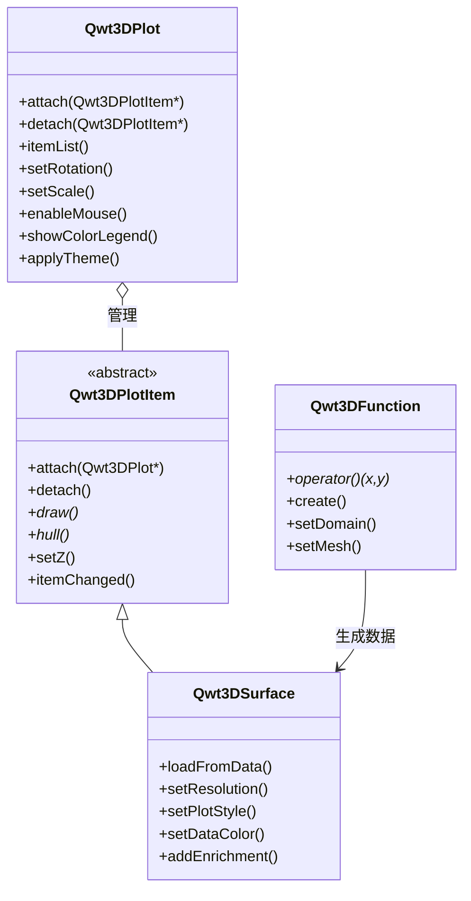

# 3D绘图简介

Qwt 7.1 将原 `QwtPlot3D` 库整合进来，提供了三维数据可视化能力。从 v7.3.3 起，3D模块已完全重构为 **Plot + Item** 架构，与2D模块（`QwtPlot` + `QwtPlotItem`）对称，并采用现代OpenGL渲染（VBO/VAO + GLSL 3.3 Core着色器）。

## 主要功能特性

**特性**

- ✅ **Plot + Item 架构**：`Qwt3DPlot`（渲染窗口）+ `Qwt3DPlotItem`（绘图item），与2D的 `QwtPlot` + `QwtPlotItem` 对称
- ✅ **多种绘图类型**：表面图、网格图、参数曲面、函数绘图等
- ✅ **现代OpenGL渲染**：VBO/VAO + GLSL 3.3 Core着色器（不使用旧版固定管线）
- ✅ **交互操作**：支持鼠标旋转、缩放、平移
- ✅ **光照和材质**：支持光照效果和材质配置
- ✅ **主题系统**：一键切换视觉风格，支持10种预设主题和22种科学色彩映射
- ✅ **多item组合**：一个 `Qwt3DPlot` 可挂载任意数量的item，在同一GL上下文中统一渲染

## 架构概述

3D模块遵循与2D模块对称的 **Plot + Item** 模式：

- **`Qwt3DPlot`** 是渲染窗口（`QOpenGLWidget` 子类），负责GL上下文管理、视图变换、光照、坐标系统和鼠标/键盘交互。它本身**不持有任何绘图数据**。
- **`Qwt3DPlotItem`** 是所有3D绘图元素的抽象基类。item自行管理数据、几何和样式，通过 `attach()` / `detach()` 挂载到渲染窗口。
- 一个 `Qwt3DPlot` 窗口可以挂载**任意数量的item**，在同一个GL上下文中统一渲染。



!!! note "无命名空间"
    所有3D类直接使用 `Qwt3D` 前缀定义在全局作用域（如 `Qwt3DPlot`、`Qwt3DSurface`）。不再有 `namespace Qwt3D`——这是相对于 v7.3.2 及更早版本的破坏性变更。

## 核心类介绍

| 类名 | 说明 |
|------|------|
| `Qwt3DPlot` | 3D渲染窗口（QOpenGLWidget），管理GL上下文、视图、光照、坐标系统和item列表 |
| `Qwt3DPlotItem` | 所有3D绘图item的抽象基类（attach/detach/draw/hull） |
| `Qwt3DSurface` | 3D表面图item，显示连续曲面（同时支持网格和单元数据） |
| `Qwt3DBar` | 3D柱状图item（1D序列或2D网格直方图）；逐柱立方体，扁平法向 |
| `Qwt3DLine` | 3D线图item；Tube（扫掠圆柱、带光照）/ Lines / Dots 三种样式 |
| `Qwt3DFunction` | 数据生成器，根据 z = f(x, y) 数学函数生成曲面 |
| `Qwt3DParametricSurface` | 参数曲面数据生成器 r(u, v) |
| `Qwt3DCoordinateSystem` | 3D坐标系统，12轴，支持BOX/FRAME样式 |
| `Qwt3DColorLegend` | 3D颜色条/图例 |
| `Qwt3DTheme` | 3D主题系统，封装背景、网格、colormap、坐标轴、光照等全部视觉属性 |

## 使用方法

3D绘图的例子位于：`examples/3D/simpleplot3D`，例子截图如下：


### 基本使用示例

```cpp
#include <qwt3d_plot.h>
#include <qwt3d_surface.h>
#include <qwt3d_function.h>

// 创建渲染窗口
Qwt3DPlot* plot = new Qwt3DPlot();

// 创建曲面item
Qwt3DSurface* surface = new Qwt3DSurface();
surface->attach(plot);

// 定义数学函数
class MyFunction : public Qwt3DFunction
{
public:
    double operator()(double x, double y) override
    {
        return std::sin(x) * std::cos(y);  // 数学函数
    }
};

// 创建函数对象并绑定到曲面item
MyFunction* func = new MyFunction(*surface);
func->setDomain(-5, 5, -5, 5);  // x和y范围
func->setMesh(50, 50);           // 50x50网格
func->create();

// 设置旋转角度
plot->setRotation(30, 0, 45);  // X、Y、Z轴旋转角度

// 显示
plot->show();
```

### 数据加载

```cpp
#include <qwt3d_plot.h>
#include <qwt3d_surface.h>

// 创建渲染窗口 + 曲面item
Qwt3DPlot* plot = new Qwt3DPlot();
Qwt3DSurface* surface = new Qwt3DSurface();
surface->attach(plot);

// 分配 100x100 的 Z 值数组
double* zData[100];
for (int i = 0; i < 100; ++i)
    zData[i] = new double[100];
// ... 填充数据 ...

// 加载 Z 值数据，需显式指定 X/Y 范围
surface->loadFromData(zData, 100, 100, 0.0, 100.0, 0.0, 100.0);

// 设置分辨率（1 表示使用全部数据，值越大下采样越强）
surface->setResolution(1);
```

### 交互操作

```cpp
// 启用鼠标交互
plot->enableMouse(true);

// 鼠标操作：
// - 左键拖动：旋转视角
// - 中键拖动：平移
// - 滚轮：缩放

// 设置缩放比例
plot->setScale(1.0, 1.0, 1.0);  // X、Y、Z缩放比例

// 设置旋转角度
plot->setRotation(45, 30, 60);  // X、Y、Z轴旋转角度（度）
```

### 颜色映射

```cpp
#include <qwt3d_colormap_color.h>

// 启用颜色条
plot->showColorLegend(true);

// 使用 core 模块的 colormap 预设根据 Z 值映射颜色
surface->setDataColor(new Qwt3DColorMapColor(plot, "viridis"));
```

### 多item组合绘图

Plot + Item 架构的核心优势之一是能在同一个3D空间中渲染多个item：

```cpp
Qwt3DPlot* plot = new Qwt3DPlot();

// 第一个曲面
Qwt3DSurface* surface = new Qwt3DSurface();
surface->loadFromData(gridData, cols, rows, 0, 10, 0, 10);
surface->attach(plot);

// 第二个曲面，设置不同的z-order
Qwt3DSurface* overlay = new Qwt3DSurface();
overlay->loadFromData(overlayData, cols2, rows2, 0, 10, 0, 10);
overlay->setZ(1.0);  // 在上层渲染
overlay->attach(plot);
```

### 3D柱状图（v7.3.5+）

`Qwt3DBar` 渲染 3D 柱状图 / 3D 直方图。每个样本变成一个轴对齐的长方体（"柱"），其高度编码标量值。支持两种数据形态：

- **1D 序列**：柱子自由放置在 xy 平面上（用 `QwtPoint3D` 的 `setSamples`，其中 (x,y) 为柱底中心，z 为高度）。
- **2D 网格**：在矩形 x/y 域上采样的柱阵列（用 `double**` z 矩阵或 `Qwt3DFunctionData` 的 `setSamples`）——经典的 "bar3" / 3D 直方图。

柱体复用带光照的 surface 着色器，使用逐面扁平法向，因此响应 `enableLighting()`。颜色由 `Qwt3DColor` functor 按柱驱动（通常按高度）。

```cpp
#include <qwt3d_plot.h>
#include <qwt3d_bar.h>
#include <qwt3d_colormap_color.h>

Qwt3DPlot* plot = new Qwt3DPlot();

Qwt3DBar* bars = new Qwt3DBar();
bars->setSamples(zMatrix, columns, rows, minX, maxX, minY, maxY); // 2D 网格
bars->setBarStyle(Qwt3DBar::FilledMesh);
bars->setDataColor(new Qwt3DColorMapColor("viridis"));
bars->setBaseline(0.0);          // 柱底 z（默认 0）
bars->attach(plot);

plot->enableLighting(true);
plot->setRotation(35, 0, 25);
```

```cpp
// 1D 序列变体：柱子沿 x 轴排列，y = 0
QVector<double> x = {0, 1, 2, 3, 4};
QVector<double> h = {1.2, 2.3, 0.8, 3.1, 1.7};
bars->setSamples(x, h);
```

### 3D线图（v7.3.5+）

`Qwt3DLine` 渲染穿过 3D 空间的折线。数据为 `QwtPoint3D` 样本序列，通过 `setSamples(...)` 设置（重载镜像 2D 的 `QwtPlotCurve`）。提供三种渲染样式：

- **`Tube`（默认）**：折线用圆形截面扫掠成带光照的实体管道。真正的 3D 粗细 + Blinn-Phong 着色；推荐用于轨迹和流线。管道几何使用 parallel-transport 标架（在直线段上稳定，不像 Frenet 标架会退化）。未设置时半径自动取包围盒对角线的 0.5%。
- **`Lines`**：细 GL 线条（1px）。可靠，但 OpenGL Core 不保证 `glLineWidth > 1`。
- **`Dots`**：逐样本点标记，点大小可配。

颜色可为纯色（`setColor`）或由 `Qwt3DColor` functor 逐顶点驱动（`setDataColor`）。

```cpp
#include <qwt3d_plot.h>
#include <qwt3d_line3d.h>
#include <qwt3d_colormap_color.h>

Qwt3DPlot* plot = new Qwt3DPlot();

QVector<QwtPoint3D> samples;
for (int i = 0; i < 240; ++i) {
    const double t = 4 * M_PI * i / 239;
    samples.append(QwtPoint3D(std::cos(t), std::sin(t), t));  // 螺旋
}

Qwt3DLine* line = new Qwt3DLine();
line->setSamples(samples);
line->setLineStyle(Qwt3DLine::Tube);
line->setTubeRadius(0.05);
line->setTubeSegments(10);
line->setDataColor(new Qwt3DColorMapColor("plasma"));
line->attach(plot);

plot->enableLighting(true);
```

!!! note "Tube 与 Lines 的取舍"
    OpenGL Core 难以可靠支持 `glLineWidth > 1`，因此粗的 3D 曲线必须用 `Tube` 样式（几何体）而非加宽 GL 线。

### 主题系统（v7.3.1+）

`Qwt3DTheme` 类提供一键切换 3D 绘图视觉风格的能力，封装了背景色、网格色、数据色彩映射（colormap）、坐标轴颜色、标题样式、光照预设、着色模式等全部视觉属性。

#### 内置预设主题

| 预设名称 | 说明 |
|---------|------|
| `Default` | 白底 + jet 色彩映射 + 无光照 |
| `Dark` | 深灰底 + viridis + 柔和光照 |
| `Scientific` | 白底 + jet + 工作室光照 |
| `Warm` | 暖色底 + hot 色彩映射 |
| `Cool` | 冷色底 + cool 色彩映射 |
| `Matplotlib` | matplotlib 风格（viridis + 柔和光照） |
| `EarthTones` | 大地色调 + autumn 色彩映射 |
| `Ocean` | 海洋色调 + winter 色彩映射 |
| `HighContrast` | 黑底白线高对比度 |
| `Presentation` | 大字体 + 粗线条，适合演示 |

#### 使用示例

```cpp
#include <qwt3d_theme.h>

// 方式1：使用预设主题（推荐）
plot->applyTheme(Qwt3DTheme::Dark);

// 方式2：通过名称应用主题
plot->applyTheme("Scientific");

// 方式3：自定义主题
Qwt3DTheme theme(Qwt3DTheme::Scientific);
theme.setDataColorPreset("plasma");  // 使用 22 种科学 colormap 预设之一
theme.setShininess(20.0);
theme.setLightingPreset(Qwt3DTheme::Studio);
theme.apply(plot);
```

#### 色彩映射预设

`Qwt3DTheme` 通过 `core` 模块的 `QwtColorMapPreset` 提供 22 种科学可视化色彩映射：

- 感知均匀：`viridis`、`plasma`、`inferno`、`magma`、`cividis`
- 经典：`jet`、`hot`、`cool`、`spring`、`summer`、`autumn`、`winter`
- 灰度：`gray`、`bone`、`copper`
- 彩虹：`rainbow`、`hsv`、`turbo`
- 发散：`coolwarm`、`rdylbu`、`rdylgn`、`spectral`

```cpp
// 切换色彩映射
theme.setDataColorPreset("viridis");

// 查看所有可用预设
QStringList presets = QwtColorMapPreset::availablePresets();
```

#### 光照预设

| 预设 | 说明 |
|------|------|
| `NoLighting` | 无光照，纯色渲染 |
| `FlatLight` | 均匀环境光 |
| `Studio` | 经典三点照明 |
| `Outdoor` | 强方向光 + 环境光 |
| `Soft` | 柔和漫射光 |

## 构建配置

使用3D功能需要启用 `QWT_CONFIG_QWTPLOT_3D` CMake选项：

```cmake
find_package(qwt REQUIRED)

# 链接2D绘图库
target_link_libraries(${PROJECT_NAME} PRIVATE qwt::plot)

# 链接3D绘图库
target_link_libraries(${PROJECT_NAME} PRIVATE qwt::plot3d)
```

!!! warning "OpenGL依赖"
    3D绘图模块需要 **OpenGL 3.3+ Core Profile**，使用 GLSL 3.30 着色器。请确保显卡驱动支持 OpenGL 3.3 或更高版本。模块还内置 `gl2ps` 用于矢量导出（EPS/PDF），作为 Compatibility Profile 的回退选项。

## 核心方法总结

### Qwt3DPlot 方法

| 方法 | 说明 |
|------|------|
| `attach(item)` / `detach(item)` | 挂载/卸载绘图item |
| `itemList()` | 获取已挂载的item列表 |
| `setRotation(x, y, z)` | 设置旋转角度（度） |
| `setScale(x, y, z)` | 设置缩放比例 |
| `setZoom(z)` | 设置缩放级别 |
| `enableMouse(bool)` | 启用/禁用鼠标交互 |
| `showColorLegend(bool)` | 显示/隐藏颜色条 |
| `applyTheme(preset)` / `applyTheme(name)` | 应用主题 |
| `setBackgroundColor(RGBA)` | 设置背景色 |

### Qwt3DSurface 方法

| 方法 | 说明 |
|------|------|
| `loadFromData(...)` | 加载数据数组（3个重载：网格double**、网格Triple**、单元） |
| `setResolution(int)` | 设置数据分辨率（1=使用全部数据，值越大下采样越强） |
| `setPlotStyle(PLOTSTYLE)` | 设置渲染样式（WIREFRAME, HIDDENLINE, FILLED, FILLEDMESH, POINTS） |
| `setDataColor(Qwt3DColor*)` | 设置数据颜色函数（获取所有权） |
| `setMeshColor(RGBA)` / `setMeshLineWidth(double)` | 配置网格外观 |
| `setFloorStyle(FLOORSTYLE)` | 设置地板投影样式 |
| `setShading(SHADINGSTYLE)` | 设置着色模式（FLAT, GOURAUD） |
| `addEnrichment(Qwt3DEnrichment&)` | 添加顶点/边/面装饰 |
| `setNormalLength(double)` / `showNormals(bool)` | 配置曲面法线 |

### Qwt3DBar 方法

| 方法 | 说明 |
|------|------|
| `setSamples(...)` | 加载柱数据（1D：`QVector<QwtPoint3D>` / `(x, heights)`；2D 网格：`double**` + 域 或 `Qwt3DFunctionData`） |
| `setBarWidth(w)` / `setBarDepth(d)` | 设置柱底面（<= 0 = 自动，取间距 80%） |
| `setBaseline(z)` | 设置柱底 z 值（默认 0） |
| `setBarStyle(BarStyle)` | `Filled`、`FilledMesh`、`Wireframe` |
| `setDataColor(Qwt3DColor*)` | 设置逐柱颜色 functor（获取所有权） |
| `setMeshColor(RGBA)` / `setMeshLineWidth(double)` | 配置边线 |
| `invalidateColors()` | 就地修改 functor 后重建 VBO 颜色 |

### Qwt3DLine 方法

| 方法 | 说明 |
|------|------|
| `setSamples(...)` | 设置 3D 点序列（`QVector<QwtPoint3D>` / 并行 x,y,z 数组 / `QwtSeriesData<QwtPoint3D>*`） |
| `setLineStyle(LineStyle)` | `Lines`、`Tube`、`Dots` |
| `setLineWidth(w)` | GL 线宽（Lines 样式；Core 下 > 1 不保证） |
| `setTubeRadius(r)` / `setTubeSegments(n)` | 管道截面（<= 0 = 自动；最少 3 段） |
| `setPointSize(s)` / `setPointVisible(bool)` | 点标记（Dots 样式，或在 Lines/Tube 上叠加） |
| `setColor(RGBA)` / `setDataColor(Qwt3DColor*)` | 纯色或逐顶点颜色 functor |
| `invalidateColors()` | 就地修改 functor 后重建 VBO 颜色 |

### Qwt3DFunction 方法

| 方法 | 说明 |
|------|------|
| `operator()(x, y)` | 纯虚函数 — 用户实现 z = f(x, y) |
| `assign(Qwt3DSurface&)` | 绑定目标曲面item |
| `setDomain(minX, maxX, minY, maxY)` | 设置X/Y数据范围 |
| `setMesh(columns, rows)` | 设置网格分辨率 |
| `create()` / `create(surface&)` | 生成并加载曲面数据 |

!!! tip "3D绘图建议"
    - 数据量不宜过大（推荐100x100网格以下）
    - 复杂曲面可适当降低分辨率提升性能
    - 使用光照效果增强视觉效果
    - 多item重叠时使用 `setZ()` 控制绘制顺序

!!! example "相关示例"
    - 基础3D绘图：`examples/3D/simpleplot3D`
    - 3D轴配置：`examples/3D/axes`
    - 3D增强：`examples/3D/enrichments`
    - 3D自动切换：`examples/3D/autoswitch`
    - 动态3D曲面（QwtFigure集成）：`examples/3D/figureSurface3D`
    - 3D柱状图：`examples/3D/bar3D`
    - 3D线图：`examples/3D/line3D`

3D轴配置、3D增强、3D自动切换与动态3D曲面的例子截图如下：


