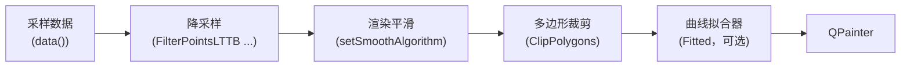

# 曲线渲染平滑

数据量巨大的曲线——例如频谱、采集信号——在屏幕上常常呈现像素级的噪声：本应是一条干净的迹线，看起来却像一条竖直抖动的模糊毛边。`QwtPlotCurve` 的**渲染平滑**（render smoothing）在绘制阶段消除这类噪声，且不修改原始采样数据。

## 为什么仅有降采样去不掉毛刺

默认的 `FilterPointsLTTB` 降采样把采样压缩为 min/max 桶表示，它**刻意保留每个桶内的极值**（参见[曲线降采样算法](curve-downsampling.md)）。随机抖动处处产生极值，因此噪声在降采样后依然存在——这是设计使然，否则真实数据的峰也会丢失。

`Fitted` 曲线属性同样无济于事：它让样条**穿过**（仍然带噪的）折线上的每一个点。插值曲线会精确复现噪声，而不是滤除噪声。

渲染平滑补上了这一环：它是一个作用于渲染折线的低通滤波器——并配合**特征保护**步骤，让显著点（峰、谷）保持原始的位置与高度，从而只去噪声、不失真。

## 在渲染管线中的位置



这个位置的特性：

- 只修改 **y 坐标**。x 坐标——以及每个特征的水平位置——保持精确。
- 平滑发生在可选的曲线拟合器**之前**，因此 `Fitted` 样条拿到的是已经去噪的折线。两者可以组合使用。
- 仅对 `QwtPlotCurve::Lines` 风格生效（含填充曲线）。

## API

```cpp
// 高斯加权滑动窗口
curve->setSmoothAlgorithm( QwtPlotCurve::GaussianSmoothing );
curve->setSmoothWindow( 15 );

// 或：Savitzky-Golay 局部多项式回归
curve->setSmoothAlgorithm( QwtPlotCurve::SavitzkyGolaySmoothing );
curve->setSmoothWindow( 21 );
curve->setSmoothPolynomialOrder( 3 );
```

| 设置接口 | 默认值 | 含义 |
|---------|--------|------|
| `setSmoothAlgorithm()` | `NoSmoothing` | `NoSmoothing`、`GaussianSmoothing` 或 `SavitzkyGolaySmoothing` |
| `setSmoothWindow()` | 9 | 滤波窗口内的相邻折线点数。取 `>= 3` 的奇数，偶数会自动进位为奇数 |
| `setSmoothPolynomialOrder()` | 3 | Savitzky-Golay 拟合的多项式阶数。限制在 `1 .. window - 2`，对其他算法无效 |
| `setSmoothPreserveThreshold()` | 3.0 | 特征保护阈值，以估计噪声水平的倍数计（见下文）。`0` 表示关闭保护，退化为纯低通滤波 |

## 算法

### GaussianSmoothing（高斯）

每个点变为窗口邻域的高斯加权平均（σ = window / 4，折线之外的采样在边界处镜像处理）。

* **+** 噪声抑制最强
* **−** 不做特征保护时，窄峰高度降低、形状变圆

### SavitzkyGolaySmoothing（Savitzky-Golay）

对每个窗口用最小二乘拟合给定阶数的多项式，并在窗口中心取值。光谱学的经典滤波算法。

* **+** 比高斯更好地保持窄峰形状
* **−** 相同窗口下噪声抑制略弱于高斯

| | 噪声抑制 | 窄峰形状（不做保护时） |
|---|---|---|
| GaussianSmoothing | 最好 | 变圆 |
| SavitzkyGolaySmoothing | 良好 | 接近原始 |

### 特征保护（峰值保持）

任何线性低通滤波器都会衰减比窗口更窄的特征——频谱峰会被拉低，造成数据失真。因此两种算法之后都跟着一个非线性保护步骤（默认开启，`setSmoothPreserveThreshold()`）：

1. 用宽基线（两遍箱式均值，`O(n)` 计算）跟随曲线的整体形状，但不跟随窄特征。
2. 用原始点相对该基线绝对偏差的**中位数**稳健估计噪声尺度——即噪声带的典型幅度；特征本身不影响该中位数。
3. 偏离基线超过 `threshold` 倍噪声尺度的点被视为真实特征的核心点：保持其**原始位置与高度**；低于阈值的点取平滑值，过渡区做小范围混合。

效果：噪声带收敛为干净的线，而峰和谷仍精确停留在数据给出的位置。

* 阈值调低 → 保留更多曲线细节（残留噪声与中等尖刺也更多）。
* 阈值调高（4 ~ 6）→ 中等尖刺也被抑制，但较浅的特征开始被平滑。
* `0` → 纯线性低通滤波（峰和谷都会被衰减）。

在一条 100,000 点、带随机抖动、向上尖刺与一个深谷的频谱上实测（900 px 画布，窗口 15，保护阈值 3.0）：噪声带的平均竖直厚度从 55.2 px 降到 10.7 px（高斯 + LTTB）/ 2.7 px（高斯 + Pixel 降采样），而窄峰的峰顶像素行**与**深谷的谷底像素行均与未平滑渲染完全一致。不做保护时同一峰的高度损失 26 px、谷的深度损失 63 px。

## 窗口的选择

平滑发生在降采样**之后**，因此窗口计量的是*折线点数*而非采样数。降采样后的折线通常只是画布宽度的小倍数（`FilterPointsLTTB` 下约为画布宽度的 4 倍），与采样量无关。

实际影响：

* 窗口 9 ~ 21 覆盖绝大多数场景，对应几个像素到几十个像素的水平跨度。
* 更大的窗口更平滑，但开始压平真实特征（且 SG 要求 `order < window - 1`）。
* 由于窗口相对于*渲染后的*点，缩放时的视觉效果保持一致：放大后采样摊到更多像素上、折线变长，同样的窗口覆盖更小的数值范围。

## 性能

滤波对降采样后的折线是 `O( n · w )` 的——典型画布上只有几千个点。在 100,000 点频谱上，开关平滑的完整 replot 耗时都在约 0.1 ms 量级，实际测不出开销。卷积核（以及 SG 的系数求解）每次重绘时计算，对所讨论的窗口大小可以忽略。

平滑是无状态、可重入的：多线程绘制曲线（例如 `QwtPlotDirectPainter` 或后台打印）无需额外同步。

## 示例

`examples/2D/curvesmoothing` 展示了一条 100,000 点、带随机抖动的频谱：

* 左图：默认渲染（仅 `FilterPointsLTTB` 降采样）
* 右图：同样数据 + 渲染平滑
* 控件可切换算法、窗口、SG 阶数与保护阈值
* 两图分别显示 replot 的 last / avg / min / max 耗时，另有基准测试按钮（各跑 50 次 replot）

## 相关

* [曲线降采样算法](curve-downsampling.md)——平滑所看到的折线是如何被压缩出来的
* [曲线图](curve.md)——曲线的常规文档
