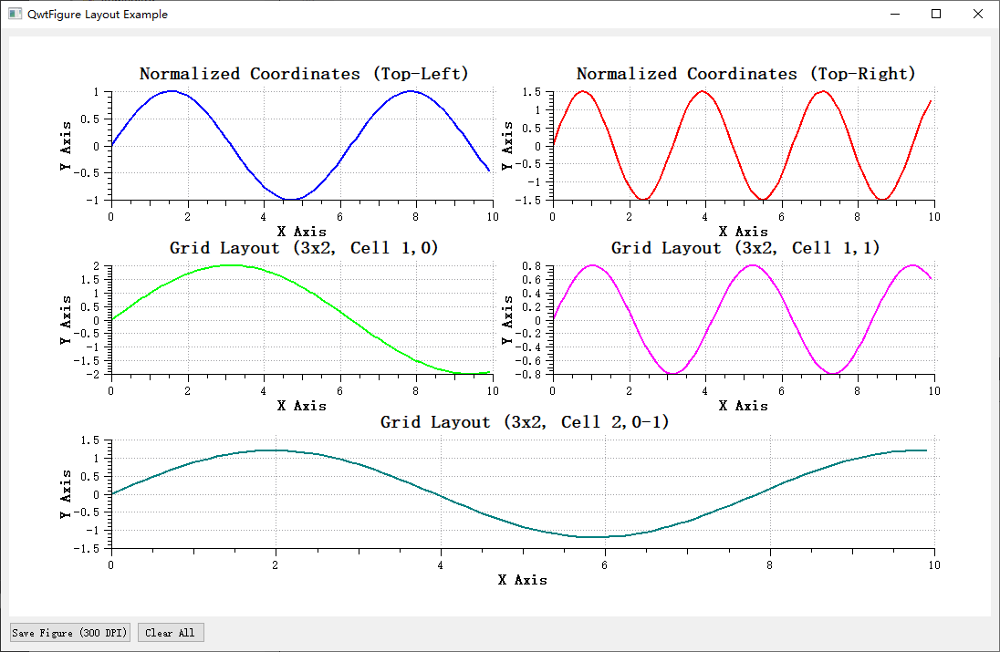

# QwtFigure绘图容器窗口

`QwtFigure`是一个类似 `matplotlib` 的 `Figure` 类的容器，用于组织和管理多个 `QwtPlot` 绘图组件。它提供了灵活的布局选项，包括**归一化坐标定位**和**网格布局**，支持创建**寄生绘图（任意多个x轴和y轴）**。

## 主要功能特性

### 1. 支持多种布局方式

- **归一化坐标布局**：使用 `[0,1]` 范围内的坐标系统进行相对位置控制
- **网格布局**：支持行列式的网格排列方式，方便创建规整的多图组合

### 2. 寄生绘图支持

- 可以为宿主绘图创建共享绘图区域但拥有独立坐标轴的寄生绘图
- 适用于在同一绘图区域内展示不同量级的数据

### 3. 图形导出功能

- 支持将整个图形导出为图片文件或 QPixmap
- 可指定 DPI 进行高分辨率输出

### 4. 灵活的外观定制

- 支持自定义背景色、边框颜色和线宽
- 支持复杂背景（渐变、纹理等）

## 使用方法

`QwtFigure`是一个窗口容器，可以进行多个子绘图（`QwtPlot`）布局

### 添加绘图组件

#### 使用归一化坐标添加

归一化坐标就是占`QwtFigure`窗口的百分比

```cpp
QwtPlot* plot = new QwtPlot;
// 添加一个占据图形左上角四分之一的绘图
figure->addAxes(plot, QRectF(0.0, 0.0, 0.5, 0.5));

// 或者使用分离参数形式
figure->addAxes(plot, 0.0, 0.0, 0.5, 0.5);
```

!!! warning "归一化坐标注意事项"
    - 使用 Qt 标准的左上角坐标系
    - 归一化坐标范围为 [0,1]

#### 使用网格布局添加

网格布局参考`matplotlib`中的`subplot`布局方式

```cpp
// 创建一个2x2网格并添加绘图
QwtPlot* topPlot = new QwtPlot;
// 添加一个占据整个顶行（第0行，第0-1列）的绘图
figure->addAxes(topPlot, 2, 2, 0, 0, 1, 2);

// 添加一个到底部左侧单元格（第1行，第0列）的绘图
QwtPlot* bottomLeftPlot = new QwtPlot;
figure->addAxes(bottomLeftPlot, 2, 2, 1, 0);
```

### 设置图形外观

```cpp
// 设置背景颜色
figure->setFaceColor(Qt::lightGray);

// 设置渐变背景
QLinearGradient gradient(0, 0, 0, 1);
gradient.setColorAt(0, Qt::white);
gradient.setColorAt(1, Qt::lightGray);
figure->setFaceBrush(QBrush(gradient));

// 设置边框
figure->setEdgeColor(Qt::black);
figure->setEdgeLineWidth(2);
```

### 寄生绘图使用

寄生绘图（parasite axes命名参考`matplotlib`）可以创建多个具有独立坐标轴的绘图，适用于在同一绘图区域内展示不同量级或单位数据。常用双y轴，多y轴等特殊的绘图场景

寄生绘图创建示例代码如下：

```cpp
// 创建宿主绘图
QwtPlot* hostPlot = new QwtPlot(figure);
figure->addAxes(hostPlot, 0.1, 0.1, 0.8, 0.8);

// 创建寄生绘图，默认显示在YRight轴并
QwtPlot* parasiteYRight = figure->createParasiteAxes(hostPlot, QwtAxis::YRight);

// 分别设置轴标题
hostPlot->setAxisTitle(QwtAxis::YLeft, "Primary Y");
parasiteYRight->setAxisTitle(QwtAxis::YRight, "Secondary Y");
```

!!! warning "寄生绘图注意事项"
    - 寄生绘图不能作为当前激活的坐标轴
    - 寄生绘图会随着宿主轴的移除而被自动隐藏
    - 如果宿主绘图销毁，寄生绘图会跟随销毁

寄生绘图的详细使用方法请参考：[寄生绘图](parasite-axes.md)

下面是使用QwtFigure的较为完整的演示：

```cpp
// 创建 QwtFigure
QwtFigure* figure = new QwtFigure();
figure->setSizeInches(8, 6);      // 设置图形尺寸为8x6英寸
figure->setFaceColor(Qt::white);  // 设置背景颜色

// 示例1: 使用归一化坐标添加绘图
QwtPlot* plot1       = new QwtPlot();
...
figure->addAxes(plot1, 0.0, 0.0, 0.5, 0.3333333);  // 左上角

QwtPlot* plot2       = new QwtPlot();
...
figure->addAxes(plot2, 0.5, 0.0, 0.5, 0.33333333);  // 右上角

// 示例2: 使用网格布局添加绘图
QwtPlot* plot3       = new QwtPlot();
...
figure->addGridAxes(plot3, 3, 2, 1, 0);  // 3x2网格，第1行第0列（0base）

QwtPlot* plot4       = new QwtPlot();
...
figure->addGridAxes(plot4, 3, 2, 1, 1);  // 2x2网格，第1行第1列（0base）

// 示例3: 多坐标轴创建
//! 创建宿主绘图
QwtPlot* hostPlot = new QwtPlot();
hostPlot->setCanvasBackground(Qt::white);
...
//! 把主绘图添加到figure中
figure->addGridAxes(hostPlot, 3, 2, 2, 0, 1, 2);  // 3x2网格，第2行第0列，跨2列

//! 添加宿主坐标系
QwtPlot* parasitePlot = hostPlot->createParasiteAxes(QwtAxis::YLeft);
//! 宿主坐标轴的其他设置
```

上面例子的效果如下图：



### 图形导出

```cpp
// 保存为图片文件
figure->saveFig("figure.png", 300); // 300 DPI

// 获取 QPixmap
QPixmap pixmap = figure->saveFig(300);
```

### 坐标轴对齐

figure绘图窗口提供了坐标轴对其的功能，子绘图刻度值如果差异较大，刻度是不对齐的，如下图所示：


这时，可以通过`QwtFigure::addAxisAlignment`函数指定坐标轴对齐

例如上面的例子，通过下面进行坐标轴对齐

```cpp
figure->addAxisAlignment({ plot1, plot3, hostPlot }, QwtAxis::YLeft);
figure->addAxisAlignment({ plot2, plot4 }, QwtAxis::YLeft);
```

上面的代码代表`plot1`, `plot3`, `hostPlot`这三个绘图的左坐标轴对齐。`plot2`, `plot4`这两个绘图的左坐标轴对齐

运行结果如下图：


!!! warning "坐标轴对齐注意事项"
    只有可显示的坐标轴才可以对齐，如果坐标轴不显示，是无法对齐的，例如上面例子的`plot2`, `plot4`和`hostPlot`的右坐标轴就无法对齐，因为`plot2`, `plot4`的坐标轴窗口不可见

## figure操作蒙版

`QwtFigureWidgetOverlay`是一个专门针对`QwtFigure`设计的操作蒙版类，它继承自`QwtWidgetOverlay`。这个类提供了在运行时对 `QwtFigure` 中的子绘图组件进行交互式操作的功能，包括调整绘图组件的大小和选择当前激活的绘图。

### 主要功能

1. **绘图组件大小调整**：用户可以通过鼠标拖拽来调整 `QwtFigure` 中子绘图组件的尺寸和位置
2. **当前绘图选择**：支持通过鼠标点击或键盘快捷键来选择当前激活的绘图组件
3. **可视化反馈**：在操作过程中提供清晰的视觉反馈，包括边框、控制点和尺寸信息显示

可以通过 `BuiltInFunctionsFlag` 枚举来控制蒙版的不同功能：

```cpp
enum BuiltInFunctionsFlag
{
    FunSelectCurrentPlot = 1,  // 选择当前绘图功能
    FunResizePlot        = 2   // 调整绘图大小功能
};
```

使用 `setBuiltInFunctionsEnable()` 方法可以动态启用或禁用这些功能。

蒙版提供了下面这些方法来自定义其外观：

- `setBorderPen()` - 设置边框画笔
- `setControlPointBrush()` - 设置控制点填充
- `setControlPointSize()` - 设置控制点尺寸
- `showPercentText()` - 控制是否显示尺寸百分比文本

### 使用方法

要使用 `QwtFigureWidgetOverlay`，只需创建其实例并将其附加到目标 `QwtFigure` 上：

```cpp
QwtFigure* figure = new QwtFigure();
// ... 添加一些绘图组件到figure ...

// 创建并显示操作蒙版
QwtFigureWidgetOverlay* overlay = new QwtFigureWidgetOverlay(figure);
overlay->show();
```

其效果如下图所示：


可以根据需要启用或禁用特定功能：

```cpp
// 禁用尺寸调整功能，只保留选择功能
overlay->setBuiltInFunctionsEnable(QwtFigureWidgetOverlay::FunResizePlot, false);

// 或者禁用选择功能，只保留尺寸调整功能
overlay->setBuiltInFunctionsEnable(QwtFigureWidgetOverlay::FunSelectCurrentPlot, false);
```

可以自定义蒙版的外观以匹配应用程序的整体风格：

```cpp
// 设置边框颜色和样式
overlay->setBorderPen(QPen(Qt::red, 2, Qt::DashLine));

// 设置控制点的颜色和样式
overlay->setControlPointBrush(QBrush(Qt::green));

// 设置控制点大小
overlay->setControlPointSize(QSize(10, 10));

// 隐藏百分比文本显示
overlay->showPercentText(false);
```

`QwtFigureWidgetOverlay` 提供了几个有用的信号来响应用户操作：

- `widgetNormGeometryChanged()` - 当绘图组件的归一化几何尺寸发生变化时发出
- `activeWidgetChanged()` - 当前激活的组件发生变化时发出

这个操作蒙版为用户提供了一种直观、交互式的方式来管理和调整 `QwtFigure` 中的多个绘图组件，提升用户体验和操作效率

!!! example "寄生绘图示例"
    完整的示例代码可参阅`examples/figure`


