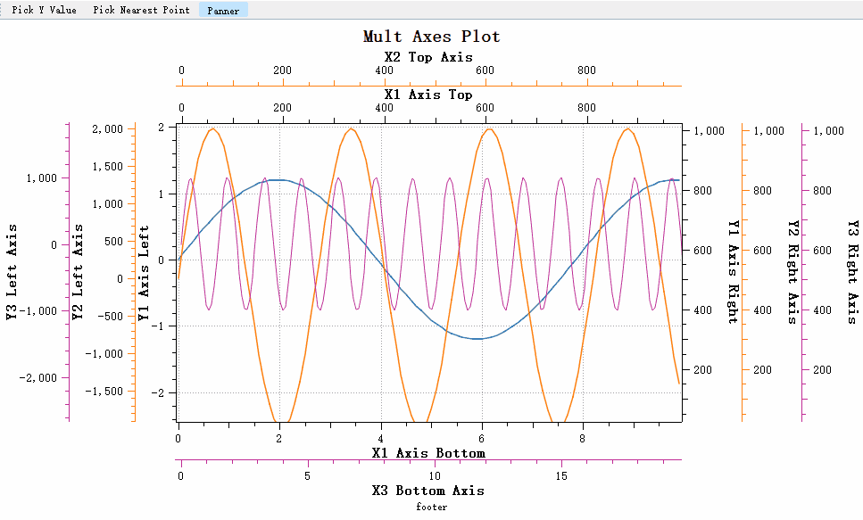

# 平移工具

!!! success "新特性"
    QwtPlotPicker 是一个完全重构的实时交互式绘图选择器，提供了比原版 `QwtPicker` 更流畅、更直观的用户体验。

`Qwt6`的`QwtPlotPicker`是基于缓存的平移机制，主要有下面两个问题：

- 平移过程中显示的是缓存的位图，而不是实时更新的绘图内容
- 用户无法在平移过程中看到数据的实时变化，无法实现流畅的交互式数据探索

虽然在某些层面，`Qwt6`的`QwtPlotPicker`能极大的减少了绘图的刷新，但对视觉体验却非常不友好，为此`Qwt7`对`QwtPlotPicker`进行了重构，目的是实现流畅的交互式数据探索

## 重构的QwtPlotPicker改进

新的`QwtPlotPicker`基于`QwtPicker`状态机机制，实现了实时平移和缩放：

效果如下：



新的`QwtPlotPicker`提供了完整坐标轴支持

- ✅ 线性坐标轴（Linear Scale）
- ✅ 对数坐标轴（Logarithmic Scale）  
- ✅ 日期时间坐标轴（DateTime Scale）
- ✅ 多坐标轴

!!! warning "使用原来的缓存式选择器"
    如果你想使用原来的缓存式选择器，可以使用`QwtPlotCachePicker`

| 类变更情况                  | 属性 | 基类 |
|---------------------------|------|-------|
|QwtPanner -> QwtCachePanner| 更名  |QWidget|
|原QwtPlotPanner -> QwtPlotCachePanner| 更名  |QwtCachePanner|
|原QwtPolarPanner -> QwtPolarCachePanner| 更名  |QwtCachePanner|
|QwtPlotPanner| 重构  |QwtPicker|

`Qwt6`的`QwtPlotPanner`完全进行了重构，但接口保持不变，原来代码基本可以不用进行修改

## 基本使用方法

```cpp
#include "qwt_plot_panner.h"
#include "qwt_plot.h"
#include "qwt_plot_curve.h"

// 创建绘图和曲线
QwtPlot* plot = new QwtPlot;
QwtPlotCurve* curve = new QwtPlotCurve("Sine Wave");
curve->attach(plot);

// 创建实时panner
QwtPlotPanner* panner = new QwtPlotPanner(plot->canvas());
// 配置鼠标按钮
panner->setMouseButton(Qt::MiddleButton);  // 中键平移
// panner->setMouseButton(Qt::LeftButton); // 或者左键平移

// 启用选择器
panner->setEnabled(true);

// 连接信号（可选）
connect(picker, &QwtPlotPicker::panned, 
        [](int dx, int dy) {
            qDebug() << "Canvas panned by:" << dx << dy;
        });
```

你可以设置平移的方向，这样可以限制只能往一个方向移动：

```cpp
// 1. 设置平移方向
panner->setOrientations(Qt::Horizontal | Qt::Vertical); // 默认：水平和垂直
// panner->setOrientations(Qt::Horizontal);            // 仅水平
// panner->setOrientations(Qt::Vertical);              // 仅垂直
```

!!! warning "注意"
    `QwtPlotPanner`和`QwtPlotPicker`不同，它不需要绑定坐标轴，因为移动是针对整个画布的，移动画布过程中，所有坐标轴都会被移动
