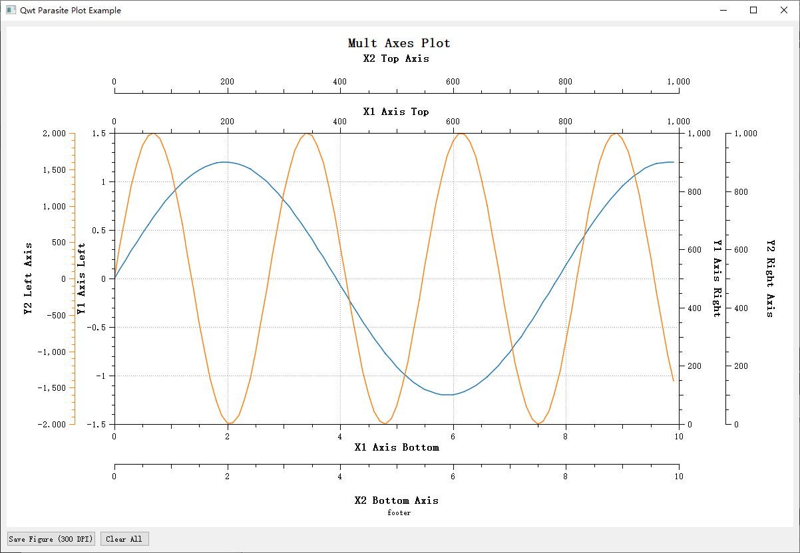

# Qwt寄生绘图使用指南

寄生绘图（Parasite Axes）是 `QwtPlot` 中在同一个绘图区域内创建多个具有不同刻度和标签的坐标轴。寄生绘图与宿主绘图持有共同的绘图区域（寄生绘图的绘图区域是透明颜色），但可以拥有独立的坐标系统，这在需要展示不同量级或单位的数据时特别有用。

## 寄生绘图的工作原理

寄生绘图是通过 `QwtPlot::createParasiteAxes` 或 `QwtFigure::createParasiteAxes` （`QwtFigure::createParasiteAxes`内部实际也是调用`QwtPlot::createParasiteAxes`）方法创建的，它属于宿主绘图的子窗口。

寄生绘图具有以下特点：

1. **绘图区域尺寸一致**：寄生绘图与宿主绘图的绘图区域保持一致
2. **独立坐标系统**：寄生绘图可以有自己的刻度范围和标签
3. **透明背景**：寄生绘图具有透明背景，只显示坐标轴本身和绘制的曲线
4. **自动同步**：可以选择性地与宿主绘图共享 X 轴或 Y 轴的刻度

## 创建寄生绘图

寄生绘图通过 `QwtPlot::createParasiteAxes` 方法创建，该方法定义如下：

```cpp
QwtPlot* createParasitePlot(QwtAxis::Position enableAxis);
```

`enableAxis`为寄生绘图显示的坐标轴，此时寄生绘图只会显示此坐标轴,其他坐标轴隐藏

该方法创建的寄生绘图对象，与宿主绘图的绘图区域是保持一致的，但它可以拥有独立的坐标系统，此时宿主绘图内部会记录绑定的寄生绘图对象，**当宿主绘图被销毁时，寄生绘图也会被销毁。**

宿主绘图的尺寸改变时会同时调整寄生绘图的尺寸，宿主绘图会让所有的寄生绘图尺寸和其保持一致

下面是创建寄生绘图的代码示例：

```cpp
// 创建 QwtFigure
QwtPlot* hostPlot = new QwtPlot();
//! 设置宿主绘图的参数（这里省略）

////////////////////////////////////////////////////////
//! 添加寄生坐标系
////////////////////////////////////////////////////////
QwtPlot* parasitePlot = hostPlot->createParasitePlot(QwtAxis::YLeft);
//!  设置寄生轴1坐标的显示和共享的轴
parasitePlot->enableAxis(QwtAxis::YRight, true);
parasitePlot->enableAxis(QwtAxis::XTop, true);
parasitePlot->setParasiteShareAxis(QwtAxis::XBottom);

//! 宿主坐标轴的其他设置
parasitePlot->setAxisTitle(QwtAxis::YLeft, "Y2 Left Axis");
parasitePlot->setAxisTitle(QwtAxis::YRight, "Y2 Right Axis");
parasitePlot->setAxisTitle(QwtAxis::XTop, "X2 Top Axis");

//! 用于宿主坐标的曲线
QColor curColor             = QColor(255, 127, 14);
QwtPlotCurve* parasiteCurve = new QwtPlotCurve("parasite sine Wave 1");
parasiteCurve->setSamples(generateSampleData(100, 2000, 2.3));//generateSampleData函数用于生成一个正弦曲线
parasiteCurve->attach(parasitePlot);
parasiteCurve->setPen(curColor, 1.5);
parasiteCurve->setRenderHint(QwtPlotItem::RenderAntialiased, true);
//! 为了区分宿主轴，给宿主轴的坐标也增加颜色
parasitePlot->axisWidget(QwtAxis::YLeft)->setScaleColor(curColor);
parasitePlot->axisWidget(QwtAxis::YRight)->setScaleColor(curColor);
parasitePlot->axisWidget(QwtAxis::XTop)->setScaleColor(curColor);
```

上面代码运行效果如下：


要创建寄生绘图，首先需要创建宿主绘图，寄生绘图是在宿主绘图基础上通过`QwtPlot::createParasitePlot`函数创建，此函数返回寄生绘图的指针；寄生绘图的对象也是`QwtPlot`,通过函数`QwtPlot::isHostPlot`和`QwtPlot::isParasitePlot`可以区分这个绘图是寄生绘图还是宿主绘图。如果当前是寄生绘图，可以通过`QwtPlot::hostPlot`获取宿主绘图指针，如果当前是宿主绘图，可以通过`QwtPlot::parasitePlots`获取所有寄生绘图指针

!!! warning "注意"
    一个绘图不会既是寄生绘图也是宿主绘图的情况，也就是说，如果绘图是寄生绘图，那么他自身不允许再创建寄生绘图，在寄生绘图上调用`createParasitePlot`将返回`nullptr`

寄生绘图创建后，可以按照正常绘图那样设置它的属性

通过`QwtPlot::setParasiteShareAxis`可以设置寄生绘图和宿主绘图共享的坐标轴。例如寄生绘图设置x轴和宿主绘图共享，那么在寄生绘图上应调用`setParasiteShareAxis(QwtAxis::XBottom)`

Qwt允许创建多个寄生绘图，实现任意多的坐标轴叠加，只要在宿主绘图上继续调用`createParasitePlot`即可再创建一个寄生绘图

```cpp
////////////////////////////////////////////////////////
//! 添加第二个寄生坐标系
////////////////////////////////////////////////////////
QwtPlot* parasitePlot2 = hostPlot->createParasitePlot(QwtAxis::YLeft);
//! 设置寄生轴2坐标的显示和共享的轴
parasitePlot2->enableAxis(QwtAxis::YRight, true);
parasitePlot2->enableAxis(QwtAxis::XBottom, true);
parasitePlot2->setParasiteShareAxis(QwtAxis::XTop);

//! 宿主坐标轴的其他设置
parasitePlot2->setAxisTitle(QwtAxis::YLeft, "Y3 Left Axis");
parasitePlot2->setAxisTitle(QwtAxis::YRight, "Y3 Right Axis");
parasitePlot2->setAxisTitle(QwtAxis::XBottom, "X3 Bottom Axis");
//! 用于宿主坐标的曲线
QColor curColor2             = QColor(192, 43, 149);
QwtPlotCurve* parasiteCurve2 = new QwtPlotCurve("parasite sine Wave 2");
parasiteCurve2->setSamples(generateSampleData(200, 1000, 4.3));
parasiteCurve2->attach(parasitePlot2);
parasiteCurve2->setPen(curColor2, 1);
parasiteCurve2->setRenderHint(QwtPlotItem::RenderAntialiased, true);
//! 为了区分宿主轴，给宿主轴的坐标也增加颜色
parasitePlot2->axisWidget(QwtAxis::YLeft)->setScaleColor(curColor2);
parasitePlot2->axisWidget(QwtAxis::YRight)->setScaleColor(curColor2);
parasitePlot2->axisWidget(QwtAxis::XBottom)->setScaleColor(curColor2);
```

上面代码运行效果如下：



## 寄生绘图的层级关系

寄生绘图有层级关系，寄生绘图的层级关系主要决定了寄生轴的布局顺序，首先添加的寄生绘图位于最低层级，最后添加的寄生绘图处于最高层级

布局过程中宿主绘图布局完成后，开始布局寄生绘图，优先布局低层级的寄生绘图，也就是层级越低的寄生绘图的轴越接近宿主绘图，层级越高的寄生绘图的坐标轴越远离宿主绘图

## 寄生绘图的布局

寄生绘图的布局由寄生绘图布局管理器和宿主绘图共同完成，寄生绘图布局管理器由`QwtParasitePlotLayout`类实现，它继承`QwtPlotLayout`


`QwtParasitePlotLayout`类的`activate`函数会计算寄生轴的各个轴的窗口大小，通过`parasiteScaleRect`可以获取到这个尺寸，这个尺寸的作用是给宿主绘图布局寄生绘图的轴坐标使用，这里不要使用`QwtParasitePlotLayout::scaleRect`函数获取寄生绘图的轴尺寸，这个函数获取的尺寸是和宿主绘图一样的

宿主绘图通过`QwtPlot::updateAxisEdgeMargin`函数来布局各个寄生绘图的轴坐标

每个轴通过`QwtScaleWidget::margin`和`QwtScaleWidget::edgeMargin`两个参数，控制轴到绘图区域和轴到绘图边界的距离

例如，下面代码的效果如下图所示

```cpp
QwtPlot* plot = new QwtPlot;
...
plot->axisWidget(QwtAxis::YLeft)->setMargin(50);
plot->axisWidget(QwtAxis::YLeft)->setEdgeMargin(100);
```


- **margin**：决定了坐标轴靠近绘图区域边界到绘图区域的距离，默认为0紧贴绘图区域
- **edgeMargin**：决定了坐标轴靠近绘图边界区域到绘图边界的距离，默认为0紧贴绘图边框

上面这两个参数即可实现一个寄生绘图的坐标轴的正常显示

`QwtPlot::updateAxisEdgeMargin`函数用于自动计算寄生绘图和宿主绘图的`margin`和`edgeMargin`,避免轴层之间重叠

大致计算过程如下：

1. 收集宿主及所有可见寄生轴的“净”矩形（已剔除旧的 edgeMargin 与 margin）
2. 对每i层：
   - margin = 0 ~ i-1 层净矩形尺寸之和
   - edgeMargin = i+1 ~ 末层净矩形尺寸之和
3. 将新值设置给对应轴的 QwtScaleWidget
4. 宿主的 margin 予以保留（不覆盖用户可能手工设置的值）。

!!! warning "注意"
    `updateAxisEdgeMargin`不会改变宿主绘图的`margin`属性

在添加寄生轴后，绘图显示前，你应该手动调用`updateAxisEdgeMargin`来更新寄生绘图坐标轴的布局

!!! tip "提示"
    某些情况，多坐标轴绘图在构造函数中创建，最后一次性显示，由于最后一次resize事件未能完全触发，寄生绘图坐标轴的布局可能不正确，这时你可以在绘图构造完成最后把宿主绘图的`replot`投递到消息队列中，例如：
    ```cpp hl_lines="14"
    int main(int argc, char* argv[])
    {
        QMainWindow mainWindow;
        QWidget* centralWidget  = new QWidget(&mainWindow);
        QVBoxLayout* mainLayout = new QVBoxLayout(centralWidget);
        // 创建宿主绘图
        QwtPlot* hostPlot = new QwtPlot(centralWidget);
        ...
        QwtPlot* parasitePlot = hostPlot->createParasitePlot(QwtAxis::YLeft);
        ...
        QwtPlot* parasitePlot2 = hostPlot->createParasitePlot(QwtAxis::YLeft);
        ...
        //通过invokeMethod把replot投递到消息队列，让其最后执行
        QMetaObject::invokeMethod(hostPlot, &QwtPlot::replot, Qt::QueuedConnection);
    }
    ```

## 注意事项

### 1. 生命周期管理

- 寄生绘图的生命周期与宿主绘图绑定
- 当宿主绘图被移除或销毁时，寄生绘图也会自动被清理
- 不需要手动删除寄生绘图对象

### 2. 布局限制

- 寄生绘图不能作为`QwtFigure`当前激活的坐标轴
- 寄生绘图不参与`QwtFigureLayout`的布局计算
- 寄生绘图的位置由宿主绘图控制


!!! example "寄生绘图示例"
    完整的示例代码可参阅`examples/parasitePlot`