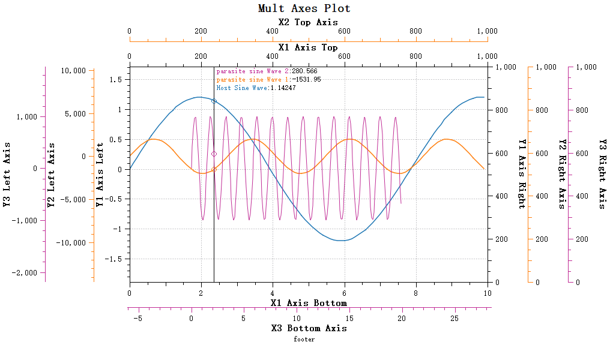

# 数据拾取

数据拾取功能是一个绘图控件常用的需求，旨在用户通过鼠标移动来显示当前鼠标所在位置的具体数值情况

`Qwt7`增加了`QwtPlotSeriesDataPicker`类，它提供了在绘图区域移动鼠标时实时显示数据点信息的功能。该类支持两种拾取模式：Y值拾取模式和最近点拾取模式，能够显著提升数据可视化和分析的交互体验。

**特性**

- ✅ **双模式拾取**：支持Y值拾取和最近点拾取两种模式
- ✅ **智能插值**：支持线性插值计算，在数据点之间精确取值
- ✅ **高性能优化**：使用二分查找和窗口优化算法，支持大数据集的最近点拾取
- ✅ **多曲线支持**：同时处理多个曲线的数据拾取
- ✅ **自定义显示**：可自定义文本样式、特征点绘制和背景
- ✅ **寄生绘图支持**：支持宿主绘图和寄生绘图的数据获取

头文件引入

```cpp
#include "qwt_plot_series_data_picker.h"
```

效果：



## 基本用法

`QwtPlotSeriesDataPicker`继承`QwtPlotPicker`,要创建拾取器，只要传入绘图的canvas区域即可，示例代码如下

```cpp
// 创建绘图对象
QwtPlot* plot = new QwtPlot(this);

// 创建数据拾取器
QwtPlotSeriesDataPicker* picker = new QwtPlotSeriesDataPicker(plot->canvas());

// 设置拾取模式
picker->setPickMode(QwtPlotSeriesDataPicker::PickYValue);

// 启用插值
picker->setInterpolationMode(QwtPlotSeriesDataPicker::LinearInterpolation);

// 设置文本显示位置
picker->setTextArea(QwtPlotSeriesDataPicker::TextPlaceAuto);
```

## 拾取模式设置

`QwtPlotSeriesDataPicker`提供了两种拾取模式，可以通过`setPickMode`函数进行拾取模式的设置，拾取模式枚举如下：

```cpp
enum PickSeriesMode
{
    PickYValue,  ///< 拾取y值（默认）
    PickNearestPoint  ///< 拾取最接近鼠标光标位置的点
};
```

### Y值拾取模式

Y值拾取模式（`QwtPlotSeriesDataPicker::PickYValue`）可以显示当前X位置对应所有曲线的Y值

```cpp
// Y值拾取模式 - 显示当前X位置对应的所有曲线的Y值
picker->setPickMode(QwtPlotSeriesDataPicker::PickYValue);
```

Y值拾取模式效果如下：


y值拾取模式下，可以通过`setInterpolationMode`方法设置是否进行插值计算，插值计算可以提高数据的精度，如果点比较稀疏，会通过线性插值方式计算出当前x轴对应的y值。

!!! info "注意"
    插值方式默认开启

```cpp
// 不进行插值，使用最近的数据点
picker->setInterpolationMode(QwtPlotSeriesDataPicker::NoInterpolation);
```

### 临近点拾取模式

临近点拾取模式（`QwtPlotSeriesDataPicker::PickNearestPoint`）会计算距离鼠标最接近的点进行拾取并显示，这个模式尤其适合用于类似频谱等绘图的峰值数据拾取

```cpp
// 最近点拾取模式 - 显示距离鼠标最近的数据点
picker->setPickMode(QwtPlotSeriesDataPicker::PickNearestPoint);
```

临近点拾取模式效果如下：


临近点要计算曲线的点到鼠标位置的距离，如果全曲线遍历会非常耗时，为此，`Qwt7`提供了窗口搜索算法，能够快速找到距离鼠标最近的数据点

通过`setNearestSearchWindowSize`方法设置搜索窗口大小

```cpp
//临近点搜索窗口大小，窗口大小决定了临近点搜索的范围，避免全曲线遍历
void setNearestSearchWindowSize(int windowSize);
int nearestSearchWindowSize() const;
```

搜索窗口可以设置为以下几种方式：

- 0: 不使用窗口，搜索整个曲线
- 正数: 固定的窗口大小（数据点数量）
- 负数: 自适应窗口，使用曲线数据点总数的百分比（取绝对值，如-5表示5%）

搜索窗口大小默认为-5，也就是曲线点数的5%

!!! warning "注意"
    Qwt7默认启用窗口搜索算法的阈值是1000个数据点，也就是说如果曲线点数超过1000窗口设置才会生效

!!! note "注意事项"
    窗口优化算法要求曲线数据必须按X坐标升序排列。如果使用自定义数据源，请确保数据已正确排序。


## 其它属性设置

### 文本显示设置

`QwtPlotSeriesDataPicker`可以设置文本显示位置，文本显示位置通过枚举`QwtPlotSeriesDataPicker::TextPlacement`定义，你可以使用`setTextArea`函数设置文本放置的地方，默认为自动选择，会根据拾取模式智能选择

你可以通过以下方法设置文本的对其样式和背景颜色

```cpp
// 自定义文本背景
picker->setTextBackgroundBrush(QBrush(QColor(255, 255, 255, 180)));
// 设置文本对齐方式
picker->setTextAlignment(Qt::AlignLeft | Qt::AlignTop);
```

!!! Bug "Bug"
    `QwtPlotSeriesDataPicker`的绘制区域是宿主绘图的图层，寄生绘图的属于宿主绘图的子窗口，因此寄生绘图绘制的图元会覆盖宿主绘图，也就是说寄生绘图显示的曲线是在`QwtPlotSeriesDataPicker`的绘制区域之上。目前的寄生绘图架构无法让`QwtPlotSeriesDataPicker`的内容显示在寄生绘图之上

### 特征点绘制

`QwtPlotSeriesDataPicker`拾取到的点称之为特征点，特征点会在曲线上标记出来，你可以通过以下方法设置特征点绘制样式

```cpp
// 启用/禁用特征点标记
picker->setEnableDrawFeaturePoint(true);

// 设置特征点大小（像素）
picker->setDrawFeaturePointSize(6);
```

## 自定义

### 自定义显示文本

显示的文本内容可以通过继承`QwtPlotSeriesDataPicker`并重写 `valueString` 方法来自定义数据点的显示格式：

下面是一个示例：

```cpp
class CustomDataPicker : public QwtPlotSeriesDataPicker {
public:
    explicit CustomDataPicker(QWidget* canvas) : QwtPlotSeriesDataPicker(canvas) {}
    
protected:
    QString valueString(const QPointF& value, QwtPlotItem* item, 
                       size_t seriesIndex, int order) const override {
        Q_UNUSED(seriesIndex);
        
        if (pickMode() == PickYValue) {
            QString text;
            if (order != 0) {
                text += "\n";
            }
            text += QString("%1: %2 (X=%3)")
                .arg(item->title().text())
                .arg(value.y(), 0, 'f', 3)
                .arg(value.x(), 0, 'f', 3);
            return text;
        }
        return QString("坐标: (%1, %2)").arg(value.x()).arg(value.y());
    }
};
```

`valueString`方法的`order`参数代表了显示的第n个特征点，如果你有多条曲线，这个参数会递增，你可以根据这个参数是否为0来换行


