# QwtPicker的状态机

在图形交互系统中，用户的操作往往不是单一的瞬间动作，而是一个**有序的事件序列**。比如：

- **拖拽操作**：按下鼠标 → 移动鼠标 → 释放鼠标
- **矩形选择**：点击第一个点 → 移动鼠标 → 点击第二个点
- **多边形绘制**：点击多个点 → 右键结束

如果没有状态机管理，我们需要在事件处理函数中维护大量`if-else`分支和状态变量，代码会变得**复杂且难以维护**。

Qwt的`QwtPicker`就使用状态机来管理交互过程，对应的实现位于`qwt_picker_machine.h/cpp`文件中

## QwtPicker状态机的优势

状态机将**事件序列的处理**与**具体的业务操作**分离：

- 状态机负责识别完整的事件序列
- `QwtPicker`负责执行具体的绘制、选择等操作

`QwtPicker`所有状态机都继承自`QwtPickerMachine`，提供统一的`transition()`接口，`QwtPicker`无需关心具体是哪种交互模式。

新增交互模式只需继承`QwtPickerMachine`并实现状态转换逻辑，无需修改`QwtPicker`核心代码。

自动管理交互过程中的状态转换，避免手动维护状态变量带来的错误。

## QwtPicker状态机工作原理

`QwtPicker`的状态机机制采用了经典的**观察者模式 + 状态模式**组合：

```txt
事件流: QEvent → QwtPicker → QwtPickerMachine → Commands → QwtPicker方法
```

`QwtPicker`作为事件过滤器安装在父组件上，它接收父窗口的事件，然后分发给对应的`widgetXXXEvent`方法，并调用状态机进行转换。

具体绘图动作被`QwtPicker`抽象成如下几种状态：

| 状态 | 描述 |
| - | - |
|begin()| 开始选择|
|append()| 添加点 |
|move()| 移动点 |
| remove()| 删除点 |
| end()| 结束选择 |

而具体移动店、删除点、添加点是由哪些操作组成，这些则由状态机进行管理：例如点击一个点，移动鼠标，释放鼠标，结束选择，这样就不用在`QwtPicker`里既要处理鼠标/键盘事件，还要处理状态转换，这就是状态机的优势。

状态机处理核心为`transition`方法,`QwtPicker`中的`widgetXXXEvent`方法都是调用`transition`方法

```cpp
void QwtPicker::transition(const QEvent* event)
{
    if (!m_data->stateMachine)
        return;

    // 状态机分析事件，返回命令序列
    const QList<QwtPickerMachine::Command> commandList = 
        m_data->stateMachine->transition(*this, event);

    // 获取当前鼠标位置
    QPoint pos;
    switch (event->type()) {
        case QEvent::MouseButtonPress:
        case QEvent::MouseMove:
            pos = static_cast<const QMouseEvent*>(event)->pos();
            break;
        default:
            pos = parentWidget()->mapFromGlobal(QCursor::pos());
    }

    // 执行状态机返回的命令
    for (int i = 0; i < commandList.count(); i++) {
        switch (commandList[i]) {
            case QwtPickerMachine::Begin:
                begin();        // 开始选择
                break;
            case QwtPickerMachine::Append:
                append(pos);    // 添加点
                break;
            case QwtPickerMachine::Move:
                move(pos);      // 移动点
                break;
            case QwtPickerMachine::Remove:
                remove();       // 移除点
                break;
            case QwtPickerMachine::End:
                end();          // 结束选择
                break;
        }
    }
}
```

上面的`transition()`方法，就是状态机处理核心，它接收一个事件，返回一个命令序列`commandList`,而各种状态机的实例都继承自`QwtPickerMachine`，并实现`transition()`方法，返回命令序列。

可以通过下面这个流程图来表诉：

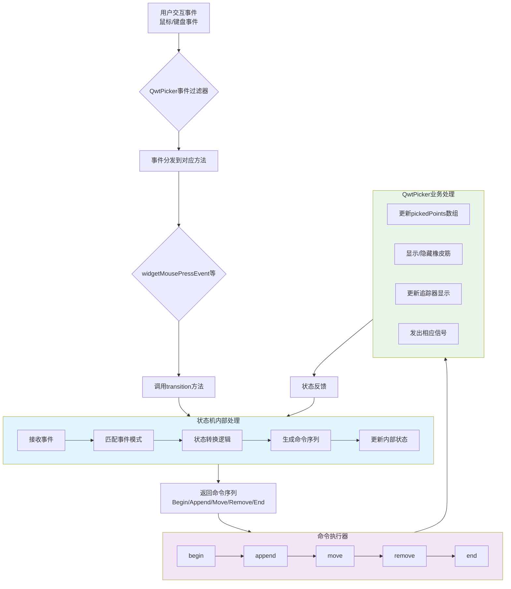

以`QwtPickerDragPointMachine`为例：

```cpp
QList<QwtPickerMachine::Command> QwtPickerDragPointMachine::transition(
    const QwtEventPattern& eventPattern, const QEvent* event)
{
    QList<QwtPickerMachine::Command> cmdList;

    switch (event->type()) {
        case QEvent::MouseButtonPress:
            if (eventPattern.mouseMatch(QwtEventPattern::MouseSelect1,
                static_cast<const QMouseEvent*>(event))) {
                if (state() == 0) {  // 初始状态
                    cmdList += Begin;   // 开始选择
                    cmdList += Append;  // 添加第一个点
                    setState(1);       // 进入拖拽状态
                }
            }
            break;
            
        case QEvent::MouseMove:
        case QEvent::Wheel:
            if (state() != 0)          // 如果在拖拽状态
                cmdList += Move;       // 持续移动
            break;
            
        case QEvent::MouseButtonRelease:
            if (state() != 0) {
                cmdList += End;        // 结束选择
                setState(0);           // 回到初始状态
            }
            break;
    }
    return cmdList;
}
```

这是处理鼠标拖拽操作的状态机，它的时序图可以如下表述：

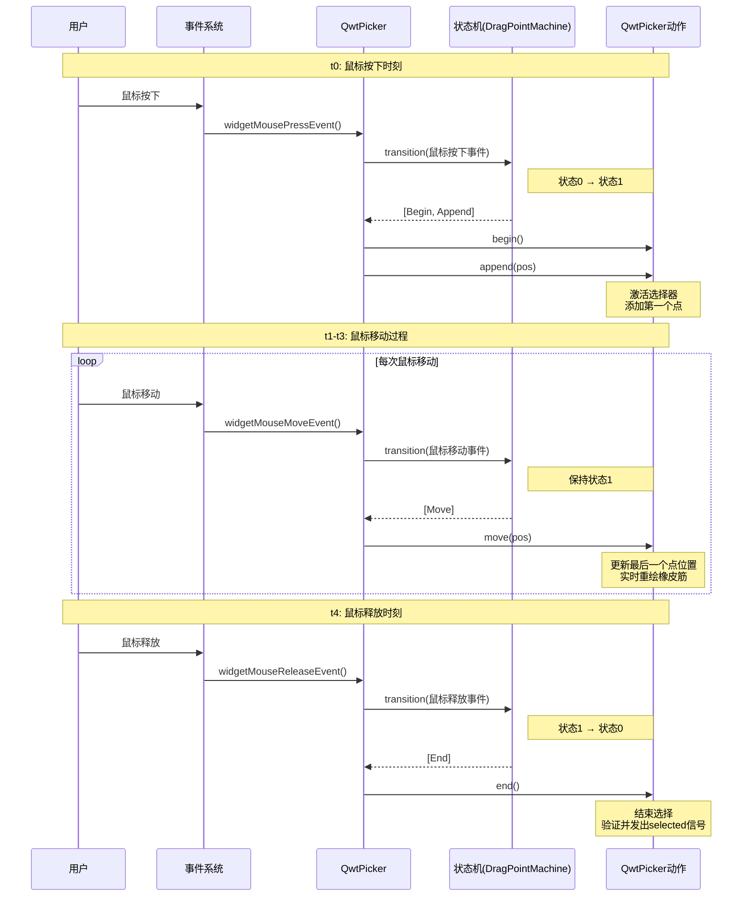

在`QwtPickerMachine`中，`setState()`函数的参数代表状态机的内部状态，这些状态值是由各个状态机自己定义和维护的，没有统一的含义。不同的状态机使用不同的状态值来表示其特定的交互阶段

像`QwtPickerDragPointMachine`,它有状态值`0`和`1`，分别表示初始状态和拖拽状态。

可以使用状态转换图来描述状态转换，`QwtPickerDragPointMachine`的状态转换图如下：

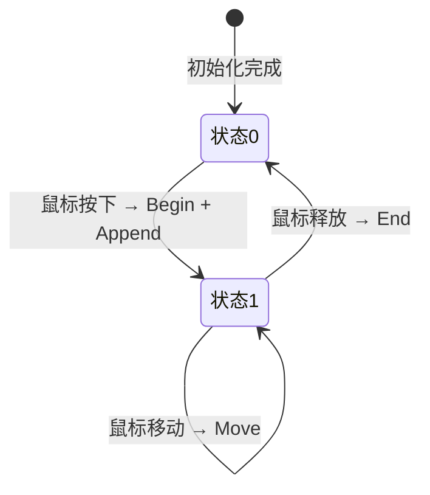

通过状态机，即可把事件类型转换为图表操作的各种状态，实现了事件的分发

将复杂的交互逻辑分解为：
- 事件识别（状态机）
- 命令执行（QwtPicker）
- 绘图（橡皮筋、追踪器）

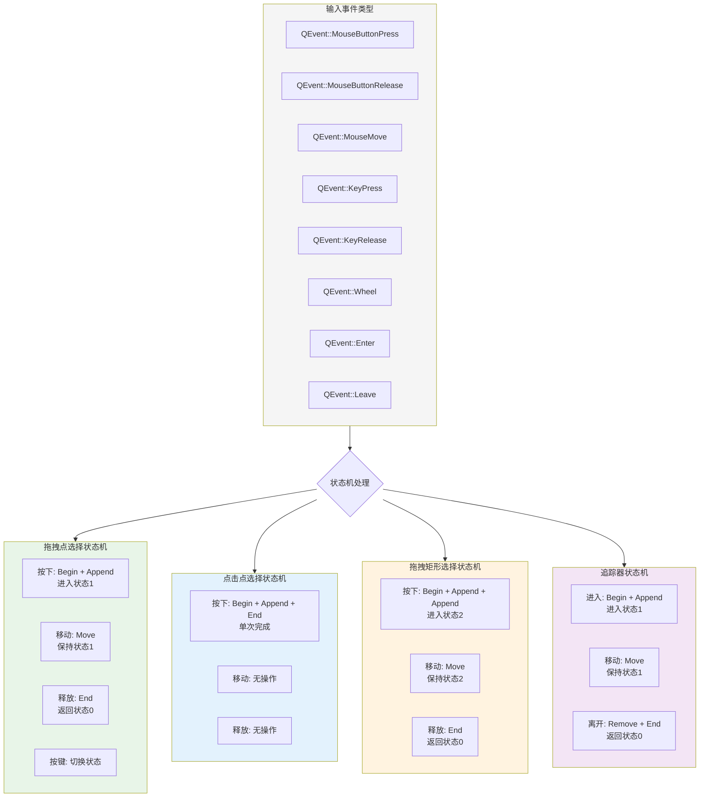

## QwtPicker内置状态机介绍

### 1. QwtPickerTrackerMachine（追踪器状态机）

#### 用途
实时追踪鼠标位置并显示信息，不进行任何选择操作

#### 状态转换过程
```cpp
初始状态: 0 (未追踪)
- QEvent::Enter / QEvent::MouseMove → [Begin, Append] → 状态1
- QEvent::MouseMove (状态1) → [Move] → 状态1  
- QEvent::Leave → [Remove, End] → 状态0
```

#### 状态转换图
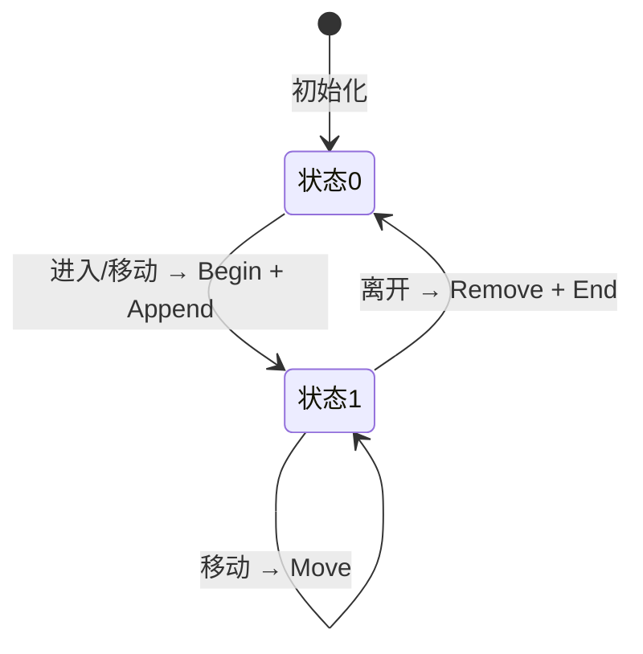

#### 适用场景
- 坐标显示
- 鼠标悬停提示
- 实时数值显示
- 测量工具的位置反馈

### 2. QwtPickerClickPointMachine（点击点选择状态机）

#### 用途
通过单次点击选择一个点

#### 状态转换过程
```cpp
初始状态: 0 (等待点击)
- QEvent::MouseButtonPress (匹配MouseSelect1) → [Begin, Append, End] → 状态0
- QEvent::KeyPress (匹配KeySelect1) → [Begin, Append, End] → 状态0
```

#### 状态转换图
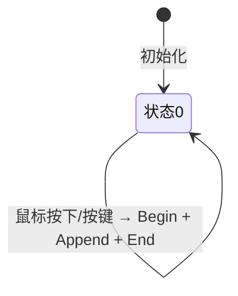

#### 适用场景
- 点选数据点
- 标记特定位置
- 简单的坐标选择
- 快速定位操作

### 3. QwtPickerDragPointMachine（拖拽点选择状态机）

#### 用途
通过拖拽操作精确选择点位置

#### 状态转换过程
```cpp
初始状态: 0 (等待开始)
- QEvent::MouseButtonPress (匹配MouseSelect1) → [Begin, Append] → 状态1
- QEvent::MouseMove (状态1) → [Move] → 状态1
- QEvent::Wheel (状态1) → [Move] → 状态1
- QEvent::MouseButtonRelease (状态1) → [End] → 状态0
- QEvent::KeyPress (匹配KeySelect1) → 切换状态0/1
```

#### 状态转换图
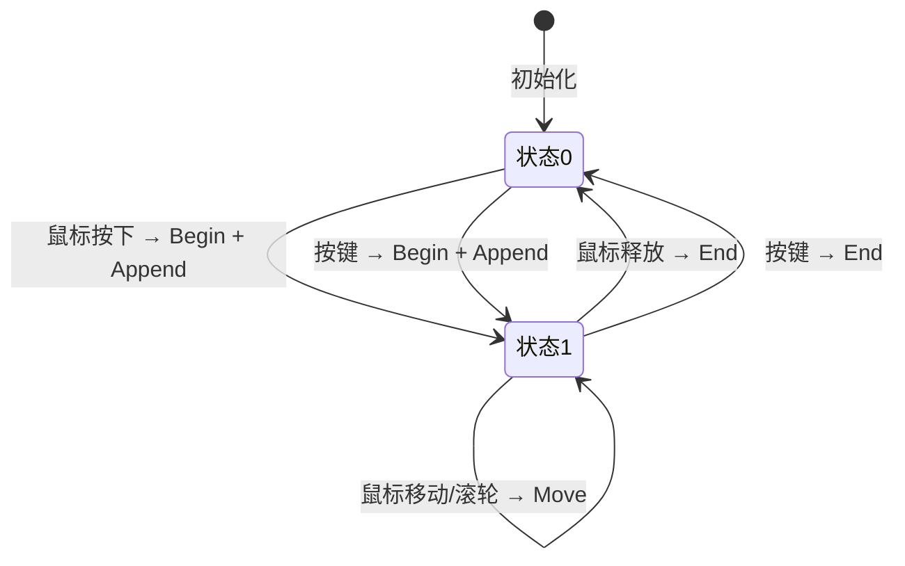

#### 适用场景
- **精确位置选择**（如我们的实时Panner）
- 需要微调的点选择
- 拖拽定位工具
- 高精度测量

### 4. QwtPickerClickRectMachine（点击矩形选择状态机）

#### 用途
通过两次点击确定矩形区域

#### 状态转换过程
```cpp
初始状态: 0 (等待第一次点击)
- QEvent::MouseButtonPress (匹配MouseSelect1) → [Begin, Append] → 状态1
- QEvent::MouseMove (状态1) → [Move] → 状态1
- QEvent::MouseButtonRelease (状态1) → [Append] → 状态2
- QEvent::MouseButtonPress (状态2) → [End] → 状态0
- 键盘事件有对应的多步骤转换
```

#### 状态转换图
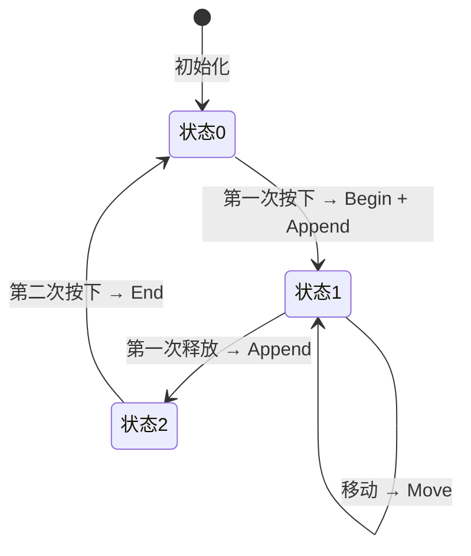

#### 适用场景
- 精确矩形区域选择
- 需要精确定位的缩放区域
- 坐标对齐的矩形绘制
- 建筑图纸测量

### 5. QwtPickerDragRectMachine（拖拽矩形选择状态机）

#### 用途
通过拖拽操作快速选择矩形区域

#### 状态转换过程
```cpp
初始状态: 0 (等待开始)
- QEvent::MouseButtonPress (匹配MouseSelect1) → [Begin, Append, Append] → 状态2
- QEvent::MouseMove (状态2) → [Move] → 状态2
- QEvent::MouseButtonRelease (状态2) → [End] → 状态0
- QEvent::KeyPress (匹配KeySelect1) → 切换状态0/2
```

#### 状态转换图
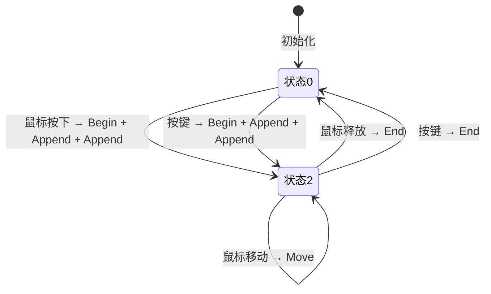

#### 适用场景
- 快速矩形区域选择
- 交互式缩放
- 区域截图工具
- 批量选择操作

### 6. QwtPickerDragLineMachine（拖拽线段选择状态机）

#### 用途
通过拖拽操作选择线段

#### 状态转换过程
```cpp
初始状态: 0 (等待开始)
- QEvent::MouseButtonPress (匹配MouseSelect1) → [Begin, Append, Append] → 状态1
- QEvent::MouseMove (状态1) → [Move] → 状态1
- QEvent::MouseButtonRelease (状态1) → [End] → 状态0
- QEvent::KeyPress (匹配KeySelect1) → 切换状态0/1
```

#### 状态转换图
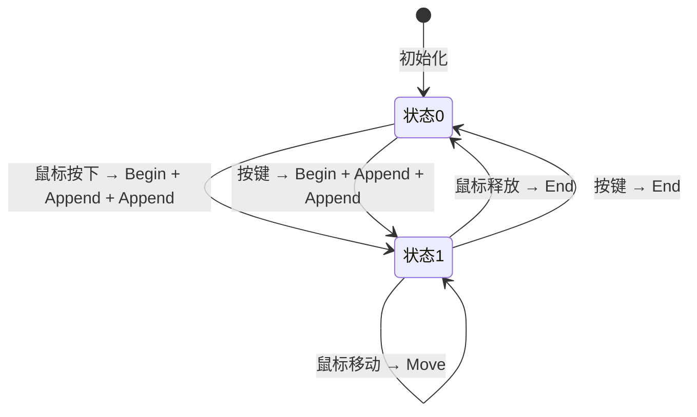

#### 适用场景
- 距离测量工具
- 线段绘制
- 方向指示器
- 角度测量

### 7. QwtPickerPolygonMachine（多边形选择状态机）

### 用途
通过多次点击创建多边形区域

#### 状态转换过程
```cpp
初始状态: 0 (未开始)
- QEvent::MouseButtonPress (匹配MouseSelect1) → [Begin, Append, Append] → 状态1
- QEvent::MouseButtonPress (状态1, 匹配MouseSelect1) → [Append] → 状态1
- QEvent::MouseMove (状态1) → [Move] → 状态1
- QEvent::MouseButtonPress (匹配MouseSelect2) → [End] → 状态0
- 键盘事件有对应的多边形绘制逻辑
```

#### 状态转换图
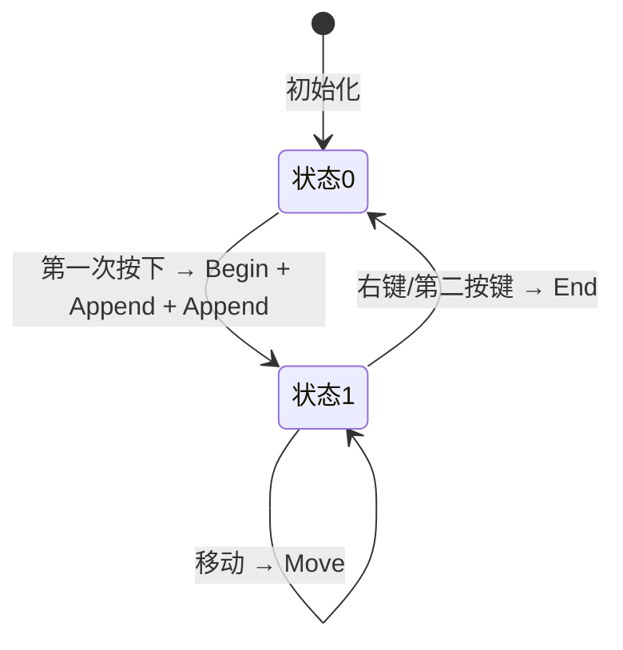

#### 适用场景
- 复杂区域选择
- 多边形绘制工具
- 自定义形状标注
- 地理信息系统区域选择

## 总结

`QwtPicker`的状态机机制提供了一种**优雅且强大**的方式来处理复杂的用户交互序列。通过选择合适的预定义状态机，我们可以轻松实现各种交互模式，而无需编写复杂的事件处理逻辑。

理解状态机的工作原理不仅有助于正确使用QwtPicker，还能在需要自定义交互时，快速实现符合需求的状态机。