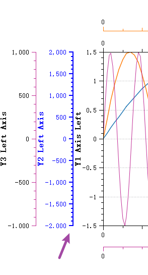

# 坐标轴交互动作

坐标轴交互动作允许用户通过鼠标对坐标轴进行拖动和缩放操作。这一功能在`QWT 6`及更早版本中并不支持，从`QWT 7.0.5`版本开始引入

该功能的设计灵感来源于`QCustomPlot`，后者通过`QCustomPlot::setInteractions`方法配置内置交互行为，例如`QCP::iMoveAxes`允许拖动选中的坐标轴，`QCP::iRangeZoom`支持通过滚轮或框选方式缩放坐标轴范围（聚焦数据）。这些交互特性显著提升了图表的用户体验。

## 配置QWT坐标轴交互

从`QWT 7.0.5`起，新增了坐标轴交互功能。该功能通过`QwtPlotScaleEventDispatcher`类实现事件分发，将绘图区域的事件转发至相应的坐标轴组件。用户通常无需直接使用此类，只需调用`QwtPlot::setEnableScaleBuildinActions`即可启用或禁用坐标轴交互事件（`QWT7`默认启用）。

启用后可实现以下效果：

### 坐标轴可以拖动


- 在任意坐标轴上单击鼠标左键可选中该坐标轴，并对其进行拖动操作
- 单击鼠标右键可取消选中状态
- 拖动过程中绘图区域将实时更新显示

### 坐标轴滚轮缩放操作


- 在任意坐标轴上单击鼠标左键选中该坐标轴
- 滚动鼠标滚轮可对该坐标轴进行缩放，缩放中心点位于鼠标当前位置
- 单击鼠标右键可取消选中状态

## 自定义坐标轴交互行为

可以通过`QwtScaleWidget`单独配置各坐标轴的交互行为。`QwtPlot`提供了全局开关，而具体设置则在各个坐标轴组件上进行。

`QwtScaleWidget`使用`BuiltinActions`枚举来定义当前支持的内置交互动作，可通过以下函数进行配置：

```cpp
// 启用/禁用内置交互动作
void setBuildinActions(BuiltinActionsFlags acts);
BuiltinActionsFlags buildinActions() const;
// 检测内置动作是否激活
bool testBuildinActions(BuiltinActions ba) const;
```

您可以针对特定坐标轴启用特定动作。例如，如果您希望`XBottom`轴仅支持拖动而不支持滚轮缩放，可以使用以下代码：

```cpp
plot->axisWidget(QwtAxis::XBottom)->setBuildinActions(QwtScaleWidget::ActionClickPan);
```

上述代码使`XBottom`轴仅支持拖动操作。

## 配置坐标轴选中效果

执行坐标轴交互操作前需先选中目标坐标轴，因此`QwtScaleWidget`新增了选中状态管理函数：

```cpp
// 设置坐标轴选中状态
void setSelected(bool selected);
bool isSelected() const;
```

默认情况下，左键单击坐标轴即可选中，右键单击或点击坐标轴外区域将取消选中状态。

您可以自定义选中状态下坐标轴`QwtScaleWidget`的视觉效果。当选中坐标轴时，其文字颜色和轴线颜色将变为预设的选中颜色(默认为蓝色)：

```cpp
// 设置选中状态的颜色
void setSelectionColor(const QColor& color);
QColor selectionColor() const;
```

此外，还可调整坐标轴`QwtScaleWidget`的画笔宽度偏移量：

```cpp
// 设置选中后画笔的宽度修正
void setSelectedPenWidthOffset(qreal offset = 1);
qreal selectedPenWidthOffset() const;
```

默认画笔宽度偏移量为1，即选中坐标轴后，实际绘制的画笔宽度将增加该偏移量，使坐标轴线条显得更加粗壮，如下图箭头所示：



